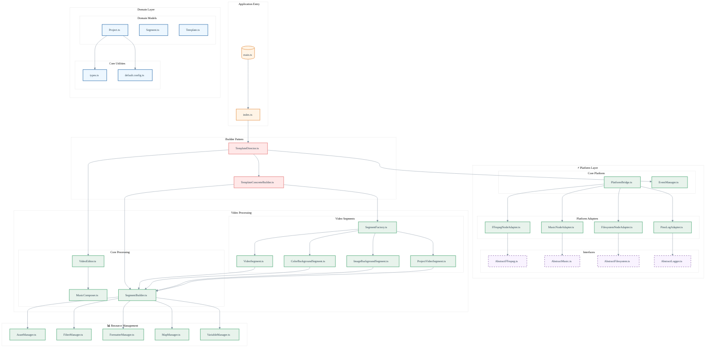

# FFmpeg Video Composer

[](https://nodejs.org/en/) [](https://opensource.org/licenses/MIT)

`ffmpeg-video-composer` is a tool designed to streamline the process of video compilation and audio mixing using FFmpeg. It enables dynamic template generation, video rendering, and audio composition, making it a comprehensive solution for creating personalized multimedia content programmatically.

## 🎥 Demo

Check out the video sample to see `ffmpeg-video-composer` in action (unmute for sound):

https://github.com/heristop/assets/6bcd0578-7dee-4630-aa6b-c730cf5cec17

[View the template descriptor](https://github.com/heristop/ffmpeg-video-composer/blob/main/src/shared/templates/sample.json)

## 🚀 Features

- Dynamic video and audio template generation
- Easy video compilation and audio mixing using FFmpeg
- Flexible JSON-based template descriptor system
- CLI for quick video creation
- JSON configuration for complex project setups
- Custom project configurations support
- Audio overlay and mixing capabilities
- Automated video editing and composition

## ⚠️ Prerequisites

This tool requires **FFmpeg** to be installed on your system and available in your PATH. FFmpeg is used directly for all video and audio processing operations.

### FFmpeg Installation Guide

#### macOS

Using [Homebrew](https://brew.sh/):

```bash
brew install ffmpeg
```

#### Linux

For Debian/Ubuntu:

```bash
sudo apt update && sudo apt install ffmpeg
```

For Fedora:

```bash
sudo dnf install ffmpeg
```

For Arch Linux:

```bash
sudo pacman -S ffmpeg
```

#### Verify Installation

After installation, verify that FFmpeg is properly installed:

```bash
ffmpeg -version
ffprobe -version
```

## 📦 Installation

### Using npm (or yarn/pnpm)

```bash
pnpm add ffmpeg-video-composer
```

### Development Setup

```bash
git clone https://github.com/heristop/ffmpeg-video-composer.git
cd ffmpeg-video-composer
pnpm i
```

## 📖 Usage

### Command Line Interface

```bash
pnpm compile src/shared/templates/sample.json
```

This generates `sample_output.mp4` in the `build` directory.

### Programmatic Usage

```javascript
import { compile, loadConfig } from 'ffmpeg-video-composer';

const projectConfig = {
  buildDir, // Build directory for output files
  assetsDir, // Assets directory for video segments
  // Other project configurations...
  currentLocale: 'en',
  fields: {
    form_1_firstname: 'Firstname',
    form_1_lastname: 'Lastname',
  },
};

// Using a template descriptor object
compile(projectConfig, {
  global: {
    // ... (template global configuration)
  },
  sections: [
    // ... (template sections configurations)
  ],
});

// Or using a JSON file
await compile(projectConfig, await loadConfig('./src/shared/templates/sample.json'));
```

## 🧪 Running Tests

Ensure the quality of the codebase by running the test suite:

```bash
pnpm test
```

## 🏗 Architecture



## 📄 License

This project is licensed under the MIT License - see the [LICENSE](LICENSE) file for details.

## 📬 Contact

If you have any questions or feedback, please open an issue on GitHub.
