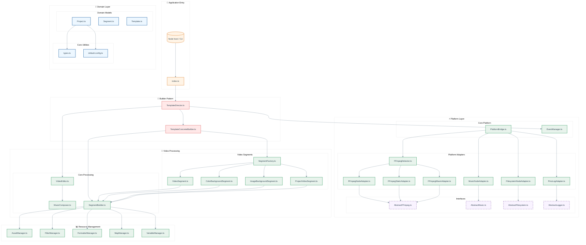

# 🏗 Architecture

```mermaid
%%{init: {
  'theme': 'base',
  'themeVariables': {
    'fontFamily': 'system-ui',
    'fontSize': '13px',
    'primaryColor': '#fff',
    'primaryTextColor': '#2A3F4D',
    'primaryBorderColor': '#7C8D9D',
    'lineColor': '#7C8D9D',
    'tertiaryColor': '#fff'
  }
}}%%

graph TD
    %% Style Definitions
    classDef core fill:#EDF7FF,stroke:#4B83B8,stroke-width:2px
    classDef abstract fill:#F9F3FF,stroke:#9D7AB8,stroke-width:2px,stroke-dasharray: 5 5
    classDef implementation fill:#E8F3EC,stroke:#67B58A,stroke-width:2px
    classDef entry fill:#FFF4E6,stroke:#E8A364,stroke-width:2px
    classDef builder fill:#FFE8E8,stroke:#E88B8B,stroke-width:2px
    classDef title fill:none,stroke:none

    %% Entry Points
    subgraph Flow ["🚀 Application Entry"]
        direction TB
        main[("Node host / CLI")]:::entry --> index["index.ts"]:::entry
    end

    %% Core Domain
    subgraph Core ["💎 Domain Layer"]
        direction TB
        subgraph CoreModels ["Domain Models"]
            core_project["Project.ts"]:::core
            core_segment["Segment.ts"]:::core
            core_template["Template.ts"]:::core
        end

        subgraph CoreUtils ["Core Utilities"]
            core_types["types.ts"]:::core
            core_config["default.config.ts"]:::core
        end
    end

    %% Director Pattern
    subgraph Builder ["👷 Builder Pattern"]
        direction TB
        director["TemplateDirector.ts"]:::builder
        template_builder["TemplateConcreteBuilder.ts"]:::builder
    end

    %% Platform Layer
    subgraph Platform ["⚡ Platform Layer"]
        direction TB
        subgraph PlatformCore ["Core Platform"]
            platform_bridge["PlatformBridge.ts"]:::implementation
            event_manager["EventManager.ts"]:::implementation
        end

        subgraph Abstractions ["Interfaces"]
            abstract_ffmpeg["AbstractFFmpeg.ts"]:::abstract
            abstract_music["AbstractMusic.ts"]:::abstract
            abstract_fs["AbstractFilesystem.ts"]:::abstract
            abstract_logger["AbstractLogger.ts"]:::abstract
        end

        subgraph Adapters ["Platform Adapters"]
            ffmpeg_node["FFmpegNodeAdapter.ts"]:::implementation
            ffmpeg_static["FFmpegStaticAdapter.ts"]:::implementation
            ffmpeg_wasm["FFmpegWasmAdapter.ts"]:::implementation
            ffmpeg_detector["FFmpegDetector.ts"]:::implementation
            music_node["MusicNodeAdapter.ts"]:::implementation
            fs_node["FilesystemNodeAdapter.ts"]:::implementation
            pino_adapter["PinoLogAdapter.ts"]:::implementation
        end
    end

    %% Editor Components
    subgraph Editor ["🎥 Video Processing"]
        direction TB
        subgraph EditorCore ["Core Processing"]
            video_editor["VideoEditor.ts"]:::implementation
            music_composer["MusicComposer.ts"]:::implementation
            segment_builder["SegmentBuilder.ts"]:::implementation
        end

        subgraph Segments ["Video Segments"]
            segment_factory["SegmentFactory.ts"]:::implementation
            video_segment["VideoSegment.ts"]:::implementation
            color_bg_segment["ColorBackgroundSegment.ts"]:::implementation
            image_bg_segment["ImageBackgroundSegment.ts"]:::implementation
            project_video_segment["ProjectVideoSegment.ts"]:::implementation
        end
    end

    %% Resource Management
    subgraph Resources ["📊 Resource Management"]
        direction TB
        asset_manager["AssetManager.ts"]:::implementation
        filter_manager["FilterManager.ts"]:::implementation
        formatter_manager["FormatterManager.ts"]:::implementation
        map_manager["MapManager.ts"]:::implementation
        var_manager["VariableManager.ts"]:::implementation
    end

    %% Main Flow
    index --> director
    director --> template_builder
    director --> video_editor
    director --> event_manager

    %% Builder Pattern Flow
    template_builder --> segment_builder
    template_builder --> segment_factory

    %% Segment Creation Flow
    segment_factory --> video_segment & color_bg_segment & image_bg_segment & project_video_segment
    video_segment & color_bg_segment & image_bg_segment & project_video_segment --> segment_builder

    %% Platform Relations
    platform_bridge --> ffmpeg_detector
    ffmpeg_detector --> ffmpeg_node & ffmpeg_static & ffmpeg_wasm
    platform_bridge --> music_node & fs_node & pino_adapter
    ffmpeg_node & ffmpeg_static & ffmpeg_wasm --> abstract_ffmpeg
    music_node --> abstract_music
    fs_node --> abstract_fs
    pino_adapter --> abstract_logger

    %% Resource Management
    segment_builder --> asset_manager & filter_manager & formatter_manager & map_manager & var_manager

    %% Core Dependencies
    core_project --> core_config & core_types

    %% Editor Flow
    video_editor --> music_composer

    %% Link Styling
    linkStyle default stroke:#7C8D9D,stroke-width:1px
```

## Architecture Overview

Rendering separates descriptor settings, host `ProjectConfig`, and MCP runtime configuration.
The descriptor owns scene/motion settings and orientation/fps; hosts bind media and choose encoders.
MCP configures containment, deadlines and an optional trusted Node/Remotion backend. Registered
effects are preflighted and resolved to ordinary clips before entering this pipeline. The
[engine configuration reference](./engine-configuration.md) documents precedence and current limits.

The FFmpeg Video Composer follows a layered architecture with clear separation of concerns:

### 🚀 Entry Points

- **`packages/leclap-cli/src/index.ts`** - Published `leclap` CLI (`init`, `render`, `validate`, `samples`, `diagnose`)
- **`packages/ffmpeg-video-composer/src/index.ts`** - Node library entry point; initializes adapters through `PlatformBridge`
- **`packages/ffmpeg-video-composer/src/browser.ts`** - Browser entry point; registers WASM, IndexedDB, browser logging and events directly
- **`packages/ffmpeg-video-composer/src/reactnative.ts`** - React Native entry point; registers an injected native engine, Expo filesystem, logging and events directly
- **`packages/ffmpeg-video-composer/src/main.ts`** - Internal development runner; the published CLI lives in `@leclap/cli`

### 💎 Domain Layer

Contains the core business logic and domain models:

- **Project.ts** - Represents a video project configuration
- **Segment.ts** - Represents individual video segments
- **Template.ts** - Template descriptor model
- **types.ts** - TypeScript type definitions
- **default.config.ts** - Default project configuration

### 👷 Builder Pattern

Implements the Builder pattern for template construction:

- **TemplateDirector** - Orchestrates the building process
- **TemplateConcreteBuilder** - Concrete implementation of template building

### ⚡ Platform Layer

Provides cross-platform abstractions and implementations:

#### Core Platform

- **PlatformBridge** - Node entry point's adapter factory and FFmpeg detector; browser/RN entry points wire their adapters directly
- **EventManager** - Event handling and notifications

#### Abstractions

- **AbstractFFmpeg** - FFmpeg interface abstraction
- **AbstractMusic** - Music processing abstraction
- **AbstractFilesystem** - Filesystem operations abstraction
- **AbstractLogger** - Logging abstraction

#### Platform Adapters

- **FFmpegNodeAdapter** - System FFmpeg implementation using `execFile` and parsed argv
- **FFmpegStaticAdapter** - Static binary FFmpeg implementation (`ffmpeg-static` ships `ffmpeg` only; see [Cross-Platform Support](#cross-platform-support) for ffprobe)
- **FFmpegWasmAdapter** - WebAssembly FFmpeg implementation; bridges IndexedDB input/output files to FFmpeg's separate MEMFS
- **FFmpegDeviceAdapter** - Injected native `run`/`probe` executor for React Native; uses real device paths
- **MusicWasmAdapter / MusicFFmpegAdapter** - Music adapters for browser and native-engine entry points
- **FFmpegDetector** - FFmpeg detection and diagnostics
- **MusicNodeAdapter** - Node.js music processing
- **FilesystemNodeAdapter** - Node.js filesystem operations
- **PinoLogAdapter** - Pino logging implementation

### 🎥 Video Processing

Handles the core video editing functionality:

#### Core Processing

- **VideoEditor** - Main video editing orchestrator
- **MusicComposer** - Audio mixing and composition
- **SegmentBuilder** - Video segment construction

#### Video Segments

- **SegmentFactory** - Factory for creating different segment types
- **VideoSegment** - Basic video segment implementation
- **ColorBackgroundSegment** - Colored background segments
- **ImageBackgroundSegment** - Image background segments
- **ProjectVideoSegment** - Project-specific video segments

### 📊 Resource Management

Manages assets, filters, and configurations:

- **AssetManager** - Asset discovery and management
- **FilterManager** - FFmpeg filter management
- **FormatterManager** - Text and data formatting
- **MapManager** - Data mapping utilities
- **VariableManager** - Template variable processing

## Design Patterns

### 1. **Adapter Pattern**

Used extensively in the platform layer to provide consistent interfaces across different environments (Node.js, Browser, React Native).

### 2. **Factory Pattern**

Implemented in `SegmentFactory` for creating different types of video segments based on configuration.

### 3. **Builder Pattern**

Used in `TemplateDirector` and `TemplateConcreteBuilder` for step-by-step construction of complex video templates.

### 4. **Dependency Injection**

Utilizes `tsyringe` for IoC container management, allowing for flexible component composition and testing.

### 5. **Strategy Pattern**

FFmpeg detection and adapter selection use strategy pattern to choose the best available implementation.

## Cross-Platform Support

The architecture is designed to support multiple platforms:

- **Node.js** - Full featured implementation with system FFmpeg support
- **Browser** - WebAssembly-based implementation for client-side processing
- **React Native** - On-device compilation through the embedded FFmpeg CLI engine (`packages/ffmpeg-engine` + `FFmpegDeviceAdapter`); see [on-device-compilation.md](./on-device-compilation.md)

On Node, `FFmpegDetector` checks system `ffmpeg -version` first (`FFmpegNodeAdapter`), then the `ffmpeg-static` package (`FFmpegStaticAdapter`). Both execute commands through `execFile` with parsed argv, without a shell. System detection checks FFmpeg only; `FFmpegNodeAdapter.getInfos()` separately expects `ffprobe` on PATH. The detector's last WASM branch requires `window`, so it is not a fallback for a pure Node environment. Browser hosts load `browser.ts` directly.

`ffmpeg-static` ships no ffprobe. The static adapter looks for one from the optional `ffprobe-static` package or beside the resolved FFmpeg binary, using only a candidate that exists (`platform/ffmpeg/resolve-ffprobe.ts`). Without one, it sets `probeUnavailableReason`. The director rejects probing templates before the first segment encodes: non-cut transitions, enabled/resolved music, whole-video overlays, and `project_video` sections. `MusicNodeAdapter` probes and loops with the selected adapter's `binaries`, including on the static path.

Browser storage uses IndexedDB, while FFmpeg reads its own in-memory MEMFS. Inputs, concat-list references, and embedded font paths are bridged before execution, and output is copied back. IndexedDB quota does not increase WASM memory capacity; the approximate 2 GB input ceiling does not guarantee a project of that size can render with its intermediate copies. The core pin and default CDN loader live in `platform/ffmpeg/ffmpeg-core.ts`; browser hosts can provide a loader through `BrowserCompileOptions.loadFFmpegCore`. Browser fonts must be bundled font IDs or readable TTF assets; family-based remote font resolution is rejected.

Node/static adapters allow concurrent executions because each command has its own process. WASM and device adapters use shared instances and render segments serially. Progress is delivered through `AbstractFFmpeg.progressListener` to director events; WASM uses elapsed time, while the native adapter can poll an injected progress file. The web app emits `task-cancelled` to stop at director checkpoints, which does not interrupt an active WASM command. Native cancellation uses the module's cooperative `cancel()` hook; see the [native API contracts](./on-device-compilation.md#boundary-contracts-the-schema).

## Error Handling & Diagnostics

The architecture includes error handling and diagnostics:

- **Interactive Setup** - Node bridge displays detection/install guidance in interactive terminals (suppressed in CI/tests, non-TTY contexts, or when `LECLAP_CLI_UI=1`)
- **Detection** - Automatically detects available FFmpeg implementations
- **Fallback Strategy** - Node selects a detected system/static backend; unavailable backends and execution failures surface errors
- **Rich Diagnostics** - Detailed system analysis and recommendations
