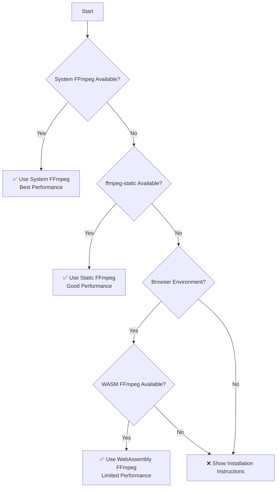

# 🔧 FFmpeg Fallback Strategy

The package uses a three-tier fallback system so FFmpeg is available across different environments:



## Detection Priority

The system automatically detects and uses FFmpeg implementations in this order:

### 1. **🖥️ System FFmpeg** (Highest Priority)

- **Performance**: Best (native binary)
- **File Size Limits**: None
- **Installation**: Manual (brew, apt, etc.)
- **Use Case**: Production environments, development

### 2. **📦 Static FFmpeg** (Fallback)

- **Performance**: Good (bundled binary)
- **File Size Limits**: Limited by available memory
- **Installation**: `npm install ffmpeg-static`
- **Use Case**: Zero-configuration deployments

### 3. **🌐 WebAssembly FFmpeg** (Browser Fallback)

- **Performance**: Limited (WebAssembly overhead)
- **File Size Limits**: ~2GB maximum
- **Installation**: `npm install @ffmpeg/ffmpeg @ffmpeg/util`
- **Use Case**: Client-side processing, demos

### 4. **❌ No FFmpeg** (Error State)

- Shows detailed installation instructions
- Provides platform-specific guidance
- Suggests best option for user's system

## Automatic Detection Process

The detection process runs automatically when you first use the package:

1. **System Scan**: Checks for `ffmpeg` command in PATH
2. **Static Check**: Looks for `ffmpeg-static` package
3. **WASM Check**: Looks for `@ffmpeg/ffmpeg` package (browser only)
4. **Environment Detection**: Identifies Node.js vs Browser vs React Native

## Performance Comparison

| Implementation | Startup Time | Processing Speed | Memory Usage | File Size Limit |
| -------------- | ------------ | ---------------- | ------------ | --------------- |
| System FFmpeg  | Instant      | 100% (baseline)  | Low          | Unlimited       |
| Static FFmpeg  | Fast         | 95%              | Medium       | ~8GB            |
| WASM FFmpeg    | Slow         | 20-40%           | High         | ~2GB            |

## Platform-Specific Recommendations

### **macOS**

```bash
# Recommended (best performance)
brew install ffmpeg

# Alternative (zero-config)
npm install ffmpeg-static
```

### **Linux (Ubuntu/Debian)**

```bash
# Recommended (best performance)
sudo apt update && sudo apt install ffmpeg

# Alternative (zero-config)
npm install ffmpeg-static
```

### **Linux (Fedora/RHEL)**

```bash
# Recommended (best performance)
sudo dnf install ffmpeg

# Alternative (zero-config)
npm install ffmpeg-static
```

### **Windows**

```bash
# Option 1: Chocolatey
choco install ffmpeg

# Option 2: Windows Package Manager
winget install ffmpeg

# Option 3: Zero-config
npm install ffmpeg-static
```

### **Browser Environments**

```bash
# Client-side processing
npm install @ffmpeg/ffmpeg @ffmpeg/util
```

## Troubleshooting

### Common Issues

#### "No FFmpeg implementation found"

- **Cause**: No FFmpeg installation detected
- **Solution**: Run `pnpm diagnose` for personalized recommendations

#### "FFmpeg command failed"

- **Cause**: Corrupted or incomplete FFmpeg installation
- **Solution**: Reinstall FFmpeg or try static fallback

#### "Out of memory" errors

- **Cause**: Large video files with limited RAM
- **Solution**: Use system FFmpeg or reduce video size

#### Slow processing in browser

- **Cause**: WebAssembly performance limitations
- **Solution**: Expected behavior; consider server-side processing

### Diagnostic Commands

```bash
# Check your current setup
pnpm diagnose

# Test FFmpeg availability
ffmpeg -version

# Check static FFmpeg (if installed)
npm list ffmpeg-static
```

## Advanced Configuration

### Force Specific Implementation

You can force a specific FFmpeg implementation by manipulating the environment:

```javascript
// Force static FFmpeg (remove system FFmpeg from PATH temporarily)
process.env.PATH = process.env.PATH.replace(/\/usr\/local\/bin:?/, '');

// Import after PATH modification
const { compile } = require('ffmpeg-video-composer');
```

### Custom Detection Logic

For advanced use cases, you can implement custom detection:

```javascript
import { FFmpegDetector } from 'ffmpeg-video-composer';

// Run custom diagnostics
const report = await FFmpegDetector.runFullDiagnostics(false); // Silent mode

if (report.ffmpegStatus.system.available) {
  console.log('Using system FFmpeg for optimal performance');
} else if (report.ffmpegStatus.static.available) {
  console.log('Using static FFmpeg fallback');
} else {
  console.log('Consider installing FFmpeg for better performance');
}
```

## Performance Optimization Tips

1. **Use System FFmpeg** for production workloads
2. **Keep videos under 100MB** when using static FFmpeg
3. **Limit to 10MB files** for WebAssembly processing
4. **Use appropriate codecs** (H.264 for compatibility)
5. **Monitor memory usage** during processing
6. **Batch smaller operations** instead of one large operation

## CI/CD Considerations

### GitHub Actions

```yaml
- name: Install FFmpeg
  run: |
    sudo apt update
    sudo apt install ffmpeg
```

### Docker

```dockerfile
RUN apt-get update && apt-get install -y ffmpeg
```

### Heroku

```bash
# Add buildpack for FFmpeg
heroku buildpacks:add https://github.com/jonathanong/heroku-buildpack-ffmpeg-latest.git
```

The fallback strategy ensures your application works across all environments while providing optimal performance where possible.
