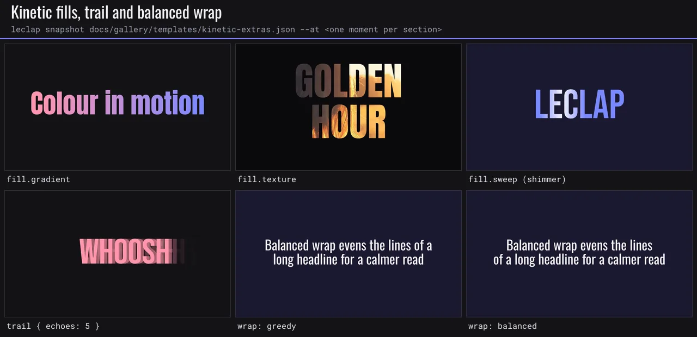
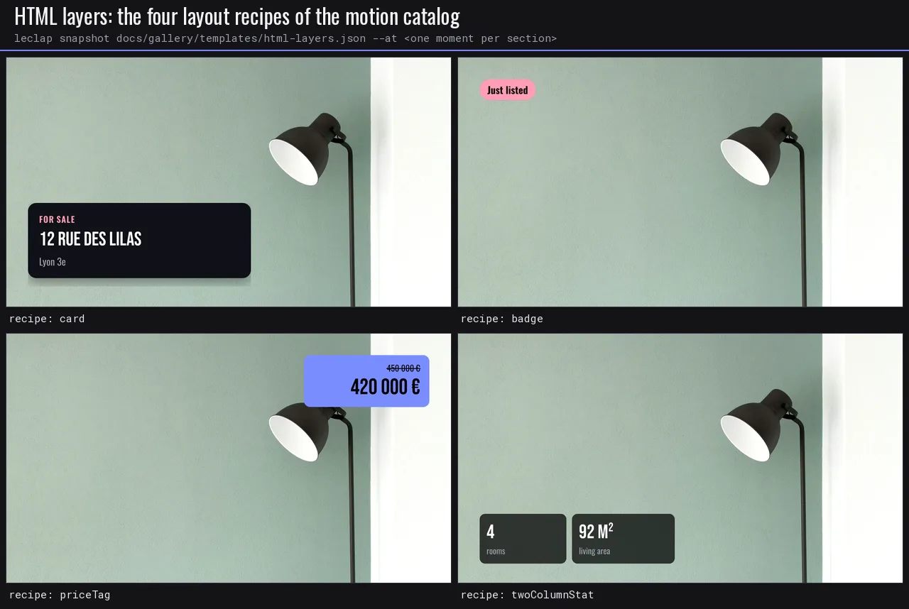
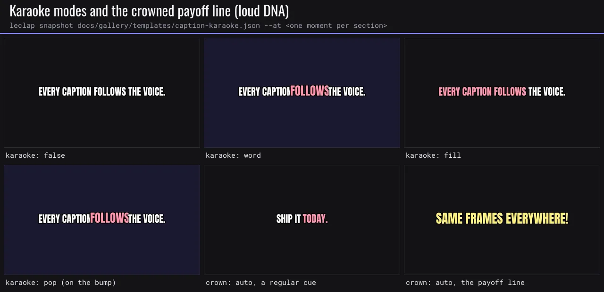
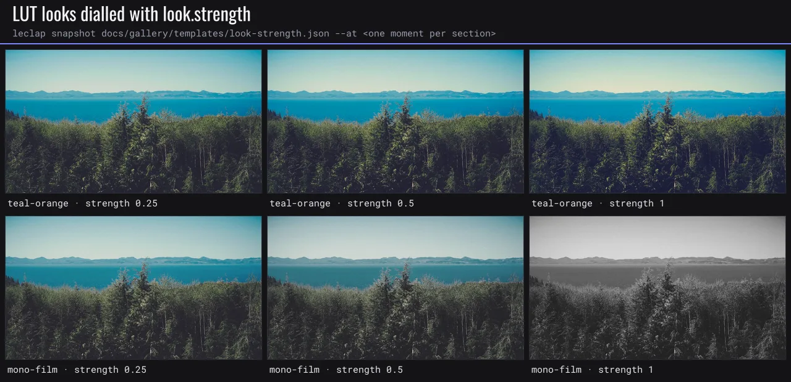
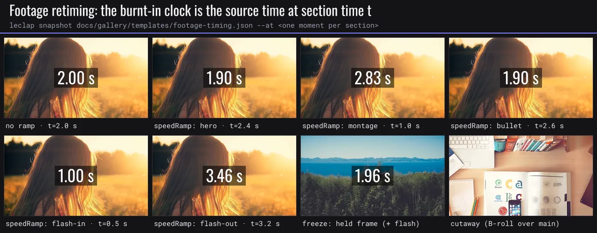
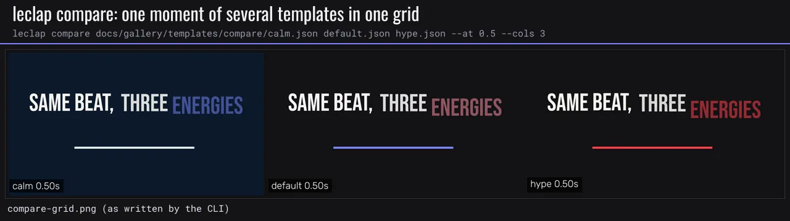
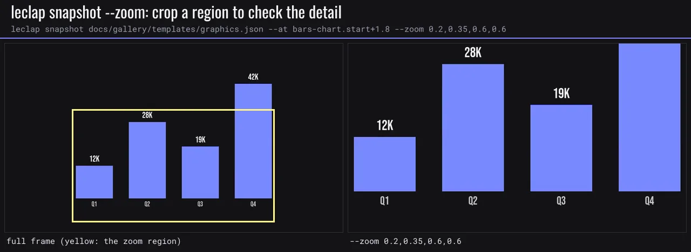

# 🖼 Gallery

What each motion, caption, layout, look and delivery option looks like. Every image on this page is a frame rendered by LeClap itself: the [`leclap snapshot`](./engine-configuration.md#snapshots-timeline-and-catalog-search) and `leclap compare` commands run on small demo templates in [`docs/gallery/templates/`](./gallery/templates/), and the frames are tiled into labelled sheets. Each tile is labelled with the option it shows.

The footage sheets use short clips that the script generates from the bundled photographs (a drift, a push-in and a burnt-in clock), so they need no recorded media.

Regenerate every sheet from the repository root, with `ffmpeg` (built with libwebp, 6.1 or later) and `python3` on `PATH`:

```bash
pnpm --filter ffmpeg-video-composer build && pnpm --filter @leclap/cli build
bash docs/gallery/make-gallery.sh            # every sheet
bash docs/gallery/make-gallery.sh camera     # one sheet group (see SHEETS in docs/gallery/gallery.py)
```

[`make-gallery.sh`](./gallery/make-gallery.sh) stages the bundled fonts, emoji and photographs under `build/gallery/assets` (the engine only reads real files under `--assets`), validates every demo template, then runs [`gallery.py`](./gallery/gallery.py), which generates the clips, calls the CLI and writes the WebP sheets into [`docs/media/gallery/`](./media/gallery/). The same templates and seeds always give the same frames.

- [Kinetic typography](#kinetic-typography)
- [Camera](#camera)
- [Graphics](#graphics)
- [Light and effects](#light-and-effects)
- [Strokes](#strokes)
- [Transitions](#transitions)
- [Lower thirds and title cards](#lower-thirds-and-title-cards)
- [HTML layers](#html-layers)
- [Captions](#captions)
- [Layouts](#layouts)
- [Themes](#themes)
- [Delivery platforms](#delivery-platforms)
- [Formats](#formats)
- [Looks](#looks)
- [Footage editing](#footage-editing)
- [Emoji and right-to-left scripts](#emoji-and-right-to-left-scripts)
- [Snapshot tooling](#snapshot-tooling)

## Kinetic typography


Every `kinetic[].preset`, caught while its units enter: `cascade`, `rise`, `drop`, `slide`, `pop`, `impact`, `tracking-in`, `typewriter`, `scramble`, `wave`, `highlight` (marker swept), `counter`, `split` and `fade`. Template: [`kinetic-presets.json`](./gallery/templates/kinetic-presets.json). Sheet: `bash docs/gallery/make-gallery.sh kinetic`.



`fill.gradient`, `fill.texture` (a photograph through the letters), `fill.sweep` (the shimmer band crossing), a `trail` of five echoes on a fast slide, and the same long headline with `wrap: greedy` and `wrap: balanced`. Template: [`kinetic-extras.json`](./gallery/templates/kinetic-extras.json). Sheet: `bash docs/gallery/make-gallery.sh kinetic-extras`.

## Camera


Each tile blends the first and the last frame of the move, so the doubled yellow frame shows its direction: `push-in`, `pull-out`, `drift-left`, `drift-right`, `drift-up`, `drift-down`, `orbit`, `handheld` (seeded shake), and a punch-in `hits` entry (before and on the hit). Template: [`camera-presets.json`](./gallery/templates/camera-presets.json). Sheet: `bash docs/gallery/make-gallery.sh camera`.

## Graphics


Every `graphics[].type`: `flash` (at its peak), `bars`, `underline`, `frame`, `corners`, `wipe` (half-way), `panel`, `glitch`, `focus` (still racking in), `progress`, `ticker` and `bars-chart`. Template: [`graphics.json`](./gallery/templates/graphics.json). Sheet: `bash docs/gallery/make-gallery.sh graphics`.

## Light and effects


Every `graphics[].type: "fx"` primitive, each anchored to what it decorates and tuned for it. Light: `sheen` (crossing the card), `edge-glow`, `leak` (from the left edge), `bloom`. Marks: `ripple` (a tap on the button), `glint`, `confetti`. Ambient textures, which stay faint by design (≤ 0.12): `bokeh`, `dust`, `vignette-breathe`, `grain`. Surfaces: `glass` (a frosted plate under the line), `resolve` (the title still out of focus). Template: [`fx.json`](./gallery/templates/fx.json). Sheet: `bash docs/gallery/make-gallery.sh fx`.

## Strokes


`frame`, `corners` and `underline` with their defaults, then with options: a rounded `frame` traced along its `path`, a `frame` hugging a kinetic block (`target: "text:0"`, `trace: "split"`), `corners` closing in on the title (`target` + `spread`) and with rounded elbows (`radius`), and an `underline` with square `caps` and no `settle` next to the default round, overshooting one. Template: [`strokes.json`](./gallery/templates/strokes.json). Sheet: `bash docs/gallery/make-gallery.sh strokes`.

## Transitions


Every designed `transition.type`, 0.3 s into a 0.6 s transition between a pink "A" section and a lavender "B" section: `push-left`, `push-right`, `push-up`, `push-down`, `swipe-left`, `swipe-right`, `zoom-through`, `iris`, `whip-left`, `whip-right`, `whip-up` and `whip-down` (the whips blur along their travel). Template: [`transitions.json`](./gallery/templates/transitions.json). Sheet: `bash docs/gallery/make-gallery.sh transitions`.

## Lower thirds and title cards


The default band and every `lowerThird.style`: `clean-bar`, `side-rule`, `kicker`, `stack-bars` and `pill`, cropped to the lower-left corner with `--zoom 0,0.6,0.6,0.4`. Template: [`lower-thirds.json`](./gallery/templates/lower-thirds.json). Sheet: `bash docs/gallery/make-gallery.sh lower-thirds`.


`titleCard` with `align: left` and an accent, `align: center` and an accent, and a headline with a subtitle only. Template: [`title-cards.json`](./gallery/templates/title-cards.json). Sheet: `bash docs/gallery/make-gallery.sh title-cards`.

## HTML layers



The four layout recipes of `motionCatalog().html` as `inputs[].type: "html"` layers on the `leclap` theme: `card`, `badge`, `priceTag` and `twoColumnStat`, each filled from typed fields and styled with `$color.*` / `$font.*` tokens. Template: [`html-layers.json`](./gallery/templates/html-layers.json). Sheet: `bash docs/gallery/make-gallery.sh html-layers`.

## Captions


The same word-timed line in every `subtitles.style` (caption DNA), while "follows" is spoken: `clean`, `loud`, `keynote`, `documentary`, `boxed` and `neon`. Template: [`caption-styles.json`](./gallery/templates/caption-styles.json). Sheet: `bash docs/gallery/make-gallery.sh captions` (both caption sheets).



`subtitles.karaoke` `false`, `word`, `fill` and `pop` on the `loud` DNA, then `crown: "auto"`: a regular cue, and the payoff line drawn larger in the crown colour. Template: [`caption-karaoke.json`](./gallery/templates/caption-karaoke.json).

## Layouts


`layout.type: "split"` with 2 panes, `ratio: 0.66` and a divider, 3 panes with a `gap`, 4 panes with dividers, `direction: "vertical"`, vertical with `ratio: 0.33`, 3 stacked panes, and a photo next to a `#colour` pane; then `before-after` mid-wipe for each `wipe.direction`: `right`, `left`, `down` and `up`. Template: [`layouts.json`](./gallery/templates/layouts.json). Sheet: `bash docs/gallery/make-gallery.sh layouts`.

## Themes


One card whose colours and fonts are all `$color.*` / `$font.*` tokens, rendered on every built-in `global.theme`: `leclap`, `midnight`, `editorial`, `bold`, `neon`, `paper`, `sunset`, `ocean`, `mono`, `candy`, `retro` and `corporate`. Templates: [`themes/`](./gallery/templates/themes/) (one file per theme, rendered side by side with `leclap compare`). Sheet: `bash docs/gallery/make-gallery.sh themes`.

## Delivery platforms


One card composed per orientation (`formats` with `$format` markers) and checked under every platform's UI with `leclap snapshot --safe <platform>`: `tiktok`, `reels`, `shorts`, `square-feed`, `youtube`, `x`, `linkedin` and `facebook`. Red is covered by the app's UI. Template: [`platform-safe.json`](./gallery/templates/platform-safe.json). Sheet: `bash docs/gallery/make-gallery.sh platforms`.

## Formats


The hook and stat beats of one story rendered with `--format landscape`, `portrait` and `square`: each format has its own type scale, positions and holds. Template: [`examples/motion-design/formats.json`](../examples/motion-design/formats.json). Sheet: `bash docs/gallery/make-gallery.sh formats`.

## Looks


One frame under every `look` preset, tiled by `leclap snapshot --looks`: the authored frame, `cinematic`, `warm`, `cool`, `vintage`, `noir`, `vivid`, `dreamy`, `teal-orange`, `warm-film`, `mono-film`, `noir-film`, `vivid-pop`, `duotone`, `posterize`, `sketch`, `glitch` and `soft-vignette`. Template: [`looks.json`](./gallery/templates/looks.json). Sheet: `bash docs/gallery/make-gallery.sh looks` (both look sheets).



The LUT-backed `teal-orange` and `mono-film` looks at `look.strength` 0.25, 0.5 and 1. Template: [`look-strength.json`](./gallery/templates/look-strength.json).

## Footage editing


A portrait clip in a landscape frame under `options.fit` `cover`, `letterbox` and `blur`, and a wide clip under `options.focus` `left`, `center` and `right`. Template: [`footage-framing.json`](./gallery/templates/footage-framing.json). Sheet: `bash docs/gallery/make-gallery.sh footage` (both footage sheets).



A clip with a burnt-in clock (its source time) at the labelled section time: no ramp, then every `options.speedRamp` preset (`hero`, `montage`, `bullet`, `flash-in`, `flash-out`); a `freeze` frame held after its flash; and a `cutaway` showing B-roll over the main clip. Template: [`footage-timing.json`](./gallery/templates/footage-timing.json).

## Emoji and right-to-left scripts


Colour emoji in a kinetic block, with a skin tone, a flag, a ZWJ sequence and a keycap, in a title card and in a lower third. Template: [`emoji.json`](./gallery/templates/emoji.json). Sheet: `bash docs/gallery/make-gallery.sh emoji-rtl` (both sheets).


Arabic and Hebrew kinetic type with the bundled `noto-arabic` and `noto-hebrew` fonts, both scripts next to Latin, and a Hebrew caption. Template: [`rtl.json`](./gallery/templates/rtl.json) (snapshotted with `--locale he`).

## Snapshot tooling



`leclap compare` renders several templates and tiles the same moment of each into one labelled grid, shown here as the CLI writes it: one beat at motion energy 0.6 (`midnight`), 1 (`leclap`) and 1.5 (`bold`). Templates: [`compare/`](./gallery/templates/compare/). Sheet: `bash docs/gallery/make-gallery.sh tooling` (both sheets).



`leclap snapshot --zoom x,y,w,h` crops a region (fractions of the frame) to check small detail, here the bar chart's labels. Template: [`graphics.json`](./gallery/templates/graphics.json).
