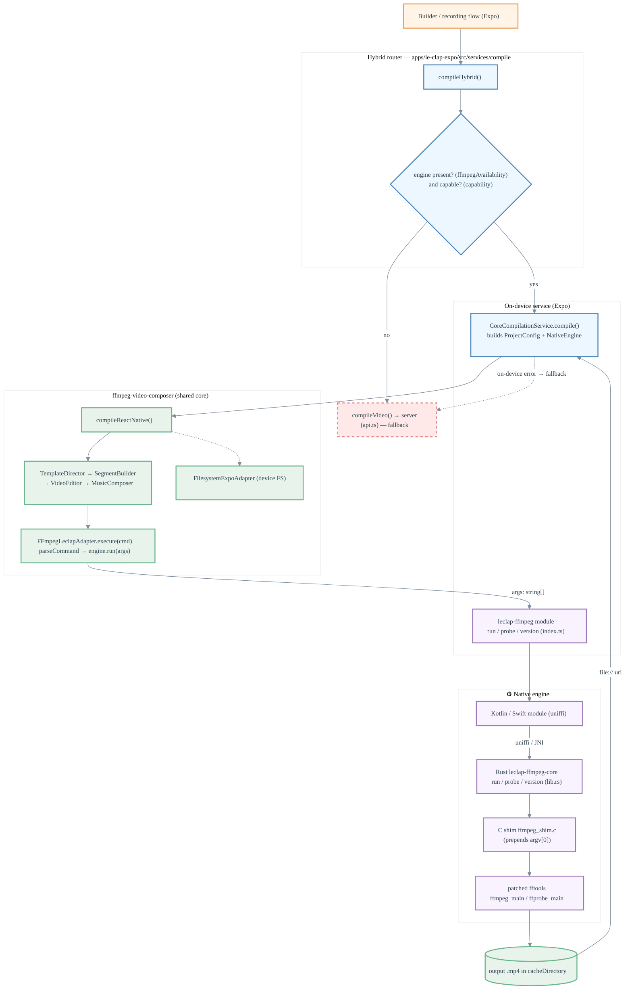

# 📱 On-Device Compilation

How the Expo app compiles a template **fully on-device** — no upload, no server — by running a real, statically-linked FFmpeg CLI through the **same** `ffmpeg-video-composer` core that powers the server and web.

> For the overall system architecture see [`architecture.md`](./architecture.md); for how a job is routed between on-device and server see [`ffmpeg-fallback-strategy.md`](./ffmpeg-fallback-strategy.md).

## Why

`ffmpeg-expo` was only a remux stub. The on-device engine replaces it with the actual FFmpeg `ffmpeg`/`ffprobe` programs (n8.0, `drawtext` enabled) embedded as a native library, so the app can render every template feature offline. Crucially it is **not a second engine** — it is one more `AbstractFFmpeg` implementation plugged into the existing director/builder pipeline. The core builds the same ffmpeg commands it always has; only the backend that executes them changes (WASM on web, system binary on server, native CLI on device).

## Two halves

| Half                | Lives in                                                                                           | Role                                                                  |
| ------------------- | -------------------------------------------------------------------------------------------------- | --------------------------------------------------------------------- |
| **Build toolchain** | `scripts/ffmpeg/`                                                                                  | Compiles FFmpeg + deps into static libs (`libfftools.a` …) per target |
| **Runtime engine**  | `packages/ffmpeg-engine/` (Rust) + `apps/le-clap-expo/modules/leclap-ffmpeg/` (Expo native module) | Wraps those libs and exposes `run`/`probe`/`version` to JS            |

---

## Runtime flow — compiling a template



**Routing (`compileHybrid`)** runs on-device only when both hold, else it uses the server; an on-device failure also falls back, so a job never gets stuck:

- **Availability** — `isFFmpegAvailable()` calls the native module's `version()`; absent in a build (e.g. Expo Go) ⇒ server.
- **Capability** — `describeOnDeviceCapability()` is intentionally permissive: it accepts everything the core supports (multi-section concat, color/title cards, `drawtext`, music, multiple clips) and only routes sections using animation `maps` (ZIP frame overlays) to the server.

---

## Build toolchain — producing the engine

```mermaid
%%{init: {
  'theme': 'base',
  'themeVariables': {
    'fontFamily': 'system-ui',
    'fontSize': '13px',
    'primaryColor': '#fff',
    'primaryTextColor': '#2A3F4D',
    'primaryBorderColor': '#7C8D9D',
    'lineColor': '#7C8D9D',
    'tertiaryColor': '#fff'
  }
}}%%
graph LR
    classDef build fill:#FFF4E6,stroke:#E8A364,stroke-width:2px
    classDef artifact fill:#E8F3EC,stroke:#67B58A,stroke-width:2px
    classDef native fill:#F9F3FF,stroke:#9D7AB8,stroke-width:2px

    deps["freetype 2.13.3 · harfbuzz 8.5.0<br/>openh264 2.5.0 (build-deps.sh)"]:::build
    scripts["scripts/ffmpeg<br/>build-{host,android,ios}.sh<br/>patch-fftools.sh"]:::build
    dist["dist/[target]/lib<br/>libfftools.a + FFmpeg n8.0 static libs"]:::artifact
    crate["packages/ffmpeg-engine<br/>build.rs links via pkg-config"]:::native
    so["libleclap_ffmpeg_core (.so / .a)<br/>+ uniffi Kotlin/Swift bindings"]:::artifact
    jni["modules/leclap-ffmpeg<br/>android jniLibs/[abi] · iOS LeclapFfmpegCore.xcframework"]:::native

    deps --> scripts --> dist --> crate --> so --> jni
```



`patch-fftools.sh` renames FFmpeg's `main` → `ffmpeg_main` / `ffprobe_main` and zeroes its global state at entry, making the CLI **re-entrant** so it can be called repeatedly in-process. `build.rs` then statically links `libfftools.a` ahead of the FFmpeg/freetype/harfbuzz/openh264 libs into one self-contained `.so` (no runtime FFmpeg dependency). Versions are pinned in `scripts/ffmpeg/versions.env`.

### Building the engine locally

The staged engine binaries (`modules/leclap-ffmpeg/android/src/main/jniLibs/*.so`,
`modules/leclap-ffmpeg/ios/LeclapFfmpegCore.xcframework`) are **not committed** — build them from
source (versions pinned in `scripts/ffmpeg/versions.env`):

```bash
# one-time prerequisites
rustup target add aarch64-linux-android armv7-linux-androideabi x86_64-linux-android \
  aarch64-apple-ios aarch64-apple-ios-sim x86_64-apple-ios
cargo install cargo-ndk   # android; also needs NDK 27.1 (see versions.env)

bash scripts/ffmpeg/build-engine.sh          # everything (~1 h cold)
bash scripts/ffmpeg/build-engine.sh android  # or one platform
```

---

## Boundary contracts (the schema)

Each hop and exactly what crosses it:

| Boundary                | Call                                                                 | Input                                                                                               | Output                                                                        |
| ----------------------- | -------------------------------------------------------------------- | --------------------------------------------------------------------------------------------------- | ----------------------------------------------------------------------------- |
| App → router            | `compileHybrid(descriptor, recordedVideos, opts)`                    | `TemplateDescriptor`, `CompileRecordedVideos` = `Record<string, {path, orientation, trim?, crop?}>` | `HybridResult {success, outputUri?, error?, engine: 'on-device' \| 'server'}` |
| router → on-device      | `CoreCompilationService.compile(input)`                              | `CompileInput {descriptor, clips}`                                                                  | `CompileResult {success, outputUri?, error?}`                                 |
| service → core          | `compileReactNative(projectConfig, descriptor, engine, onProgress?)` | `ProjectConfig`, `TemplateDescriptor`, `NativeEngine`                                               | `string \| null` (output path)                                                |
| core → engine (adapter) | `FFmpegLeclapAdapter.execute(cmd)` / `getInfos(src)`                 | command `string`                                                                                    | `{rc: number}` (throws `FFmpegError` on non-zero) / `FFMpegInfos`             |
| adapter → native module | `engine.run(args)` / `engine.probe(args)`                            | `string[]` (argv, no program name)                                                                  | `RunResult {code, log}` / `ProbeResult {code, output}`                        |
| module → Rust (uniffi)  | `run` / `probe` / `version`                                          | `Vec<String>`                                                                                       | `RunResult {code: i32, log}` / `ProbeResult {code: i32, output}` / `String`   |
| Rust → C shim           | `leclap_ffmpeg_run` / `leclap_ffprobe_run`                           | `argc, argv` (no `argv[0]`)                                                                         | `int` exit code                                                               |
| C shim → fftools        | `ffmpeg_main` / `ffprobe_main`                                       | `argc+1, argv` (with `argv[0]`)                                                                     | `int` exit code, writes output file                                           |

Notes:

- `NativeEngine` (in core) is the seam that keeps `ffmpeg-video-composer` free of any Expo import — `CoreCompilationService` injects `{ run: Leclap.run, probe: Leclap.probe }`.
- The Rust layer serializes calls behind a mutex (fftools hold global state) and captures the tool's stderr (`run`) / stdout (`probe`) by redirecting the fd around each invocation.
- Output is H.264 via **libopenh264** (LGPL) + AAC — the build is `--disable-gpl`, so there is no libx264.

---

## Key files

| Concern                                    | Path                                                                                                                                        |
| ------------------------------------------ | ------------------------------------------------------------------------------------------------------------------------------------------- |
| Hybrid router + capability gate            | `apps/le-clap-expo/src/services/compile/{compileHybrid,capability,ffmpegAvailability}.ts`                                                   |
| On-device service (builds config + engine) | `apps/le-clap-expo/src/services/compile/CoreCompilationService.ts`                                                                          |
| Expo native module (JS surface)            | `apps/le-clap-expo/modules/leclap-ffmpeg/index.ts` (+ Android Kotlin, iOS Swift, `jniLibs/`)                                                |
| Core RN entrypoint                         | `packages/ffmpeg-video-composer/src/reactnative.ts`                                                                                         |
| FFmpeg adapter (core ⇄ engine)             | `packages/ffmpeg-video-composer/src/platform/ffmpeg/FFmpegLeclapAdapter.ts`                                                                 |
| Device filesystem adapter                  | `packages/ffmpeg-video-composer/src/platform/filesystem/FilesystemExpoAdapter.ts`                                                           |
| Rust engine crate                          | `packages/ffmpeg-engine/{Cargo.toml, src/lib.rs, csrc/ffmpeg_shim.c, build.rs}`                                                             |
| FFmpeg build toolchain                     | `scripts/ffmpeg/{versions.env, common.sh, build-engine.sh, build-deps.sh, build-host.sh, build-android.sh, build-ios.sh, patch-fftools.sh}` |
| In-app smoke test                          | `apps/le-clap-expo/app/(fullscreen)/ffmpeg-spike.tsx`                                                                                       |
