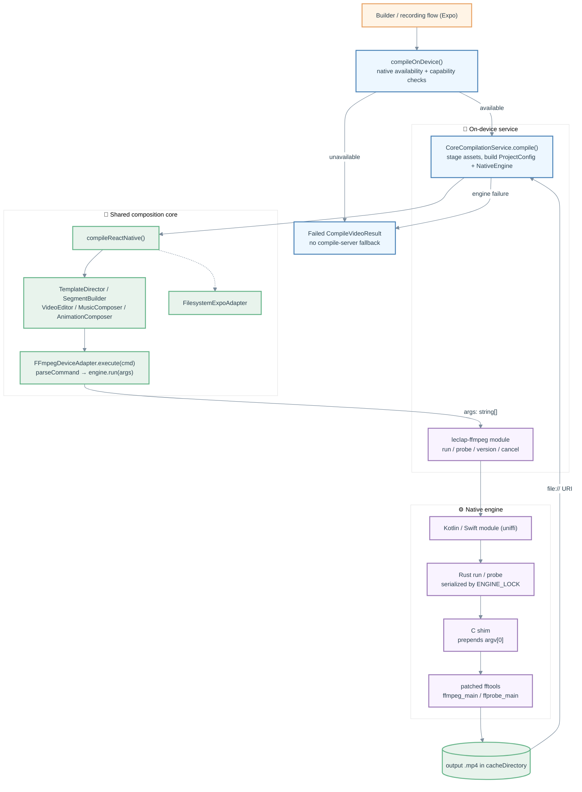

# 📱 On-Device Compilation

The Expo app renders templates on-device through the same `ffmpeg-video-composer` core used by Node and browser hosts. Rendering uses an embedded FFmpeg CLI rather than a compile server. Bundled assets are staged locally; templates with remote assets may still need downloads.

> For the overall system architecture — including how FFmpeg detection selects a backend — see [`architecture.md`](./architecture.md#cross-platform-support).

## Host configuration

The app's `CoreCompilationService` builds `ProjectConfig` from the descriptor and recorded clips.
It stages assets locally, maps effective section names into `userVideoPaths`, passes form `fields`,
and forwards an optional `qualityTier`. Android uses `libopenh264` + AAC; iOS uses
`h264_videotoolbox` + AAC. The host sets `hwaccel: null` and `preset: 'medium'`; these encoder
families use their own bitrate arguments rather than libx264 presets.

Descriptor `global.orientation` resolves dimensions and `global.fps` overrides host fps. Segment
rendering is serial, regardless of `hardwareConfig.maxRenderConcurrency`, because the native
engine serializes FFmpeg invocation. `compileReactNative` always validates descriptors.

MCP settings such as `--effect-catalog`, `--remotion-entry`, worker timeout and effect-cache budget
configure the separate Node server, not this engine. Registered React effects must be rendered on
that backend or another trusted renderer and supplied as compatible clips; unresolved `effect`
sections are rejected before native platform initialization. Native motion, text easing and APNG
overlay recipes use the on-device FFmpeg route. See [engine configuration](./engine-configuration.md)
for the complete field/default reference and reproducibility limits.

## Why

The native backend embeds the FFmpeg `ffmpeg`/`ffprobe` programs (pinned to n8.0, with `drawtext` enabled) in a Rust library. It is another `AbstractFFmpeg` implementation in the existing director/builder pipeline: shared managers build commands, and the backend executes them. Runtime support depends on the built codecs/filters and available media, rather than a promise that every descriptor renders offline.

## Two halves

| Half                | Lives in                                                                                          | Role                                                                  |
| ------------------- | ------------------------------------------------------------------------------------------------- | --------------------------------------------------------------------- |
| **Build toolchain** | `scripts/ffmpeg/`                                                                                 | Compiles FFmpeg + deps into static libs (`libfftools.a` …) per target |
| **Runtime engine**  | `packages/ffmpeg-engine/` (Rust) + `apps/leclap-expo/modules/leclap-ffmpeg/` (Expo native module) | Wraps those libs and exposes `run`/`probe`/`version`/`cancel` to JS   |

---

## Runtime flow — compiling a template


```mermaid
%%{init: {
  'theme': 'base',
  'themeVariables': {
    'fontFamily': 'system-ui',
    'fontSize': '13px',
    'primaryColor': '#fff',
    'primaryTextColor': '#2A3F4D',
    'primaryBorderColor': '#7C8D9D',
    'lineColor': '#7C8D9D',
    'tertiaryColor': '#fff'
  }
}}%%
graph TD
    classDef entry fill:#FFF4E6,stroke:#E8A364,stroke-width:2px
    classDef app fill:#EDF7FF,stroke:#4B83B8,stroke-width:2px
    classDef core fill:#E8F3EC,stroke:#67B58A,stroke-width:2px
    classDef native fill:#F9F3FF,stroke:#9D7AB8,stroke-width:2px
    ui["Builder / recording flow (Expo)"]:::entry
    gate["compileOnDevice()<br/>native availability + capability checks"]:::app
    error["Failed CompileVideoResult<br/>no compile-server fallback"]:::app

    subgraph Expo ["📱 On-device service"]
        ccs["CoreCompilationService.compile()<br/>stage assets, build ProjectConfig + NativeEngine"]:::app
        mod["leclap-ffmpeg module<br/>run / probe / version / cancel"]:::native
    end

    subgraph Core ["💎 Shared composition core"]
        crn["compileReactNative()"]:::core
        director["TemplateDirector / SegmentBuilder<br/>VideoEditor / MusicComposer / AnimationComposer"]:::core
        adapter["FFmpegDeviceAdapter.execute(cmd)<br/>parseCommand → engine.run(args)"]:::core
        fs["FilesystemExpoAdapter"]:::core
    end

    subgraph Native ["⚙️ Native engine"]
        kt["Kotlin / Swift module (uniffi)"]:::native
        rust["Rust run / probe<br/>serialized by ENGINE_LOCK"]:::native
        shim["C shim<br/>prepends argv[0]"]:::native
        ff["patched fftools<br/>ffmpeg_main / ffprobe_main"]:::native
    end

    out[("output .mp4 in cacheDirectory")]:::core

    ui --> gate
    gate -->|"available"| ccs --> crn --> director --> adapter
    gate -->|"unavailable"| error
    crn -.-> fs
    adapter -->|"args: string[]"| mod --> kt --> rust --> shim --> ff --> out
    out -->|"file:// URI"| ccs
    ccs -->|"engine failure"| error
```

`compileOnDevice()` checks availability via the native module's `version()` and returns an error when the engine is absent (for example, Expo Go). `describeOnDeviceCapability()` currently returns `{ capable: true }`; it does not reject animation maps. The old ZIP-frame overlay path has been replaced by single-file APNG/WebM overlays. Engine failures are returned to the caller, with no server fallback.

`CoreCompilationService` stages bundled fonts, music, videos, animations, backgrounds, and watermarks into the cache assets directory, maps recorded clips to real paths, and invokes `compileReactNative`. The native adapter can inject `-progress <file>` and poll output time every 500 ms for intra-segment progress. An `AbortSignal` listener calls the native `cancel()` hook during compilation; it is removed when the call settles.

---

## Build toolchain — producing the engine


```mermaid
%%{init: {
  'theme': 'base',
  'themeVariables': {
    'fontFamily': 'system-ui',
    'fontSize': '13px',
    'primaryColor': '#fff',
    'primaryTextColor': '#2A3F4D',
    'primaryBorderColor': '#7C8D9D',
    'lineColor': '#7C8D9D',
    'tertiaryColor': '#fff'
  }
}}%%
graph LR
    classDef build fill:#FFF4E6,stroke:#E8A364,stroke-width:2px
    classDef artifact fill:#E8F3EC,stroke:#67B58A,stroke-width:2px
    classDef native fill:#F9F3FF,stroke:#9D7AB8,stroke-width:2px

    deps["freetype 2.13.3 · harfbuzz 8.5.0<br/>openh264 2.5.0 · libvpx 1.14.1<br/>(build-deps.sh / build-deps-ios.sh)"]:::build
    scripts["scripts/ffmpeg<br/>build-{host,android,ios}.sh<br/>patch-fftools.sh"]:::build
    dist["dist/[target]/lib<br/>libfftools.a + FFmpeg n8.0 static libs"]:::artifact
    crate["packages/ffmpeg-engine<br/>build.rs links via pkg-config"]:::native
    so["libleclap_ffmpeg_core (.so / .a)<br/>bindings regenerated separately"]:::artifact
    jni["modules/leclap-ffmpeg<br/>android jniLibs/[abi] · iOS LeclapFfmpegCore.xcframework"]:::native

    deps --> scripts --> dist --> crate --> so --> jni
```

`patch-fftools.sh` renames FFmpeg's `main` → `ffmpeg_main` / `ffprobe_main` and resets the FFmpeg render globals at entry, making the CLI **re-entrant** so it can be called repeatedly in-process. `patch-fftools.sh` also injects the cancellation hook into FFmpeg's translation unit. `build.rs` links `libfftools.a` before its FFmpeg/dependency libraries, producing an Android engine `.so` with no separate runtime FFmpeg library dependency. Android embeds openh264 and libvpx; iOS embeds libvpx and enables VideoToolbox instead of openh264. The macOS host test library dynamically links Homebrew openh264/libvpx. Versions are pinned in `scripts/ffmpeg/versions.env`.

### Building the engine locally

The staged engine binaries (`apps/leclap-expo/modules/leclap-ffmpeg/android/src/main/jniLibs/<abi>/*.so`,
`apps/leclap-expo/modules/leclap-ffmpeg/ios/LeclapFfmpegCore.xcframework`) are **not committed** — build them from
source. Run these commands from the repository root. The current Android scripts select the macOS NDK host toolchain (`darwin-x86_64`); iOS requires macOS + Xcode. Versions and target minimums are in `scripts/ffmpeg/versions.env` (Android API 24, iOS 13.0):

```bash
# one-time prerequisites
rustup target add aarch64-linux-android armv7-linux-androideabi x86_64-linux-android \
  aarch64-apple-ios aarch64-apple-ios-sim x86_64-apple-ios
cargo install cargo-ndk   # android; also needs NDK 27.1 (see versions.env)

bash scripts/ffmpeg/build-engine.sh          # both platforms; a cold build can be lengthy
bash scripts/ffmpeg/build-engine.sh android  # or one platform
```

---

## Boundary contracts (the schema)

Each hop and exactly what crosses it:

| Boundary            | Call                                                                 | Input                                                                   | Output                                                               |
| ------------------- | -------------------------------------------------------------------- | ----------------------------------------------------------------------- | -------------------------------------------------------------------- |
| App → compile entry | `compileOnDevice(descriptor, recordedVideos, options)`               | descriptor, section-keyed clips, optional quality/progress/abort signal | `CompileVideoResult { success, outputUri?, error? }`                 |
| Entry → service     | `CoreCompilationService.compile(input, options)`                     | `CompileInput { descriptor, clips, qualityTier? }`, `CompileOptions`    | `CompileResult { success, outputUri?, error? }`                      |
| Service → core      | `compileReactNative(projectConfig, descriptor, engine, onProgress?)` | `ProjectConfig`, resolved `TemplateDescriptor`, injected `NativeEngine` | output path or `null`; can throw                                     |
| Core → adapter      | `FFmpegDeviceAdapter.execute(cmd)` / `getInfos(src)`                 | command string without program name / media path                        | `{ rc: number }` / `FFMpegInfos`; throws on non-zero native code     |
| Adapter → module    | `engine.run(args)` / `engine.probe(args)`                            | argv without program name                                               | `{ code, log }` / `{ code, output }`                                 |
| Module → Rust       | uniffi `run` / `probe`                                               | `Vec<String>`                                                           | `RunResult { code: i32, log }` / `ProbeResult { code: i32, output }` |
| Rust → C shim       | `leclap_ffmpeg_run` / `leclap_ffprobe_run`                           | argc and argv without `argv[0]`                                         | integer exit code                                                    |
| C shim → fftools    | `ffmpeg_main` / `ffprobe_main`                                       | argc + 1, argv with program name                                        | exit code; writes output files or probe output                       |

- `NativeEngine` avoids importing the app's native module into shared code. It requires `run`/`probe` and optionally supplies `progressFilePath`/`readTextFile`. The RN filesystem adapter itself imports `expo-file-system/legacy`.
- Rust `run` and `probe` serialize behind `ENGINE_LOCK` because fftools uses global state. `run` captures stderr, and `probe` captures stdout through file-descriptor redirection. Empty argv or an interior NUL returns `ARGV_ERROR` (`-2`) without invoking fftools.
- `version()` is synchronous and used as a presence check. `cancel()` bypasses the mutex and requests cooperative shutdown of the current `run`, normally returning code 255. It does not cancel `probe`; idle cancellation is cleared when the next run resets its flags.
- `FFmpegDeviceAdapter.getInfos()` extracts the outer JSON object from probe output; malformed JSON with a zero exit code yields no streams so callers can use declared duration. A non-zero probe code throws.
- Android output uses **libopenh264** (software H.264) + AAC. iOS uses **h264_videotoolbox** + AAC, selected in `CoreCompilationService.codecConfig`. The build disables GPL and includes no libx264.
- Compilation entry points require effect sections to be resolved before rendering; the native executor does not render motion JSON itself. See [template configuration](./template-configuration.md) for the effect-resolution contract.

---

## Filter capability matrix

The supported filter inventory and device compatibility rewrites are **generated, not hand-maintained**: see [`docs/runtime-capabilities.md`](./runtime-capabilities.md). It's produced by `pnpm --filter ffmpeg-video-composer generate:capabilities` from `ENGINE_EMITTED_FILTERS` + `FILTER_COMPAT` (engine) and the device build's `--enable-filter` list (`scripts/ffmpeg/common.sh`). The command also writes `packages/ffmpeg-video-composer/src/editor/utils/device-filters.generated.ts`. Two guard tests keep the artifacts current: `tests/capability-matrix.test.ts` (the doc matches the generated render) and `tests/lgpl-filter-audit.test.ts` (declared filter emissions and preset outputs are covered by the allowlist or compatibility rewrites). The matrix assumes full Node/WASM builds; it does not probe an installed binary. Changes to the allowlist require rebuilding/staging the native engine and updating the app build; existing binaries may lack newly listed filters.

---

## Key files

| Concern                                    | Path                                                                                                                                        |
| ------------------------------------------ | ------------------------------------------------------------------------------------------------------------------------------------------- |
| Local compile entry + capability gate      | `apps/leclap-expo/src/services/compile/{compileOnDevice,capability,ffmpegAvailability}.ts`                                                  |
| On-device service (builds config + engine) | `apps/leclap-expo/src/services/compile/CoreCompilationService.ts`                                                                           |
| Expo native module (JS surface)            | `apps/leclap-expo/modules/leclap-ffmpeg/index.ts` (+ Android Kotlin, iOS Swift, `jniLibs/`)                                                 |
| Core RN entrypoint                         | `packages/ffmpeg-video-composer/src/reactnative.ts`                                                                                         |
| FFmpeg adapter (core ⇄ engine)             | `packages/ffmpeg-video-composer/src/platform/ffmpeg/FFmpegDeviceAdapter.ts`                                                                 |
| Device filesystem adapter                  | `packages/ffmpeg-video-composer/src/platform/filesystem/FilesystemExpoAdapter.ts`                                                           |
| Rust engine crate                          | `packages/ffmpeg-engine/{Cargo.toml, src/lib.rs, csrc/ffmpeg_shim.c, build.rs}`                                                             |
| FFmpeg build toolchain                     | `scripts/ffmpeg/{versions.env, common.sh, build-engine.sh, build-deps.sh, build-host.sh, build-android.sh, build-ios.sh, patch-fftools.sh}` |
| In-app smoke test                          | `apps/leclap-expo/app/(fullscreen)/ffmpeg-spike.tsx`                                                                                        |
