# 🧩 Template Configuration

A **template** is a JSON document that describes a video: its global settings and the ordered sections that make it up. The compiler (`ffmpeg-video-composer`) turns a template plus a `ProjectConfig` (build/assets dirs, locale, user-supplied form values, recorded clips) into a finished video. Native descriptor scenes render on Node, in the browser via WebAssembly, and fully on-device on React Native. Registered effect scenes require a configured backend to resolve them into compatible clips before composition.

This is the template descriptor reference. Upgrading an older template? See [Migrating older templates](#migrating-older-templates).

- **Source of truth (zod):** [`packages/ffmpeg-video-composer/src/schemas/`](../packages/ffmpeg-video-composer/src/schemas/) — every field carries a `.describe()`. `TemplateDescriptorSchema` is the root.
- **Machine-readable schema:** [`docs/template-descriptor.schema.json`](./template-descriptor.schema.json) — generated from the zod source via `pnpm --filter ffmpeg-video-composer generate:schema`. Feed this to an editor or an agent for autocompletion/validation.
- **Examples:** [`packages/leclap-creative-kit/src/templates/`](../packages/leclap-creative-kit/src/templates/) — shared template descriptors plus bundled creative assets.
- **Validation:** `TemplateValidator` validates a descriptor against the schema (plus cross-field rules) before compilation.

> For the conceptual compile pipeline (director → builder → segments → managers), see [`architecture.md`](./architecture.md).

## Philosophy: structured sugar vs. raw filters

A descriptor has two layers, and you can mix them freely:

- **Structured sugar** — the editor-friendly, LLM-clear layer. `transition`, `look`, `grade`, `motion`, `audio`, `layers`, animation `inputs`, and the text sugar (`caption`, `titleCard`, `lowerThird`, `reveal`, and whole-video `global.overlays`/`look`/`grade`) are high-level intents. They compile down to ordinary FFmpeg filters for you (`xfade`/`acrossfade`, `eq`/`colorbalance`/`curves`, `zoompan`/`rotate`/`crop`/`hflip`/`vflip`, `loudnorm`/`sidechaincompress`/`afade`, `drawbox`/`drawtext`/`fade`/gradients). Prefer this layer — it is portable, validated, and on-device-safe. A title card or lower-third replaces ~80 lines of hand-positioned `drawtext` + `alpha` expressions with a few fields.
- **Raw filters (escape hatch)** — `filters[]`, `inputs[].filters`, and `maps[]` pass FFmpeg filter names and arguments through **verbatim**. This is the power-user layer for anything the sugar doesn't cover.

Because `filters[]` is a raw pass-through, its `values` keys stay **FFmpeg-native by design** — `x`, `y`, `w`, `h`, `c`, `t`, `fontcolor`, `fontsize`, `fontfile`, `alpha`, `d`, `st`, `color`, `box`, `boxcolor`, `boxborderw`. They are _not_ camelCased. The structured-sugar fields, in contrast, use editor-friendly camelCase names (`sourceVolume`, `musicVolume`, `colorBalance`, `curvesPreset`). Keep the two mental models separate: sugar = friendly keys, raw filters = FFmpeg keys.

## Top-level shape

```jsonc
{
  "meta": {/* Optional display metadata */},
  "global": {/* GlobalConfig — project-wide defaults */},
  "sections": [/* ordered Section[] — scenes, forms, or partial references */],
  "partials": [/* optional reusable fragment definitions */],
  "formats": {/* optional per-orientation overrides (see Formats) */},
}
```

All top-level keys are optional (so partial descriptors can be validated incrementally), but a useful template has at least one section.

**Native descriptor durations are in seconds** — `options.duration`, `transition.duration`, `audioFade.in.duration`, `countdownDuration`, etc. Registered-effect props can use frame counts or other units defined by their effect schema; do not assume they use seconds.

Host paths, media bindings, encoder/quality settings and MCP startup options live outside the descriptor;
see [engine configuration](./engine-configuration.md). `global.orientation` determines the output
layout, and `global.fps` takes precedence over host `videoConfig.fps`. `meta.creativeDirection` is
an authoring brief and does not override either configuration layer.

## `meta`

Optional human-facing metadata embedded in the descriptor, used by template browsers and agent catalogs.

| Field               | Type      | Description                                                                                                                                     |
| ------------------- | --------- | ----------------------------------------------------------------------------------------------------------------------------------------------- |
| `name`              | `string`  | Human-readable template name.                                                                                                                   |
| `description`       | `string`  | Short template summary for catalogs and agents.                                                                                                 |
| `creativeDirection` | `string`  | Optional authoring brief, trimmed, 1–4000 characters. Guides humans/agents; does not change rendering.                                          |
| `brief`             | `string`  | The production brief this template answers: a one-liner or a path such as `"brief.md"` (1–4000 characters). Turns on `section_without_purpose`. |
| `requirePurpose`    | `boolean` | `true` asks for a `purpose` on every rendering section even without a `brief`; `false` silences `section_without_purpose`.                      |

Use `meta.creativeDirection` to record audience, hierarchy, typography, palette, motion, pacing,
avoidances and review criteria. Implement it through explicit section settings and effect props;
the renderer never interprets or executes this prose. See [creative direction](./creative-direction.md)
for distinct example treatments, the CLI starter flag and MCP prompt arguments.

## `global`

Project-wide defaults and the options a builder/editor exposes to end users. `global` is `strict` — unknown keys are rejected.

| Field                   | Type                                    | Description                                                                                                                                    |
| ----------------------- | --------------------------------------- | ---------------------------------------------------------------------------------------------------------------------------------------------- |
| `variables`             | `Record<string, string \| string[]>`    | Named values referenced anywhere via `{{ varName }}`.                                                                                          |
| `fields`                | map or list of typed fields             | The template's declared inputs, filled into `{{ name }}` with typed values. See [Typed fields](#typed-fields-globalfields).                    |
| `orientation`           | `'landscape' \| 'portrait' \| 'square'` | Output orientation → resolution preset: landscape `1280x720`, portrait `720x1280`, square `1080x1080` (default `landscape`).                   |
| `fps`                   | `number`                                | Output frame rate for the rendered video — integer `1..120` (default `30`). Applies to every re-encode pass (segments and the final assembly). |
| `colorsList`            | `string[]`                              | Palette offered to the user; reference as `{{ color1 }}`, `{{ color2 }}`.                                                                      |
| `musicEnabled`          | `boolean`                               | Whether background music is enabled (default `true`).                                                                                          |
| `music`                 | `{ name: string, url?: string }`        | Default background track. Omit `url` to use an app-managed track.                                                                              |
| `animations`            | `GlobalAnimation[]`                     | Whole-video overlays, composited over the whole video (see [Whole-video animations](#whole-video-animations)).                                 |
| `overlays`              | `GlobalTextOverlay[]`                   | Whole-video TEXT overlays — a brand watermark authored once, drawn on every section (see [Global decorations](#global-decorations)).           |
| `look`                  | look preset                             | Colour-grade preset applied across every section (whole-video look).                                                                           |
| `grade`                 | `Grade`                                 | Fine-grained colour grade applied across every section.                                                                                        |
| `transition`            | `Transition`                            | Default boundary transition between sections (see [Transitions](#transitions)).                                                                |
| `audio`                 | `GlobalAudio`                           | Global audio mix (see [Audio](#audio)).                                                                                                        |
| `allowedMusic`          | `string[]`                              | Allowlist of music identifiers the user may choose.                                                                                            |
| `allowUploadMusic`      | `boolean`                               | Allow the user to upload a custom music file (default `false`).                                                                                |
| `allowedBackgrounds`    | `string[]`                              | Allowlist of background identifiers the user may choose.                                                                                       |
| `allowUploadBackground` | `boolean`                               | Allow the user to upload a custom background (default `false`).                                                                                |
| `seed`                  | `number` (uint32)                       | Root seed of every procedural effect (grain, shake, scramble, random order); default `0` (see [Determinism](#determinism)).                    |
| `motion`                | `MotionTokens`                          | Motion tokens and the energy dial (see [Motion tokens](#motion-tokens)).                                                                       |
| `theme`                 | theme name or `Theme`                   | Palette, fonts and motion feel referenced as `$color.*` / `$font.*` (see [Themes](#themes)).                                                   |
| `platform`              | platform id                             | Delivery destination: orientation default, UI safe zones, loudness (see [Delivery platforms](#delivery-platforms)).                            |
| `beats`                 | `Beats`                                 | Beat grid for `"beat:n"` / `"bar:n"` time references, or `{ analyze: "music" }` (see [Time references](#time-references)).                     |
| `emoji`                 | `'image' \| 'strip' \| 'error'`         | How colour emoji in drawn text render (default `image`; see [Emoji](#emoji-globalemoji)).                                                      |
| `sfx`                   | `SfxCue[]`                              | Sound effects on the whole-video timeline (see [Audio](#audio)).                                                                               |

## Sections

`sections` is a discriminated union on `type`. Native sections share the **base fields** below, then add type-specific `options`. Registered `effect` scenes require an effect reference and duration; see [Registered JSON effects](#registered-json-effects-desktop-authoring).

### Section types

| `type`             | Renders                                                                                                                                     |
| ------------------ | ------------------------------------------------------------------------------------------------------------------------------------------- |
| `video`            | A pre-recorded / asset-backed clip (`options.videoUrl`).                                                                                    |
| `project_video`    | A clip captured from the device camera (supports a `framingGuide`).                                                                         |
| `form`             | A text-input form (`options.fields`); collects values for `{{ field }}`.                                                                    |
| `color_background` | A solid or layered colour background (`options.backgroundColor`, `layers`).                                                                 |
| `image_background` | A still image background (`options.pictureUrl`).                                                                                            |
| `music`            | An audio-only / timeline-padding section (no video).                                                                                        |
| `partial`          | Expands inline to a reusable partial's sections (see [Partial sections](#partial-sections)).                                                |
| `effect`           | Registered JSON effect resolved into a clip before composition (see [Registered JSON effects](#registered-json-effects-desktop-authoring)). |

Native visual segments live in `packages/ffmpeg-video-composer/src/editor/segments/`; `SegmentFactory` maps `type` → class. A `partial` is expanded into real sections before validation and compile. An `effect` is resolved by the caller's backend before the native engine runs.

### Partial sections

A `partial` section pulls in a reusable fragment from the shared registry ([`@leclap/creative-kit`](../packages/leclap-creative-kit) — e.g. `logo-bumper`, `flash-card`), so a template composes vetted building blocks instead of repeating them.

```jsonc
{ "type": "partial", "ref": "flash-card", "prefix": "q1_", "variables": { "optionA": "{{ optionA1 }}" } }
```

| Field       | Type                     | Description                                                                                 |
| ----------- | ------------------------ | ------------------------------------------------------------------------------------------- |
| `ref`       | `string`                 | Id of a partial in the registry; its sections replace this one.                             |
| `prefix`    | `string`                 | Prepended to each expanded section's `name`, so the same partial can be used repeatedly.    |
| `variables` | `Record<string, string>` | Substituted into the partial's `{{ key }}` placeholders (values may themselves be globals). |
| `duration`  | `number` (s)             | Total length of this use of the partial; stretches only its hold (see below).               |
| `align`     | `{ sync, to }`           | Moves the section before the ref so a sync point lands on a beat, cue or time.              |

Expansion happens **before** schema validation and compile, so everything downstream only sees real sections.

**Elastic partials.** A partial definition may declare `envelope: { in, out }` (seconds of fixed intro and outro motion), `syncPoints: [{ id, offset }]` (named moments, `offset` ≤ `envelope.in`, exported as `cue:<id>` on the expanded section; an authored cue of the same name wins), `jobs` (up to 4 of `hook`, `orient`, `reveal`, `emphasize`, `prove`, `compare`, `bridge`, `ask`, `brand`, `close`), `useWhen` and `avoidWhen`. A ref's `duration` stretches only the hold between IN and OUT: IN keeps its times and OUT shifts by the extra. A duration shorter than `in + out` compresses both and drops the hold (advisory `partial_compressed`). A partial without an envelope counts as all IN, so a longer duration holds its tail. Plain-seconds time fields and cues are re-timed; raw `enable`/`range` expressions are not.

```jsonc
{ "type": "partial", "ref": "logo-bumper", "duration": 3, "align": { "sync": "logo", "to": "beat:9 - 0.1" } }
```

`align` resizes the section just before the ref so the sync point lands on `to`: seconds, `"beat:n"`, `"bar:n"` or `"cue:<name>"` of an earlier section, each with an offset. Every earlier section needs a known `options.duration`, and only top-level refs can align. Errors: `partial_duration_unknown`, `partial_envelope_invalid`, `invalid_partial_ref`, `cyclic_partial`, `align_unknown_sync`, `align_unknown_cue`, `align_unresolvable`, `align_unreachable`, `align_nested`. `motionCatalog().partials` lists the jobs vocabulary and these rules; MCP `get_sample` adds a `partialCatalog` summary.

### Base fields (native sections)

| Field         | Type                     | Description                                                                                                      |
| ------------- | ------------------------ | ---------------------------------------------------------------------------------------------------------------- |
| `name`        | `string`                 | Unique id within the template; used in section references.                                                       |
| `type`        | section literal          | One of the types above (discriminates the union).                                                                |
| `title`       | `Translation`            | Localised title shown to the user (e.g. `{ "en": "…" }`).                                                        |
| `description` | `Translation`            | Localised instruction text shown to the user.                                                                    |
| `options`     | type-specific            | See [Options](#options).                                                                                         |
| `inputs`      | `Input[]`                | Animation/image overlays composited over the section (see [Overlay inputs](#overlay-inputs-animations--images)). |
| `maps`        | `Map[]`                  | Custom filtergraph maps (see [Maps](#maps)).                                                                     |
| `filters`     | `Filter[]`               | Raw FFmpeg filter chain on the section output (see [Filters](#filters)).                                         |
| `transition`  | `Transition`             | Boundary transition applied **after** this section; overrides `global.transition`.                               |
| `look`        | look preset              | Named colour-grade (see [Looks & grade](#looks--grade)).                                                         |
| `grade`       | `Grade`                  | Fine-grained colour-grade (see [Looks & grade](#looks--grade)).                                                  |
| `letterbox`   | `Letterbox`              | Cinemascope-style horizontal bars simulating a wider aspect ratio (see [Letterbox](#letterbox)).                 |
| `motion`      | `MotionEffect[]`         | Ordered motion / geometric effects (see [Motion](#motion)).                                                      |
| `caption`     | `Caption`                | Styled lower-third / overlay caption, rendered as a `drawtext` filter (see [Captions](#captions)).               |
| `lowerThird`  | `LowerThird`             | Structured title/subtitle band over the clip (see [Lower thirds](#lower-thirds)). On visual sections.            |
| `kinetic`     | `KineticBlock[]`         | Animated copy, per word or glyph (see [Kinetic typography](#kinetic-typography)).                                |
| `camera`      | `Camera`                 | Virtual camera over the finished frame (see [Camera](#camera)).                                                  |
| `graphics`    | `Graphic[]`              | Animated editorial shapes and light hits (see [Graphics](#graphics)).                                            |
| `cues`        | `Record<string, number>` | Named moments (s) for [time references](#time-references), e.g. `"cue:drop"`.                                    |
| `assert`      | `Assertion[]`            | Timing checks proven at validation (see [Assertions](#assertions)).                                              |
| `subtitles`   | `Subtitles`              | Word-timed captions from words, cues or SRT (see [Subtitles](#subtitles-word-timed-captions)).                   |
| `sfx`         | `SfxCue[]`               | Sound effects in section time (see [Audio](#audio)).                                                             |
| `layout`      | `Layout`                 | Split screen or before/after wipe (see [Layouts](#layouts)). Colour, image, video and project_video sections.    |
| `cutaways`    | `Cutaway[]`              | **`video` / `project_video` only**: B-roll over the main clip (see [Footage editing](#footage-editing)).         |
| `purpose`     | `string`                 | Why the section exists, in one sentence (1–400 characters). Authoring metadata, never rendered.                  |
| `role`        | section role             | Narrative role: `hook`, `problem`, `product-intro`, `reveal`, `proof`, `cta`, `outro`, `bridge`. Never rendered. |

`color_background` sections also accept a section-level `titleCard` (see [Title cards](#title-cards)).

`purpose` and `role` record intent for humans and agents. With `meta.brief` set, or `meta.requirePurpose: true`, every rendering section without a `purpose` gets the advisory `section_without_purpose`. `leclap init --studio` scaffolds a template with both filled in (see the [CLI README](../packages/leclap-cli/README.md#studio--a-production-folder)).

### Options

Common options (`BaseSectionOptionsSchema`, `strict`) shared by native sections, plus per-type extras. Effect sections require `duration` and reject `useVideoSection`, `videoUrl` and `pictureUrl`. **All durations are in seconds.**

| Field                                      | Type                                        | Description                                                                                                                                                                   |
| ------------------------------------------ | ------------------------------------------- | ----------------------------------------------------------------------------------------------------------------------------------------------------------------------------- |
| `duration`                                 | `number` (s) or `{ beats }` / `{ bars }`    | Fixed section duration in **seconds**; overrides clip length. `{ beats: 8 }` / `{ bars: 2 }` sit on the `global.beats` grid (needs a `bpm`, else `beat_duration_needs_bpm`).  |
| `musicVolume`                              | `number` 0..1                               | Per-section music volume override (overrides `global.audio.musicVolume`).                                                                                                     |
| `audioFade`                                | `{ in?, out? }`                             | Section audio fades (see [Audio](#audio)).                                                                                                                                    |
| `audioEffect`                              | `'echo' \| 'telephone' \| 'muffled'`        | Voice effect preset applied to the section audio (see [Audio](#audio)).                                                                                                       |
| `speed`                                    | `number` > 0                                | Playback speed as a PTS multiplier (default 1; `2` = half-speed slow-mo). Needs a `setpts` map node to take effect; audio uses `atempo`, clamped to `[0.5, 2]`.               |
| `muteSection`                              | `boolean`                                   | Silence the source audio of this section. `project_video` keeps its sound by default; a `video` section is silent unless `muteSection: false`.                                |
| `countdown`                                | `boolean`                                   | Show a countdown overlay before recording (default `false`).                                                                                                                  |
| `countdownDuration`                        | `number` (s)                                | Countdown length in seconds (default 3); only when `countdown`.                                                                                                               |
| `upperCase` / `lowerCase`                  | `boolean`                                   | Force all text in the section to upper/lower case.                                                                                                                            |
| `useVideoSection`                          | `string`                                    | Reuse another `project_video` section's recorded clip by name.                                                                                                                |
| `videoUrl`                                 | `string`                                    | Pre-recorded video asset (`video` section).                                                                                                                                   |
| `logoUrl` / `backgroundUrl` / `pictureUrl` | `string`                                    | Asset URLs composited into the section.                                                                                                                                       |
| `backgroundColor`                          | `string`                                    | Solid background colour as a CSS hex (e.g. `#000000`).                                                                                                                        |
| `forceAspectRatio`                         | `boolean`                                   | Cover-crop the clip to fill the output frame — scales up, crops overflow, never stretches (on by default; `false` skips scaling).                                             |
| `forceOriginalAspectRatio`                 | `boolean`                                   | Letterbox to preserve the clip's original aspect ratio (bars, no crop). Overrides cover-crop (default `false`).                                                               |
| `fit` / `fill` / `focus`                   | see [Footage editing](#footage-editing)     | How the source maps into the frame (`cover`, `letterbox`, `blur`, `off`); overrides the two aspect flags. On every visual section.                                            |
| `voice` / `audioAutomation`                | see [Audio](#audio)                         | **`video` / `project_video` only**: voice clean-up preset and clip-sound volume automation.                                                                                   |
| `layers`                                   | `BackgroundLayer[]`                         | **`color_background` only** — composited layers (see [Layers](#layers)).                                                                                                      |
| `framingGuide`                             | `FramingGuide`                              | **`project_video` only** — recording-UI overlay (see [Framing guide](#framing-guide)).                                                                                        |
| `captureMode`                              | `'front' \| 'back' \| 'screen' \| 'upload'` | **`project_video` only** — default capture mode when the recorder opens (default `'front'`). `screen` = display capture (web only); `upload` = file picker instead of camera. |
| `allowedCaptureModes`                      | `CaptureMode[]`                             | **`project_video` only** — modes the user may switch between. Omit to allow all; single-element array locks to one mode. `screen` is silently ignored on native/Expo.         |

`form` sections use `options.fields`: `{ name, maxLength, label: Translation }[]`. Each field's `name` becomes a `{{ name }}` variable usable in any filter. `maxLength` is required unless the field binds a non-text `global.fields` entry.

### Footage editing

`video` and `project_video` sections can reframe, trim and retime their clip. Everything lowers to deterministic filters that run on every backend, and the edited length drives the timeline, transitions, music and output QC.

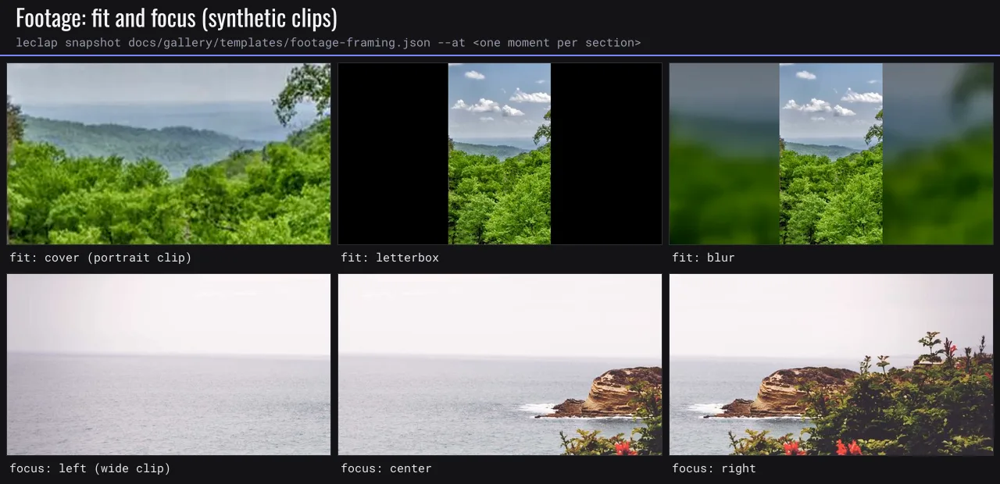

More in the [gallery](./gallery.md#footage-editing).

| Option        | Type                                                                                      | Description                                                                                                                                                                                                                           |
| ------------- | ----------------------------------------------------------------------------------------- | ------------------------------------------------------------------------------------------------------------------------------------------------------------------------------------------------------------------------------------- |
| `fit`         | `cover` \| `letterbox` \| `blur` \| `off`                                                 | How the source maps into the frame; overrides `forceAspectRatio` / `forceOriginalAspectRatio`. `blur` keeps the whole picture over a blurred, dimmed copy of itself (every visual section).                                           |
| `fill`        | `{ blur?: 20, dim?: 0.15, zoom?: 1 }`                                                     | Blur-fit background: gblur sigma, darkening 0..1, extra zoom 1..3.                                                                                                                                                                    |
| `focus`       | `center` \| `left` \| `right` \| `top` \| `bottom`, `{ x, y }`, or `[{ t, x, y, ease? }]` | Anchors the cover crop (0..1 fractions of the source); keyframes pan it over time.                                                                                                                                                    |
| `clip`        | `{ from?, to? }`                                                                          | In/out points in **source** seconds; `to` clamps to the clip. Trimmed frame-exactly with `trim`/`atrim`.                                                                                                                              |
| `speedRamp`   | preset or `[{ at, speed, ease? }]`                                                        | Presets `hero`, `montage`, `bullet`, `flash-in`, `flash-out` (timed as fractions of the trimmed clip). Keys are in section (output) seconds, strictly increasing; speeds 0.1..10. Frames are dropped or duplicated, not interpolated. |
| `rampAudio`   | `stretch` \| `mute`                                                                       | Clip sound under a ramp: pitch-preserving tempo (`atempo` chained in 0.5..2 steps, default) or silence where speed ≠ 1.                                                                                                               |
| `freeze`      | `[{ at, hold, flash?, audio?: 'silence' \| 'continue' }]`                                 | Holds the frame at section time `at` for `hold` s (up to 10); the section grows by `hold`. Later freezes count earlier holds.                                                                                                         |
| `trimSilence` | `{ edges?: true, gaps?: { minSilence: 0.6, margin: 0.15, threshold: -35 } }`              | Cuts the silence before the first and after the last word; `gaps: {}` also cuts pauses of at least `minSilence` s, keeping `margin` s next to the speech. **Node only** (one `silencedetect` pass per clip, cached).                  |
| `keep`        | `[[from, to], …]`                                                                         | Source windows to keep, ascending and non-overlapping, joined back to back (`trim`/`atrim` + `concat`). The explicit form of `trimSilence`; works on every backend, so browser and on-device hosts pass precomputed windows.          |

Section-level `cutaways` show B-roll over the main clip while its timeline keeps running:

```jsonc
"cutaways": [{ "url": "videos/broll.mp4", "at": 2, "duration": 1.5, "from": 0, "audio": "a", "fit": "cover" }]
```

`at` is section time (after trimming) or a time reference. `audio`: `a` keeps the main sound (default), `b` switches to the cutaway's own sound, `mix` sums both (`b`/`mix` need a cutaway with an audio track). `fit` is `cover` (default) or `contain`. One cutaway at a time, each ending inside the section; under a cutaway the main clip is framed by `fit` as `contain` (letterbox) or `cover` (everything else).

Ramps and freezes change the section length: a `project_video` lasts its edited length (capped by `options.duration`); a `video` section renders `min(options.duration, edited length)`. A `trimSilence` section's length is only known after the analysis, so later beat and section-relative references cannot resolve. Ramp `at`, freeze `at`, focus `t` and cutaway `at` accept [time references](#time-references); `clip` takes seconds only.

`keep`, `trimSilence` and `cutaways` cannot be combined with `clip`, `speedRamp` or `freeze` on one section (`take_edit_combination`): the first group edits the raw clip, the second runs inside the section chain. Other errors: `speed_ramp_unordered`, `focus_keys_unordered`, `freeze_overlap`, `freeze_outside_clip`, `keep_and_trim_silence`, `trim_silence_noop`, `keep_range_invalid`, `cutaway_overlap`, `cutaway_out_of_range`. Advisories: `extreme_speed` (below 0.25× or above 4×), `focus_ignored`, `blur_fit_overlaid` (an animation input or chroma key cover-crops first, so `blur` has no effect), `footage_shortens_section`, `trim_silence_host_only`. Presets and rules are in `motionCatalog().footage` (take editing under `.footage.take`). HDR, VFR and rotated sources are handled at probe time; see [media probing](./engine-configuration.md#media-probing).

## Transitions

A `Transition` controls the boundary **after** a section:

```jsonc
{ "type": "fade", "duration": 0.4 } // xfade name, or "cut" for a hard cut
```

- `type` — one of the [xfade names](#xfade-transition-names) below, or `"cut"`.
- `duration` — optional, in seconds (max 5). **Effective duration = `section.transition.duration` ?? `global.transition.duration` ?? `0.3`** (`DEFAULT_TRANSITION_DURATION`).

**How it compiles & performs:**

- A template whose boundaries are **all `cut`** (or have no transition) uses a fast stream-copy `concat` — cheap.
- **Any non-`cut` boundary forces a single re-encode assembly pass**: the segments are stitched with `xfade` (video) / `acrossfade` (audio), with offsets computed from the **probed** segment durations.
- ⚠️ **Performance:** that re-encode runs over the **full timeline** and is costly on WASM (the ~2 GB IndexedDB filesystem limit) and on-device. Cuts are nearly free. Prefer cuts unless a soft transition meaningfully improves the result.

The validator rejects:

- a non-`cut` transition on the **last** rendering section (nothing to transition into — `dangling_transition`);
- an effective transition duration **≥** the smaller of the two adjacent _declared_ `options.duration`s (`transition_too_long`);
- `kenburns` motion outside `image_background`, `video`, `project_video` or `effect` (`motion_unsupported_section`).

### Designed transitions

`transition.type` also accepts the designed transitions `push-left`, `push-right`, `push-up`, `push-down`, `swipe-left`, `swipe-right`, `zoom-through` and `iris`, plus an `ease` (default `cubic-bezier(0.65, 0, 0.35, 1)`; springs overshoot a push). A designed boundary cuts the outgoing tail and the incoming head, and composes them with filters whose geometry is evaluated once per frame (pad/overlay/crop, zoompan, a built-in crossfade). It then concatenates the result back on the same timeline as `xfade`. It costs about the same as a built-in transition and runs on device. `iris` uses the built-in circle reveal and ignores `ease`.

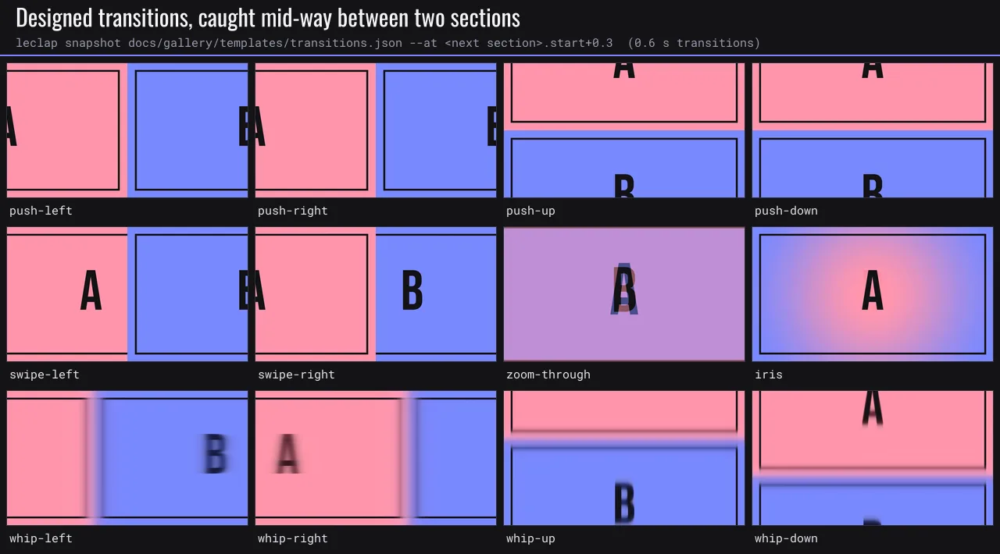

More in the [gallery](./gallery.md#transitions).

`whip-left`, `whip-right`, `whip-up` and `whip-down` are pushes with motion blur modelled on a 144° camera shutter. The push curve (default `cubic-bezier(0.7, 0, 0.2, 1)`) is differentiated around each frame, and the distance the picture travels while the shutter is open sets a gaussian blur stretched along the travel axis (capped at 4.5% of that axis). The blur ramps in and out with the speed, so a longer whip or a higher frame rate blurs less; a 0.4 s whip at 30 fps peaks at about 39 px on a 1280 px frame. Keep whips at 0.3–0.5 s, on the beat.

### xfade transition names

Quoted from `XFADE_TRANSITIONS` in [`effects.schemas.ts`](../packages/ffmpeg-video-composer/src/schemas/effects.schemas.ts) — that array is the authoritative list (don't retype it):

`fade`, `fadeblack`, `fadewhite`, `fadegrays`, `distance`, `dissolve`, `pixelize`, `radial`, `hblur`, `wipeleft`, `wiperight`, `wipeup`, `wipedown`, `wipetl`, `wipetr`, `wipebl`, `wipebr`, `slideleft`, `slideright`, `slideup`, `slidedown`, `smoothleft`, `smoothright`, `smoothup`, `smoothdown`, `circlecrop`, `rectcrop`, `circleclose`, `circleopen`, `horzclose`, `horzopen`, `vertclose`, `vertopen`, `diagbl`, `diagbr`, `diagtl`, `diagtr`, `hlslice`, `hrslice`, `vuslice`, `vdslice`, `hlwind`, `hrwind`, `vuwind`, `vdwind`, `coverleft`, `coverright`, `coverup`, `coverdown`, `revealleft`, `revealright`, `revealup`, `revealdown`, `squeezeh`, `squeezev`, `zoomin` — plus the special value `cut`.

## Looks & grade

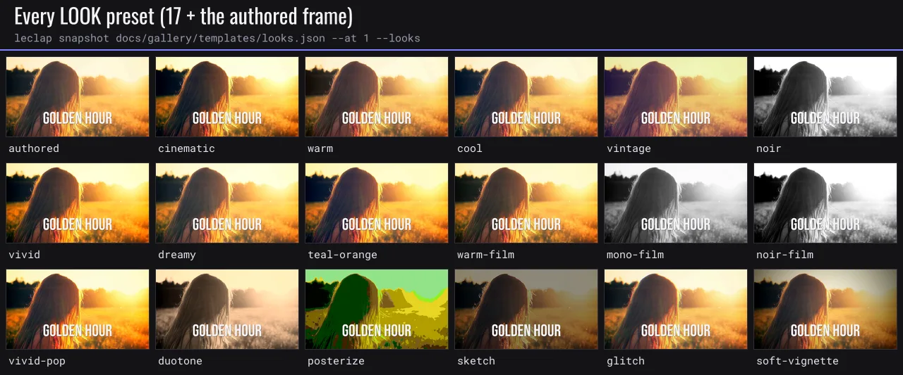

More in the [gallery](./gallery.md#looks).

`look` is a one-word colour-grade preset (`LOOK_PRESETS`). Three families:

- **`eq`/`curves` looks** (a stack of ordinary filters): `cinematic`, `warm`, `cool`, `vintage`, `noir`, `vivid`, `dreamy`.
- **LUT-backed cinema looks** (a single `lut3d` + a bundled `.cube` file — a stronger, cleaner grade than the filter stacks): `teal-orange`, `warm-film`, `mono-film`, `noir-film`, `vivid-pop`. The engine stages the referenced `.cube` the same way it stages fonts, and `lut3d` is a standard LGPL filter that runs on every backend (host, on-device, WASM). A backend without `lut3d` drops the look with a warning rather than aborting (the clip renders ungraded).
- **Stylized looks** (each its own small filter stack, all LGPL/on-device-safe — no `eq`/`geq`/`boxblur`): `duotone` (`hue` desaturate + `colorchannelmixer` tint + a `lutyuv` contrast lift), `posterize` (a single `lutyuv` that quantizes luma/chroma into 48-level steps), `sketch` (`edgedetect` in `colormix` mode + a `lutyuv` contrast/brightness lift), `glitch` (`rgbashift` channel offset + `noise`), `soft-vignette` (a single `vignette`).

A LUT look can be dialled down with `{ "preset": "teal-orange", "strength": 0.6 }`: strength (0..1, default 1) blends the generated `.cube` toward identity, so the grade stays one `lut3d` on every backend. Other looks reject `strength` (`look_strength_unsupported`).

`grade` is the fine-grained equivalent and stacks on top of `look`. All fields optional:

| Field                                                | Range                | Default | Compiles to    |
| ---------------------------------------------------- | -------------------- | ------- | -------------- |
| `brightness`                                         | -1..1                | 0       | `eq`           |
| `contrast`                                           | 0..2                 | 1       | `eq`           |
| `saturation`                                         | 0..3                 | 1       | `eq`           |
| `gamma`                                              | 0.1..3               | 1       | `eq`           |
| `hue`                                                | -180..180 (deg)      | 0       | `hue`          |
| `colorBalance.{shadows,midtones,highlights}.{r,g,b}` | -1..1                | —       | `colorbalance` |
| `blur`                                               | 0..20 (px)           | 0       | `gblur`        |
| `grain`                                              | 0..1                 | 0       | `noise`        |
| `curvesPreset`                                       | string key           | —       | `curves`       |
| `lut`                                                | `{ url, strength? }` | —       | `lut3d`        |

Looks and grades compile to ordinary FFmpeg filters (`eq`, `colorbalance`, `curves`, `gblur`, `noise`, `hue`) — nothing exotic, on-device-safe. `grain` lowers to `noise=alls=<0..20>:allf=t+u` (strength scaled from the 0..1 input).

`grade.lut` applies a user 3D `.cube` (e.g. a camera Log → Rec.709 conversion) before the other grade settings, at `strength` 0..1 (default 1). A malformed cube fails the section and names the line (`LUT_3D_SIZE` 2..256, size³ rows, `DOMAIN_MIN` < `DOMAIN_MAX`; 1D LUTs are rejected).

## Letterbox

`letterbox` overlays two solid `drawbox` bars, top and bottom, to simulate a wider aspect ratio than the actual output frame (a cinemascope look):

```jsonc
{ "letterbox": { "aspect": 2.39, "color": "#000000" } }
```

| Field    | Type              | Description                                                          |
| -------- | ----------------- | -------------------------------------------------------------------- |
| `aspect` | `number` 1..4     | Target aspect ratio the bars simulate (e.g. `2.39` for cinemascope). |
| `color`  | `string` optional | Bar colour (default `black`).                                        |

The bar height is `(ih - iw/aspect) / 2`, computed from the compiled output frame. **No-op when `aspect` is narrower than or equal to the output frame's own aspect ratio** — the engine never emits a bar with a non-positive height, so authoring `letterbox` on a frame that's already at least as wide as `aspect` silently draws nothing rather than producing an invalid filter.

## Motion

`motion` is an **ordered array** of geometric effects applied to the section video; they compile to `zoompan` / `rotate` / `crop` / `hflip` / `vflip`:

```jsonc
[
  { "type": "kenburns", "direction": "in", "intensity": 1.2 }, // still background or video clip
  { "type": "rotate", "angle": 5 },
  { "type": "crop", "w": 1280, "h": 720, "x": 0, "y": 0 },
  { "type": "flip", "axis": "horizontal" },
  { "type": "shake", "intensity": 6, "frequency": 2 },
  { "type": "pulse", "intensity": 1.08, "frequency": 1 },
]
```

| `type`     | Fields                                                                                           | Notes                                                                                                                                                      |
| ---------- | ------------------------------------------------------------------------------------------------ | ---------------------------------------------------------------------------------------------------------------------------------------------------------- |
| `kenburns` | `direction?` (`in`/`out`/`left`/`right`/`up`/`down`), `intensity?` (1.01..2, default 1.15)       | `zoompan` on `image_background`, `video`, `project_video` or resolved `effect` clips. Video uses one output frame per input frame after fps normalization. |
| `rotate`   | `angle` (degrees, + = clockwise)                                                                 | `rotate`.                                                                                                                                                  |
| `crop`     | `w`, `h` (required), `x?`, `y?` (px or FFmpeg expression)                                        | `crop`; default offset centres the crop.                                                                                                                   |
| `flip`     | `axis` (`horizontal` / `vertical`)                                                               | `hflip` / `vflip`.                                                                                                                                         |
| `shake`    | `intensity?` (jitter amplitude px, 1..20, default 6), `frequency?` (Hz, 0.5..8, default 2)       | Handheld shake: a wandering `crop` window, scaled back to the section's output size so it never shrinks the frame. No section-type restriction.            |
| `pulse`    | `intensity?` (peak zoom, 1.01..1.3, default 1.08), `frequency?` (pulses/sec, 0.25..4, default 1) | Rhythmic `zoompan` zoom in/out around the frame centre, mirroring `kenburns`'s still-vs-video (`d=frames` / `d=1`) handling. No section-type restriction.  |

## Audio

`global.audio` (`GlobalAudio`) sets the mix; per-section `options.audioFade` and `options.musicVolume` refine it.

| Field          | Type                                                               | Compiles to / behaviour                                                                                                                                                                                                                                                                        |
| -------------- | ------------------------------------------------------------------ | ---------------------------------------------------------------------------------------------------------------------------------------------------------------------------------------------------------------------------------------------------------------------------------------------- |
| `sourceVolume` | `number` 0..1 (default 1)                                          | Recorded/source-audio volume in the final mix.                                                                                                                                                                                                                                                 |
| `musicVolume`  | `number` 0..1 (default 0.5)                                        | Background-music volume; per-section `options.musicVolume` overrides.                                                                                                                                                                                                                          |
| `normalize`    | `'loudnorm'` \| `'dynaudnorm'`                                     | `loudnorm I=-16:TP=-1.5:LRA=11` or single-pass `dynaudnorm`.                                                                                                                                                                                                                                   |
| `ducking`      | `boolean` \| object                                                | Music ducking via `sidechaincompress` when source audio is present.                                                                                                                                                                                                                            |
| `musicFade`    | `number` 0.05..3 seconds (default: the global transition duration) | Length of the music cross-fade (`acrossfade`) between sections, independent of the video transition. Longer values smooth large per-section `musicVolume` changes. Clamped to half the shortest renderable section's duration so a short section can't be entirely crossfaded away.            |
| `automation`   | `[{ at, volume, ease? }]`                                          | Music-bed volume automation on the whole-video timeline (`volume` 0..4; `at`: seconds, `"intro.end"`, `"cue:drop"`, `"beat:8"`, `"50%"`, `"end"`). Lowered to `volume=eval=frame`. Multiplies per-section `musicVolume` and runs **before** ducking, so speech still dips the automated level. |
| `sfx`          | `"auto"`                                                           | Adds a whoosh at each designed transition, a hit where a kinetic `impact` block lands and on camera hits, and a riser ending on each `drop` cue. Deterministic, at most 12, never on top of an authored sound.                                                                                 |

`ducking` as an object: `{ threshold? (0..1, default 0.05), ratio? (1..20, default 8), attack? (ms, default 20), release? (ms, default 400) }`.

**Section audio fades** — `options.audioFade`: `{ in?: { duration, curve? }, out?: { duration, curve? } }`, compiled to `afade`. `duration` is in seconds; `curve` is an FFmpeg afade curve (`tri` default).

**Section audio effect** — `options.audioEffect`: `'echo' | 'telephone' | 'muffled'`, a voice-effect preset appended to the section's `-af` chain **before** any `audioFade` entries (so fades still ramp the already-effected signal in/out). Skipped entirely when the section is muted (`muteSection: true`).

| Value       | Compiles to                     |
| ----------- | ------------------------------- |
| `echo`      | `aecho=0.8:0.7:60:0.4`          |
| `telephone` | `highpass=f=300,lowpass=f=3400` |
| `muffled`   | `lowpass=f=1200`                |

**Voice clean-up** — `options.voice` on `video` / `project_video`: `clean` (highpass 80 Hz, light denoise, −3 dB at 250 Hz, +3 dB at 3 kHz, 2.5:1 compression, −1 dB limiter), `broadcast` (stronger presence, 4:1), `warm` (low-mid lift, softer highs), `rumble-cut` (highpass 100 Hz only) or `room-gate` (a gate between phrases). The `-af` chain runs voice → `audioEffect` → automation → fades. Stages the engine build lacks are skipped.

**Clip automation** — `options.audioAutomation: [{ at, volume, ease? }]` on `video` / `project_video`, in section time, after voice and effect and before `audioFade`.

**Sound effects** — section `sfx` (up to 32, section time) and `global.sfx` (up to 64, whole-video time) take `[{ id, at, volume? }]` or `[{ sound, at, volume? }]` (see [Composed sounds](#composed-sounds)). Ids: `whoosh`, `swoosh-short`, `hit`, `boom`, `riser`, `click`, `tick`, `pop`, `shutter`, `ding`, `glitch`, `sparkle`, `thud`, `zap`, `notification`, `keystroke`, `blip`, `rise-short`, `coin`, `drum-roll`, `heartbeat`, `clap`, `snap`, `success`, `error`, `swoosh-long`, `sub-drop`, `reverse-cymbal`, `water-drop`, `whistle-up`, `camera-focus`, `paper`, `tada`; `motionCatalog().audio.sfx` says when to use each. `riser`, `rise-short`, `drum-roll` and `reverse-cymbal` end at `at`; every other sound starts there. Sounds are placed on the joined timeline (transition overlaps included) and mixed over music and clip sound (`amix normalize=0`) before normalisation, so `loudnorm` measures the finished mix. A global `at` takes seconds, `"beat:n"` / `"bar:n"`, `"<section>.start"` / `"<section>.end"`, `"cue:<name>"` (the first section declaring it), `"50%"` or `"end"`, and needs every earlier section to declare `options.duration`. The sounds are synthesized originals bundled with the creative kit (`@leclap/creative-kit/sfx`).

```jsonc
"global": { "audio": { "sfx": "auto", "automation": [{ "at": 0, "volume": 1 }, { "at": "cue:drop", "volume": 0.4, "ease": "ease-out" }] } },
"sections": [{ "name": "hook", "type": "video", "options": { "videoUrl": "videos/talk.mp4", "voice": "clean" }, "sfx": [{ "id": "hit", "at": 1.2 }] }]
```

### Composed sounds

A cue takes exactly one of `id` (a library file, unchanged) or `sound`. A `sound` is synthesized in TypeScript (identical on Node, in the browser and on device), written to `build/sfx/<hash>.wav` and mixed like a library file; identical sounds render once.

- **Preset, varied** — `{ "preset": "<id>", "pitch"?: 0.25–4 (ratio), "length"?: s, "brightness"?: −1–1, "room"?: 0–1 }` renders the library sound's recipe with the variation applied: every pitch and cutoff scaled, every time stretched to `length`, cutoffs moved up to two octaves plus a tilt filter, a small room. A preset with no variation plays the shipped file byte for byte. It keeps the library's anchor and default level.
- **Composed** — `{ "layers": [...], "length"?: ≤ 4 s, "anchor"?: "start" | "end", "fx"?: {...} }`, up to 8 layers. A layer's `source` is `tone` (`wave` sine/triangle/square/saw, `pitch`, `vibrato { rate, depth }`), `noise` (`color` white/pink/brown, seeded), `strike` (a struck note: `pitch`, `ring` seconds to −60 dB, `partials [{ ratio, gain }]`, `click` transient) or `silence` (`length`, `delay`). `pitch` is Hz (20–12 000) or a sweep `{ from, to, curve?: exp|linear, time? }` (over `time` seconds then held, else over the note). Every audible layer takes `envelope { attack, hold, decay, sustain, release, curve }`, `filter` (one or a chain of up to 3: `{ type: lowpass|highpass|bandpass, cutoff | from+to, resonance 0.5–12, time? }`), `drive` (soft clip), `gain` 0–1, `pan` −1–1, `delay`, `length` per note, and `repeat` / `every` / `accelerate` / `jitter` for rolls and ticks. Whole-sound `fx`: `saturate`, `crush`, `room`, `echo` (0–1 each).
- **Level and seed** — the render is peak-normalised to −3 dBFS like the library, then `volume` applies (default 0.6 for a composed sound). Layer gains set the balance, not the level. Noise and jitter are seeded by `global.seed` and the cue's path (`sections.<name>.sfx[k]`, `global.sfx[k]`), so a render is reproducible.
- **Recipes** — every library sound is a recipe in the same vocabulary (`SOUND_PRESETS`); `motionCatalog().audio.compose` explains impacts, risers, blips and textures with worked examples, and its rule: one signature sound per beat, vary pitch rather than repeat.

```jsonc
"sfx": [
  { "id": "whoosh", "at": "title.start" },
  { "at": "cue:reveal", "sound": { "preset": "sparkle", "pitch": 1.2, "length": 0.8 } },
  { "at": "beat:4", "sound": {
      "length": 0.45,
      "layers": [
        { "source": "noise", "color": "pink", "filter": { "type": "lowpass", "from": 9000, "to": 600 },
          "envelope": { "attack": 0.01, "decay": 0.35 }, "gain": 0.8 },
        { "source": "tone", "pitch": { "from": 180, "to": 55, "time": 0.08 }, "drive": 0.2,
          "envelope": { "attack": 0.002, "decay": 0.3 }, "gain": 0.6 }
      ],
      "fx": { "saturate": 0.2, "room": 0.15 } } }
]
```

**Sound advisories** (advisory, like the motion lint; `leclap validate` and the MCP `validate_template` report them with a hint):

| Code             | When                                                                                                                  |
| ---------------- | --------------------------------------------------------------------------------------------------------------------- |
| `sound_clipped`  | A rendered sound's layers sum past +9 dBFS before normalisation: the written gains no longer describe the balance.    |
| `sound_harsh`    | A rendered sound longer than 0.25 s has over half its energy above 8 kHz (white noise measures 0.67, pink 0.14).      |
| `sound_muddy`    | Under music, a rendered sound longer than 0.8 s has over 90 % of its energy under 250 Hz: it blurs the kick and bass. |
| `sound_long`     | A section's sound runs more than 0.5 s past the section's end.                                                        |
| `sound_repeated` | Three or more cues of a list all play the same sound: vary `pitch` on a preset instead.                               |
| `sound_overlap`  | A fourth sound starts while three still play.                                                                         |

**Measure before placing** — the MCP `analyze_sound` tool renders a `sound` and returns its length, peak and RMS level (dBFS; a plain RMS, not LUFS), raw pre-normalisation peak, spectral centroid, energy share above 8 kHz and under 250 Hz, attack time and the advisories it raises, plus a spectrogram and a waveform PNG. Iterate until the numbers match the intent (a warm pop: centroid under 2 kHz, attack under 10 ms).

> `speed` ≠ 1 retimes audio via `atempo`, which is **clamped to `[0.5, 2]`**. Outside that range, video and audio can desync — split into multiple `atempo` stages or avoid extreme speeds.

## Layers

`color_background` sections can stack composited `layers` on top of the base colour (drawn as boxes / gradients). Ordered; each:

```jsonc
{
  "color": "#0d1b2a", // solid fill (CSS hex / FFmpeg colour name)
  "opacity": 0.8, // 0..1, default 1
  "x": 0,
  "y": 0, // offset (px or FFmpeg expr), default 0
  "w": 1280,
  "h": 150, // size (px or FFmpeg expr), default full output
  "gradient": {
    // optional; overrides `color`
    "from": "#13243f",
    "to": "#0d1b2a",
    "direction": "vertical", // horizontal | vertical | diagonal (default vertical)
  },
}
```

## Framing guide

`project_video` sections may declare `options.framingGuide` — a **recording-UI overlay only**. It guides the user while filming and is **never rendered into the output video**:

```jsonc
{ "type": "silhouette", "position": "center", "opacity": 0.5 }
```

`type` is always `silhouette`; `position` is `left` | `center` | `right`; `opacity` 0..1 (default 0.5).

## Chroma key

A native visual section (`video`, `project_video`, `image_background`, `color_background`) may declare a `chromaKey` block to **key out a solid screen colour** (green/blue screen) and composite the clip over a flat background colour. The section inverts internally to a colour base + a keyed-clip overlay (`colorkey` → `format=rgba` → `overlay`).

```jsonc
{ "color": "#00b140", "similarity": 0.3, "blend": 0.1, "background": "#101418" }
```

| Field        | Type             | Description                                                                             |
| ------------ | ---------------- | --------------------------------------------------------------------------------------- |
| `color`      | hex (required)   | The screen colour to remove.                                                            |
| `similarity` | `number` 0.01..1 | How close a pixel must be to `color` to be keyed (default ~0.3).                        |
| `blend`      | `number` 0..1    | Edge softness between kept and keyed pixels (default 0).                                |
| `background` | hex              | Flat colour composited behind the keyed clip (default the section's `backgroundColor`). |

`colorkey` is LGPL and present on every backend; a backend without it drops the key with a warning (the clip renders un-keyed) rather than aborting. v1 keys over a **solid colour only** (no simultaneous background image / animation overlay on the same section).

## Layouts

A `color_background`, `image_background`, `video` or `project_video` section can take a `layout`: a split screen or a before/after wipe.

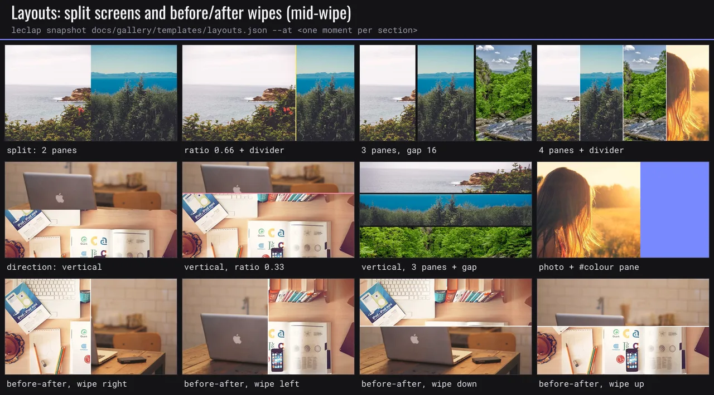

More in the [gallery](./gallery.md#layouts).

```jsonc
"layout": { "type": "split", "sources": ["demo", "videos/app.mp4", "#141416"], "direction": "horizontal", "gap": 8, "divider": { "color": "#FFFFFF", "width": 4 } }
"layout": { "type": "before-after", "before": "pictures/raw.jpg", "after": "pictures/graded.jpg", "wipe": { "at": 1, "duration": 1.2, "direction": "right", "ease": "ease-in-out-cubic" } }
```

- `split`: 2–4 `sources`, `direction` `horizontal` or `vertical`, `ratio`, `gap` and an optional `divider { color?, width? }`. Each pane is cover-fitted.
- `before-after`: `before` is shown full frame, then `after` is uncovered by `wipe { at, duration?, direction?: right | left | down | up, ease? }`, with an optional `divider`. The picture stays still while the edge moves.

A source is another section's name (its `backgroundColor`, `pictureUrl`, `videoUrl` or recorded clip), this section's own name (its own background), a media URL or path (`.png`/`.jpg`/`.webp`/`.bmp` are stills) or a `#RRGGBB` colour. Layouts are crop/pad/overlay only, so they run on device. Errors: `unknown_layout_source` (with the nearest section name), `layout_unsupported_section`, `layout_wipe_out_of_range`. Agents find the vocabulary in `motionCatalog().compositing.layouts`.

## Captions

A section's `caption` field renders a styled lower-third / overlay as a `drawtext` filter — burned into the video (unlike the framing guide). A `style` preset sets the base look; the other fields override it.

```jsonc
{ "text": { "en": "Design is how it works" }, "style": "bar", "position": "lower-third", "align": "center" }
```

| Field                             | Type                      | Description                                                                           |
| --------------------------------- | ------------------------- | ------------------------------------------------------------------------------------- |
| `text`                            | `Translation`             | Localised caption text (required).                                                    |
| `style`                           | preset                    | Visual preset (default `bar`).                                                        |
| `position`                        | enum                      | Vertical placement (default `lower-third`).                                           |
| `align`                           | enum                      | Horizontal alignment (default `center`).                                              |
| `font` / `fontsize` / `color`     | overrides                 | Override the preset's font (see [Fonts](#fonts)), size (px), colour (hex).            |
| `box` / `boxColor` / `boxOpacity` | box style                 | Background box behind the text, its colour (hex) and opacity (0..1).                  |
| `reveal`                          | `Reveal`                  | Animated entrance (see [Reveal](#reveal)).                                            |
| `effect`                          | `TextEffect`              | Drop shadow / outline for legibility (see [Text legibility](#text-legibility)).       |
| `wrap`                            | `greedy` \| `balanced`    | Wrap to the frame, one `drawtext` per line (bundled fonts only); default no wrapping. |
| `fit`                             | `{ minSize?, maxLines? }` | Shrink until the wrapped caption fits (implies `wrap`, greedy by default).            |

## Subtitles (word-timed captions)

A section's `subtitles` turns copy plus timing into designed captions, on every section type. Give it speech-to-text `words` (`[{ text, start, end }]`, section seconds), authored `cues` (`[{ at, end, text, words? }]`; `at`/`end` accept [time references](#time-references)) or an inline `srt` (SRT or WebVTT text).

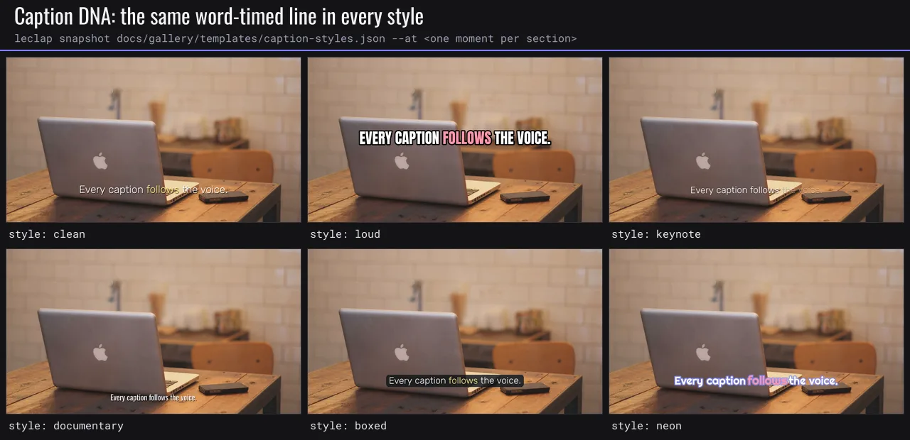

More in the [gallery](./gallery.md#captions).

```jsonc
"subtitles": {
  "words": [{ "text": "Ship", "start": 0.2, "end": 0.5 }, { "text": "faster.", "start": 0.5, "end": 1.1 }],
  "style": "loud", "karaoke": "pop", "crown": "auto"
}
```

Words are grouped into phrases: a new phrase starts after a pause ≥ `group.pause` (0.5 s), a sentence end, a comma followed by ≥ `group.commaPause` (0.25 s), or once `group.maxWords` (6) or `group.maxSeconds` (2.5) is reached. A phrase appears `lead` (0.08 s) before its first word and lingers `linger` (0.6 s), never overlapping the next. Each cue is measured with the bundled font, shrunk until it fits `maxLines` (2) balanced lines (down to `minSize`, default 75% of the size), split into consecutive cues when it still overflows, and held for at least `minDuration` (1 s). With `global.platform` set, captions stay inside its safe zones.

| Field                                                                   | Description                                                                                                                                  |
| ----------------------------------------------------------------------- | -------------------------------------------------------------------------------------------------------------------------------------------- |
| `style`                                                                 | Caption DNA: `clean` (default), `loud`, `keynote`, `documentary`, `boxed`, `neon`. See `motionCatalog().captions.styles`.                    |
| `karaoke`                                                               | `false`, `word` (the spoken word redrawn in the active colour), `fill` (words light up and stay), `pop` (eased scale bump). Default per DNA. |
| `timing`                                                                | `words` (default when timings exist) or `even` (a cue shared out by character count).                                                        |
| `group`                                                                 | `{ maxWords, maxSeconds, pause, commaPause, minSeconds, lead, linger }`: the phrase rules above.                                             |
| `crown`                                                                 | `"auto"` (the last exclaimed or final cue) or a phrase: that line is drawn larger in the crown colour, without karaoke. Once per video.      |
| `position` / `size` / `minSize` / `maxLines` / `minDuration` / `offset` | Placement and fitting; `offset` shifts every time.                                                                                           |
| `font` / `color` / `activeColor`                                        | Overrides (bundled font only; colours accept `$color.*`).                                                                                    |

Everything lowers to `drawtext` / `drawbox` gated by `enable` windows. Errors: `invalid_srt`, `invalid_word_timings` (out of order, or overlapping by more than 0.02 s), `invalid_subtitle_cue`, `subtitle_font_unmeasurable`. Advisories: `caption_split`, `caption_shrunk`, `subtitle_past_end`, `caption_crown_repeated`. See [`examples/motion-design/word-captions.json`](../examples/motion-design/word-captions.json).

## Fonts

`font` accepts three forms anywhere a text sugar takes one (`caption`, `titleCard` line styles, `global.overlays`):

| Form                          | Resolved                       | Example                                        |
| ----------------------------- | ------------------------------ | ---------------------------------------------- |
| Bundled registry id           | bundled, else catalog (cached) | `"font": "bebas"`                              |
| Raw `.ttf` filename           | bundled / catalog, else remote | `"font": "Oswald.ttf"`                         |
| `{ family, weight?, style? }` | Google Fonts (cached)          | `"font": { "family": "Inter", "weight": 700 }` |

The object form names any Google Fonts family, including multi-word ones, and picks an exact weight
(`100`–`900` in steps of 100, default `400`) and `style` (`normal` / `italic`, default `normal`):

```json
{ "caption": { "text": { "en": "Hello" }, "font": { "family": "Playfair Display", "weight": 700, "style": "italic" } } }
```

It is deliberately a different _shape_ from the string forms rather than another string: a typo in a
registry id (`"bebbas"`) stays a local `unknown_font` validation error instead of becoming a network
lookup that fails mid-render. The trade-off is that a family name is **not** checked at validation
time — there is no offline copy of Google's catalogue — so a family that does not exist surfaces as a
resolution error during the render, naming the family.

**Staging order.** A font is resolved from the cheapest source first: already staged → bundled with
the package → a persistent on-disk cache → the catalog → Google Fonts. A font that cannot be resolved
**fails the render**; it is never skipped, because a missing font does not stop `drawtext` — it just
draws with the wrong face, so the only symptom would be a silently wrong video.

**Caching.** A face resolved by family, and a catalog font, is copied into `~/.cache/leclap/fonts`
(override with `FVC_FONT_CACHE_DIR`), which outlives the build directory, so a repeat render of the
same font needs no network and does not re-hit Google's rate limit. Entries are written atomically, so
renders sharing the cache never read a half-written face. A raw filename resolved from Google is not
cached: its face is guessed from the file stem (the weight in `Roboto-Bold.ttf` is ignored).

**Platform support.** Resolving a font by family requires sending a legacy `User-Agent` — Google keys
the response format off it and otherwise returns woff2, which `drawtext` cannot read. Node and Expo
can do this; a browser cannot override the header, so the browser/WASM backend rejects the object form
up front, before rendering, with an explanatory error. Web apps should ship the fonts they need instead.

## Text legibility

Every text sugar (`caption`, `titleCard`, `lowerThird`, `global.overlays`) takes an optional `effect` — a drop shadow and/or an outline that the engine lowers onto the `drawtext` (`shadowx`/`shadowy`/`shadowcolor` and `borderw`/`bordercolor`). Both are core libfreetype, present on every backend, so text stays readable over busy footage without hand-writing the options.

```jsonc
"effect": { "shadow": true, "outline": true }
"effect": { "shadow": { "color": "#000000@0.6", "dx": 2, "dy": 2 }, "outline": { "color": "#101010", "width": 3 } }
```

| Field     | Shorthand                    | Object form                         |
| --------- | ---------------------------- | ----------------------------------- |
| `shadow`  | `true` → `#000000@0.6` @ 2,2 | `{ color?, dx?, dy? }` (px offsets) |
| `outline` | `true` → `#000000` width 2   | `{ color?, width? }` (px)           |

### Text escaping

Display text is passed to FFmpeg's `drawtext` inline and escaped for you: `:`, `%` and `\` render literally, and `[ ] , ; =`, newlines, emoji and CJK pass through unchanged. Two substitutions are deliberate: a straight apostrophe `'` is drawn as `’` and a straight double quote `"` as `”` (a straight quote would end the quoted value). Control characters other than tab and newline are dropped, and leading/trailing whitespace is trimmed by FFmpeg. `%{…}` sequences are never expanded in authored text.

### Glyph coverage (`font_missing_glyphs`, `emoji_unsupported`)

FFmpeg draws an empty box (and still reports success) for any character the font has no glyph for. For text drawn with a **bundled** font (captions, title cards, lower thirds, `drawtext` filters, global overlays, kinetic blocks), validation checks every locale against the font's character coverage and fails with:

- `font_missing_glyphs`: lists up to 10 missing characters, with a `hint` naming the bundled fonts that do cover them. When none does (e.g. CJK, Arabic, Devanagari, Thai), the hint suggests a font named by family, such as `"font": { "family": "Noto Sans JP" }` (not available in the browser; kinetic blocks need a bundled font, so move that copy to a caption or title card).
- `emoji_unsupported`: only with `global.emoji: "error"`. By default colour emoji render as images (see below).

Whitespace, zero-width joiners and variation selectors are ignored. `{{ variables }}` defined in `global.variables` are checked with their value; runtime variables are skipped. Fonts named by family and non-bundled `.ttf` files are not checked. Subtitle text is checked too.

### Emoji (`global.emoji`)

`drawtext` draws monochrome outlines, so the engine draws emoji itself. With `global.emoji: "image"` (default), each emoji in a caption, title card, lower third, global overlay, kinetic block or `drawtext` filter leaves the text, a measured gap takes its place, and a bundled 72 px colour image (about 250 common emoji, including skin tones, flags, keycaps and ZWJ sequences; CC-BY 4.0, see the [creative kit README](../packages/leclap-creative-kit/README.md)) is composited there with the text's `enable` window, motion and fade. Lookup falls back from the exact sequence to the one without U+FE0F, then without the skin tone, then the base emoji. A missing image strips the emoji (advisory `emoji_missing_asset`), and a section draws at most 24 images (`emoji_overlay_cap`). `"strip"` removes emoji (`emoji_stripped`); `"error"` fails validation with `emoji_unsupported`.

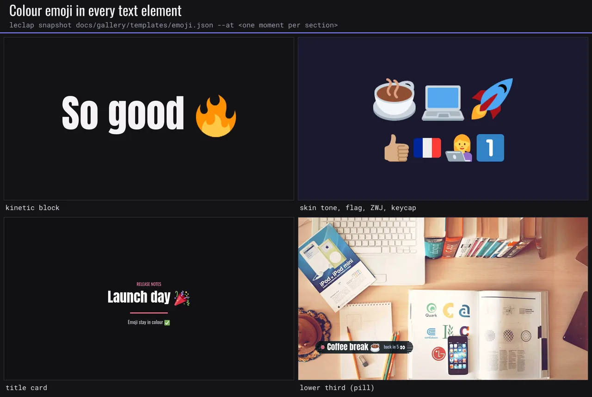

More in the [gallery](./gallery.md#emoji-and-right-to-left-scripts).

### Right-to-left and complex scripts

Arabic, Hebrew and other right-to-left scripts, and Indic, Thai and similar scripts that need shaping, animate a line at a time: a kinetic block with such text is forced to `unit: "line"` (advisory `kinetic_unit_coarsened`). Use the bundled `noto-arabic` or `noto-hebrew` fonts. `text_shaping=1` is added to such `drawtext` only when the FFmpeg build links libfribidi (the on-device engine does); otherwise the text renders unshaped and validation reports `rtl_unshaped` when the target build is known.

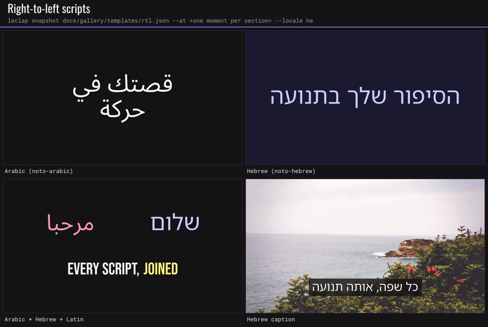

More in the [gallery](./gallery.md#emoji-and-right-to-left-scripts).

## Reveal

Every text sugar (`caption`, `titleCard`, `lowerThird`, `global.overlays`) takes an optional `reveal` — an animated entrance that the engine lowers into the `drawtext` `alpha`/`x`/`y` `t`-expressions you used to hand-write. Author it as a bare string or an object with timing:

```jsonc
"reveal": "rise"
"reveal": { "type": "slide-left", "delay": 0.3, "duration": 0.6, "distance": 60 }
```

| Type          | Effect                                               |
| ------------- | ---------------------------------------------------- |
| `none`        | No entrance (static).                                |
| `fade`        | Fades in over `duration`.                            |
| `rise`        | Rises up into place from `distance` px below + fade. |
| `slide-left`  | Enters from the right (+fade).                       |
| `slide-right` | Enters from the left (+fade).                        |

`delay` (s, default 0.3, ≥0), `duration` (s, default 0.6, >0), `distance` (px, default 60, >0, rise/slide only). Optional `easing` is `linear` (default), `ease-out` (cubic-out), `ease-in-out` (smoothstep), or `ease-out-back` (about 10% travel overshoot). Any [motion easing](#easing) is also accepted: springs, cubic-bezier, the named set, or tokens. It curves text travel and alpha; back easing clamps alpha to 0..1 while allowing position to overshoot. In `titleCard`/`lowerThird` the lines enter top-to-bottom. Title cards accept `stagger` (seconds, 0..1, default 0.15) between non-empty lines; zero reveals them together. Empty lines consume no stagger slot, and the accent bar follows its associated emitted line. Lower thirds retain the fixed 0.15-second stagger.

## Exit

A positioned text overlay (a `drawtext` filter on a section, as the builder emits) also takes an optional `exit` — an animated **departure** that the engine bakes alongside the entrance onto the same `drawtext` (the combined alpha is `enterFade × exitFade`, and the position eases from any entrance offset out to the exit offset). Same vocabulary as `reveal`; author it as a bare string or an object with timing:

```jsonc
"exit": "fade"
"exit": { "type": "slide-left", "after": 2.5, "duration": 0.6, "distance": 60, "easing": "ease-out" }
```

The types match `reveal` (`none`/`fade`/`rise`/`slide-left`/`slide-right`). The one extra field is **`after`** — seconds from the section start when the exit begins; omit it and the engine times the exit to **end at the section's end**. `duration` (s, default 0.6, >0), `distance` (px, default 60, >0, rise/slide only) and `easing` (`linear`/`ease-out`/`ease-in-out`/`ease-out-back`, default `linear`) behave as for `reveal`. `after` must be ≥0. Rise exits travel upward, slide-left exits travel left and slide-right exits travel right. Omitted easing preserves historical output. Exits remain positioned `drawtext` controls; caption/titleCard/lowerThird blocks do not gain an `exit` field.

## Motion system

The motion system gives every template motion tokens, physical springs, CSS-style curves, keyframe tracks and an energy dial, on top of the [determinism contract](#determinism) (frame-grid conform, seeded noise, bit-exact muxing). Everything compiles to plain FFmpeg expression arithmetic, so it renders identically on Node, WASM and on-device. The study [`examples/motion-design/spring-kinetics.json`](../examples/motion-design/spring-kinetics.json) uses every feature. Examples for every native motion, caption, footage and audio control live in [`examples/motion-design/`](../examples/motion-design/README.md) and play at `/showcase` under **Effects & editing**.

### Compose motion, don't pick stock animations

Motion assembled from stock parts looks the same in every template. Compose it for the brief:

1. Start from the creative direction (`meta.creativeDirection`): audience, brand and energy (`global.motion.energy`).
2. Write a motion intent for each section: what moves, why, and how it should feel.
3. Build each intent from engine primitives: [kinetic typography](#kinetic-typography), [`animate` tracks](#keyframe-tracks-animate) with [ease tokens or springs](#easing), the [camera](#camera), [designed transitions](#designed-transitions), [graphics](#graphics) including `type: "fx"` light primitives clipped to a `target`, [motion roles](#motion-roles), and [beats and cues](#time-references) for timing.
4. Tune the parameters that define the look. For an fx, that means profile, width, tilt, direction, colour token, intensity, duration and ease. For a preset, it means delay, stagger, distance and accent. Never ship all defaults.
5. Keep one or two signature moves per video. The other beats stay simpler.

The creative-kit library animations (`animations/*.apng`, such as `shine_sweep`, `confetti` and `light_leak`) are **samples** of what an [overlay input](#overlay-inputs-animations--images) can do. Use one only as a last resort. `motionCatalog().samples` (MCP `get_motion_catalog`) maps each sample to the primitives that replace it. Catalog search always ranks engine primitives above samples.

The sameness lint runs on the [motion feedback](#motion-feedback) channel. Its findings are advisory, and each one has a `hint`:

| Code                       | When                                                                                                                                            |
| -------------------------- | ----------------------------------------------------------------------------------------------------------------------------------------------- |
| `fx_untuned`               | An fx graphic sets none of its look parameters (primitive fields, `color`, `intensity`, `duration`, `ease`, `repeat`, `every`, `seed`, `role`). |
| `effect_repeated`          | One fx effect, decorative graphic, kinetic preset or camera preset drives more than 3 sections and more than half of them.                      |
| `library_animation_sample` | A section input or `global.animations` entry uses a library sample (`animations/<name>.apng`). The hint names the replacement.                  |
| `effect_off_theme`         | An fx, `frame` or `corners` colour is a literal in a themed template, or (unthemed) a hex used nowhere else in the template.                    |
| `decor_overload`           | More than 2 decorative effects (fx, flash, glitch, frame, corners, wipe, focus, animation overlays) in one section.                             |

### Easing

Every `easing` (reveal, exit, overlay `motion`) and every keyframe `ease` accepts:

| Spec                                                                                                                                                                                                                                                             | Behaviour                                                                                                                                                                                                                                                                        |
| ---------------------------------------------------------------------------------------------------------------------------------------------------------------------------------------------------------------------------------------------------------------- | -------------------------------------------------------------------------------------------------------------------------------------------------------------------------------------------------------------------------------------------------------------------------------- |
| `linear`, `ease-out`, `ease-in-out`, `ease-out-back`                                                                                                                                                                                                             | The historical curves. They are valid in v1 too and lower to the exact historical expressions.                                                                                                                                                                                   |
| `ease`, `ease-in`                                                                                                                                                                                                                                                | CSS keyword curves.                                                                                                                                                                                                                                                              |
| `ease-in-cubic`, `ease-out-cubic`, `ease-in-out-cubic`, `ease-out-quart`, `ease-out-quint`, `ease-out-expo`, `ease-in-out-expo`, `ease-out-sine`, `ease-in-out-sine`, `ease-out-circ`, `ease-in-back`, `ease-in-out-back`, `ease-out-elastic`, `ease-out-bounce` | The named set.                                                                                                                                                                                                                                                                   |
| `cubic-bezier(x1, y1, x2, y2)`                                                                                                                                                                                                                                   | CSS cubic-bezier. `x1`/`x2` must be in 0..1; `y1`/`y2` may overshoot (-5..5).                                                                                                                                                                                                    |
| `spring(stiffness, damping[, mass[, velocity]])`                                                                                                                                                                                                                 | A closed-form damped harmonic oscillator. Stiffness is 1..2000, damping 1..200, mass 0.1..20, velocity -50..50, and the damping ratio must be at least 0.1. **When no `duration` is authored, the spring takes its own settle time** (until it stays within 0.1% of its target). |
| `steps(n[, start\|end])`                                                                                                                                                                                                                                         | Stop-motion steps, lowered exactly.                                                                                                                                                                                                                                              |
| `{ "points": [[0,0],[0.4,1.08],[1,1]] }`                                                                                                                                                                                                                         | A custom curve through control points, from p=0 to p=1.                                                                                                                                                                                                                          |
| `$name`                                                                                                                                                                                                                                                          | A [motion token](#motion-tokens).                                                                                                                                                                                                                                                |

Each curve is lowered at compile time to a piecewise cubic polynomial in `t`. Segmentation is adaptive and stays within 0.1% of the true curve, so a spring costs a few multiply-adds per frame. Position may overshoot, but alpha is always clamped to 0..1.

### Motion tokens

`global.motion` is one design system for time:

```jsonc
"global": {
  "motion": {
    "energy": 0.8,                                              // 0..1.5, default 1
    "springs": { "land": { "stiffness": 260, "damping": 17 } }, // referenced as "$land"
    "curves": { "brand": "cubic-bezier(0.2, 0, 0, 1)" },        // referenced as "$brand"
    "durations": { "beat": 0.5 }                                // keyframe times: "$beat", "+$beat"
  }
}
```

The built-in tokens are always available and can be overridden by name:

- Springs: `$snappy` (420/30), `$gentle` (170/26), `$bouncy` (300/14), `$wobbly` (180/12).
- Curves: `$smooth`, `$juicy` and `$expo`, which are the web app's own `--ease-smooth`, `--ease-spring` and `--ease-out-expo`, plus `$anticipate`.
- Durations: `$stagger` 0.06, `$micro` 0.18, `$short` 0.35, `$base` 0.6, `$long` 1.1, `$hold` 2.5.

**Energy** scales every rise/slide travel distance (reveal, exit, overlay motion, global overlays) and every relative keyframe offset. `0` gives a reduced-motion cut (fades only); `1.5` is the hype cut. Camera `motion` arrays are not scaled.

### Motion roles

`global.motion.roles` sets the feel of each class of object: `micro`, `panel`, `camera`, `headline`, `accent`, `mascot`. Each is `{ "ease": <easing or $token>, "duration"?: <seconds or $token>, "overshoot"?: "none" | "subtle" | "playful" }` and replaces the built-in role of that name.

| Role       | Default ease       | Default duration  | Overshoot |
| ---------- | ------------------ | ----------------- | --------- |
| `micro`    | `ease-out-cubic`   | 0.2 s             | none      |
| `panel`    | `$expo`            | 0.55 s            | none      |
| `camera`   | `ease-in-out-sine` | (element default) | none      |
| `headline` | `$expo`            | 0.7 s             | none      |
| `accent`   | `$snappy`          | (physics)         | subtle    |
| `mascot`   | `$bouncy`          | (physics)         | playful   |

Set `role` on a kinetic block, a graphic, a `drawtext` filter (reveal, exit, animate keys), a `titleCard`, a `lowerThird` or the `camera`. The role fills the ease the element leaves unset, and its duration too unless the element sets one. An explicit `ease` always wins and keeps its own timing. `$role.<name>` is a token: use it as any ease (`"ease": "$role.panel"`) or as a keyframe duration (`"t": "+$role.micro"`). Advisories: `overshoot_overuse` (more than half of a section's 3+ entrances overshoot) and `headline_hold_short` (a headline holds less than 0.4 s + words / 3.5 s after landing). `motionCatalog().roles` lists the defaults with guidance.

### Keyframe tracks (`animate`)

A positioned `drawtext` filter takes `animate` tracks for `x`, `y`, `opacity` and `scale`. Each key eases **into** itself from the previous key:

```jsonc
{
  "type": "drawtext",
  "values": { "text": { "en": "PHYSICS," }, "fontfile": "BebasNeue.ttf", "fontsize": 200, "x": 80, "y": 150 },
  "animate": {
    "y": [
      { "t": 0.1, "v": "+140" },
      { "v": "+0", "ease": "$land" },
    ],
    "opacity": [
      { "t": 0.1, "v": 0 },
      { "t": "+$micro", "v": 1 },
    ],
    "scale": [
      { "t": 0.1, "v": 0.86 },
      { "t": "+$long", "v": 1, "ease": "$bouncy" },
    ],
  },
}
```

- `t`: seconds from the section start, `"+0.3"` relative to the previous key, or a duration token. If omitted, the first key is at 0 and later keys wait for the previous key plus the ease's natural duration (a spring's settle time, else 0.6 s).
- `v`: for `x`/`y`, pixels, or `"+80"`/`"-40"` relative to the resting position from `values.x`/`values.y`. For `opacity`, 0..1. For `scale`, a multiplier of a **numeric** `values.fontsize`; the text is re-rasterized every frame, so it stays crisp.
- A track overrides the same property from `reveal`/`exit`. Other properties keep their entrance and exit.

Validation codes: `unknown_motion_token`, `invalid_motion_token`, `invalid_easing`, and `invalid_keyframes` (keys out of order, relative opacity/scale, scale without a numeric fontsize, tracks on anything but `drawtext`). Grammar errors in an easing string fail at the schema with the reason, e.g. `unknown easing "ease-outt"`.

## Title cards

A `color_background` section takes a section-level `titleCard` that collapses the kicker / headline / accent bar / subtitle / fade boilerplate into one block. Positions and sizes are derived from the output scale, so one card renders correctly in any orientation.

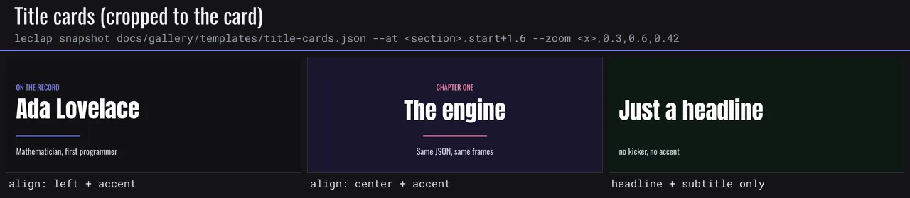

More in the [gallery](./gallery.md#lower-thirds-and-title-cards).

```jsonc
{
  "name": "intro",
  "type": "color_background",
  "options": { "backgroundColor": "#0d1b2a", "duration": 2.6 },
  "titleCard": {
    "kicker": { "en": "ON THE RECORD" },
    "headline": { "en": "{{ form_1_name }}" },
    "subtitle": { "en": "{{ form_1_title }}" },
    "accent": "#7C83FD",
    "reveal": "rise",
  },
}
```

| Field                          | Type             | Description                                                                               |
| ------------------------------ | ---------------- | ----------------------------------------------------------------------------------------- |
| `kicker`/`headline`/`subtitle` | `Translation`    | The three lines (all optional; emit only what has text).                                  |
| `accent`                       | hex              | Draws an underline bar and tints the kicker.                                              |
| `align`                        | `left`\|`center` | Horizontal alignment (default `left`).                                                    |
| `background`                   | hex              | Fade colour (defaults to the section background).                                         |
| `stagger`                      | number           | Seconds between non-empty line entrances, 0..1 (default 0.15); zero starts them together. |
| `reveal`                       | `Reveal`         | Staggered entrance for the lines (default `rise`).                                        |
| `fade`                         | `{ in?, out? }`  | Auto fade-in / fade-out over the card (both default on; set `out: false` on an outro).    |

## Lower thirds

Any visual section takes a `lowerThird` — a title/subtitle band over the clip with an optional right-aligned badge. It composites **on top** of any animation overlay (no `maps`/`@name` ceremony needed). `accent` and `boxOpacity` are separate fields so you never write `{{ var }}@alpha` by hand.

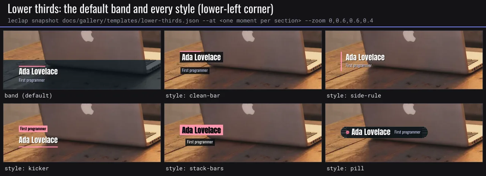

More in the [gallery](./gallery.md#lower-thirds-and-title-cards).

```jsonc
"lowerThird": {
  "title": { "en": "{{ form_1_name }}" },
  "subtitle": { "en": "{{ form_1_tagline }}" },
  "badge": { "en": "{{ form_1_price }}" },
  "accent": "#7C83FF", "reveal": "rise"
}
```

| Field              | Type              | Description                                                                                                                                                                       |
| ------------------ | ----------------- | --------------------------------------------------------------------------------------------------------------------------------------------------------------------------------- |
| `title`/`subtitle` | `Translation`     | The two lines (optional).                                                                                                                                                         |
| `badge`            | `Translation`     | Optional right-aligned pill (a price, a step number).                                                                                                                             |
| `accent`           | hex               | Accent bar + badge background.                                                                                                                                                    |
| `boxOpacity`       | 0..1              | Legibility band opacity (default 0.6; `0` = no band).                                                                                                                             |
| `position`         | `bottom`\|`top`   | Vertical anchor (default `bottom`).                                                                                                                                               |
| `reveal`           | `Reveal`          | Staggered entrance (default `rise`).                                                                                                                                              |
| `style`            | lower-third style | `clean-bar`, `side-rule`, `kicker`, `stack-bars` or `pill`; unset keeps the full-width band. Each has its own default reveal (slide-right, slide-right, rise, slide-right, fade). |

`motionCatalog().lowerThirds` describes each style.

## Global decorations

Whole-video text/colour, the sibling of `global.animations`: authored once in `global`, applied to every section (or a named subset). A brand watermark authored once instead of re-drawn per section.

```jsonc
"global": {
  "overlays": [
    { "text": { "en": "{{ brand }}" }, "position": "top-right", "color": "#ffffff", "reveal": "fade" }
  ],
  "look": "cinematic"
}
```

`global.overlays[]` — each: `text` (Translation), `position` (`top-left`/`top-right`/`bottom-left`/`bottom-right`/`top`/`bottom`/`center`, default `top-right`), `font`/`size`/`color`/`opacity`, `reveal`, and `sections?` (array of section names to limit it to). `global.look` / `global.grade` apply a whole-video colour grade. (`global.grade` is bypassed on a section that already has an animation-overlay graph — apply per-section `grade` there instead.)

## Overlay inputs (animations & images)

`inputs[]` composites overlays on top of a section. Each input is one of two `type`s — `animation` (a single-file animated input) or `image` (a single still picture). Both share the same `position`/`scale` placement convention and composite in array order (later entries paint on top), so a section can carry any number of them — e.g. a branded backdrop, a logo, and a confetti animation at once.

### `type: "animation"`

The bundled `animations/*.apng` files are samples. In a new template, compose the motion with the engine instead (see [Compose motion](#compose-motion-dont-pick-stock-animations)). `validate_template` reports `library_animation_sample` for them. Each one has an engine counterpart: `shine_sweep` → an fx `sheen`, `sparkle` and `spec_orbit` → an fx `glint` (`path: "orbit"`), `light_leak` → an fx `leak`, `confetti` → an fx `confetti`, `pulse_ring` and `tap_pulse` → an fx `ripple`, `glow_border` → an fx `edge-glow`, `corner_brackets` → `corners`, and `white_border` / `rounded_border` → a `frame`. Existing templates that reference a sample keep rendering it unchanged.

An animation is **one** single-file animated input. **APNG** and **WebM** (VP9 with alpha) are the two recommended formats — APNG decodes natively on every platform (incl. on-device) with lossless alpha; WebM is much smaller. `.webp` and `.gif` also work:

```jsonc
{
  "name": "confetti",
  "url": "{{ confettiUrl }}", // e.g. "animations/confetti.apng"
  "type": "animation",
  "options": {
    "fps": 25, // informational; the file's own frame rate governs playback
    "position": "0:0", // overlay "x:y" in output px
    "scale": "640:-1", // pre-composite scale "w:h"
    "opacity": 0.6, // 0..1, default 1 — fades the whole overlay
    "loop": true, // → -stream_loop -1 (play for the whole section)
    "loops": 3, // OR a finite play count → -stream_loop {N-1} (overrides loop)
    "duration": 8, // OR seconds the overlay plays → -t 8 (overrides loops/loop)
    "start": 3, // delay before it appears, seconds → -itsoffset 3 (default 0)
    "persistent": true, // → eof_action=repeat (holds last frame past EOF)
    "rotation": 0, // clockwise degrees applied before compositing (default upright)
    "motion": "rise", // animated entrance, reuses the Reveal vocabulary (see below)
  },
  "filters": [/* optional raw chain on this input before compositing */],
}
```

**Playback extent** — set exactly one of `loop` (forever), `loops` (a finite play count), or `duration` (seconds); precedence is `duration` > `loops` > `loop`. `start` delays the overlay (`-itsoffset`, default 0). `persistent` maps to `eof_action=repeat` (freeze the last frame once the overlay ends, instead of letting the video show through). `opacity` < 1 fades the leg via `colorchannelmixer=aa`. Reference an input by `@name` from a `maps[]` entry.

**Motion** — `options.motion` gives the overlay an animated entrance, reusing the [Reveal](#reveal) vocabulary (`fade`/`rise`/`slide-left`/`slide-right`, or an object with `delay`/`duration`/`distance`). It compiles to time-expressions on the `overlay` `x`/`y` (and the leg's fade for `fade`), so a logo or animation can slide / rise / fade into place. Available on both `animation` and `image` inputs.

### `type: "image"`

A still picture (PNG/JPG/WebP) composited over the section — a backdrop, watermark, or logo. It is held for the section's full duration (`-loop 1`) and placed with the same `position`/`scale` as an animation. The builder names these `image_0`, `image_1`, … by their array order:

```jsonc
{
  "name": "image_0",
  "url": "{{ logoUrl }}", // e.g. "pictures/logo.png", or a library:// / media:// marker (web/expo)
  "type": "image",
  "options": {
    "position": "40:40", // overlay "x:y" in output px
    "scale": "160:-1", // pre-composite scale "w:h" (-1 keeps aspect)
    "opacity": 0.9, // 0..1, default 1
    "rotation": 0, // clockwise degrees (default upright)
    "motion": "slide-left", // animated entrance — same Reveal vocabulary as an animation overlay
  },
}
```

In the template builder, each image is picked from the bundled library or uploaded, then **dragged to position and resized** on the preview frame — exactly like an animation overlay. It takes the same `opacity`/`rotation`/`motion` options too.

## Whole-video animations

`inputs[]` overlays are scoped to one section — they restart at every section. To run an overlay **continuously across the whole video** (a border that holds through intro → clip → outro, a drifting light leak, a grain layer), declare it under `global.animations[]`. The engine composites these once over the **final joined video** — after the sections are concatenated, before music is mixed — so the same mechanism that lets music span the whole video lets an animation span it too.

```jsonc
"global": {
  "animations": [
    {
      "url": "animations/light_leak.apng", // animated: .apng/.webp/.gif/.webm (stream-looped); still: .png/.jpg/.jpeg (-loop 1, always spans the whole video — start/duration gate its VISIBLE window, not its loop). May use {{ varName }}.
      "duration": 8,        // play for 8s (omit for `loop: true` to span the whole video)
      "start": 3,           // delay before it appears, seconds (default 0)
      "opacity": 0.35,      // 0..1, default 1 — fade the overlay
      "position": "0:0",   // overlay "x:y" in output px (default top-left)
      "scale": "1280:720", // pre-composite scale "w:h" (-1 keeps aspect)
      "rotation": 0,        // clockwise degrees (default upright)
      "persistent": false   // freeze last frame on end vs. let the video show through
    }
  ]
}
```

Each entry takes the same placement/playback options as a section animation input (`position`/`scale`/`opacity`/`rotation`, the playback extent `loop`/`loops`/`duration`, and `start`/`persistent`), minus `name`/`type`/`maps`. They composite in array order (later entries paint on top of earlier ones, on top of every section). A whole-video overlay sits **above** everything, including a section's own `maps[]` composite — for an overlay that must sit _under_ a section's drawn elements, keep it as a section input. The builder exposes these in its **Style & audio** step as "Whole-video animations".

## Watermark

`global.watermark` is authoring-time sugar for the single most common whole-video overlay: a still logo pinned to a corner for the entire video. It is pure sugar over `global.animations` — it lowers into one entry (`watermarkToAnimation`, prepended so any explicit `global.animations[]` entry still composites on top of it) and needs no dedicated engine support of its own.

```jsonc
"global": {
  "watermark": {
    "url": "pictures/logo.png", // png/jpg watermark image; may use {{ varName }}
    "position": "bottom-right", // top-left / top-right / bottom-left / bottom-right (default bottom-right)
    "scale": 0.12,              // fraction of the output WIDTH, 0.02..0.5 (default 0.12)
    "opacity": 0.8,             // 0..1 (default 0.8)
    "margin": 24                // inset from the frame edges in output px, 0..200 (default 24)
  }
}
```

`scale` resolves against the project's output width into a pixel width emitted as `"<px>:-1"` (aspect-preserving); `position` resolves to the corner's overlay `x:y` expression (e.g. bottom-right → `"W-w-<margin>:H-h-<margin>"`). Exactly one watermark per template — it is authoring-time only (no end-user override) and always spans the whole video (no `start`/`duration`).

## Maps

`maps[]` wires the FFmpeg filtergraph explicitly — only needed for multi-input / overlay sections beyond what the sugar covers.

| Field     | Type                              | Description                                                                                 |
| --------- | --------------------------------- | ------------------------------------------------------------------------------------------- |
| `inputs`  | `string[]`                        | Ordered input stream labels feeding this graph. `@name` resolves to an input/animation pad. |
| `outputs` | `string[]`                        | Ordered output labels; the **final** map's last output **must end with `final`**.           |
| `filters` | `Filter[]`                        | Filter chain between inputs and outputs.                                                    |
| `options` | `{ useSectionFilters?: boolean }` | When true, the section-level `filters` run inside this map's chain.                         |

## Filters

`filters[]` is the **raw FFmpeg escape hatch** — each entry is passed through verbatim:

For a hand-framed scene, a final `{ "type": "scale", "value": "output" }` is a LeClap shorthand: aspect-preserving scale and pad to the project's actual `videoConfig.scale`, then square pixels (`setsar=1`). It prevents a fixed-size custom frame from breaking concatenation when output orientation or resolution changes. Padding is black. Other `scale` values remain raw FFmpeg arguments.

| Field    | Type               | Description                                                                                           |
| -------- | ------------------ | ----------------------------------------------------------------------------------------------------- |
| `type`   | `string`           | Raw FFmpeg filter name (`drawtext`, `drawbox`, `fade`, `vignette`, `boxblur`, `overlay`, `scale`, …). |
| `value`  | `string \| number` | Single scalar arg for simple filters.                                                                 |
| `values` | `FilterValues`     | Structured args — **FFmpeg-native keys** (see below).                                                 |
| `range`  | `string`           | Active window as `"start:end"` in seconds.                                                            |
| `reveal` | `Reveal`           | Animated entrance for positioned `drawtext` (see [Reveal](#reveal)).                                  |
| `exit`   | `Exit`             | Animated departure for positioned `drawtext` (see [Exit](#exit)).                                     |

`values` keys (kept FFmpeg-native **by design**): `x`, `y`, `w`, `h`, `c`, `t`, `text` (a `Translation`), `fontcolor`, `fontsize`, `fontfile`, `alpha`, `d`, `st`, `color`, `box`, `boxcolor`, `boxborderw`, `shadowcolor`, `shadowx`, `shadowy`, `bordercolor`, `borderw`, `enable`.

`text`, `title`, `description`, and form-field `label` are `Translation` objects (`{ "en": "…", "fr": "…" }`) for i18n.

## Variables & placeholders

- **`global.variables`** — `string` or `string[]`; reference anywhere with `{{ name }}`. Resolved by `VariableManager`.
- **`{{ colorN }}`** — 1-indexed into `global.colorsList`.
- **`{{ form_field }}`** — a `form` section's field `name`, filled at compose time.

### Typed fields (`global.fields`)

`global.variables` is free text. `global.fields` declares the template's **inputs** instead: what a host must
(or may) fill in, with a type the engine checks. Declare them as a map (name → spec) or as a list of
`{ name, … }`; names are word characters (`[A-Za-z0-9_]`).

| Key           | Type               | Description                                             |
| ------------- | ------------------ | ------------------------------------------------------- |
| `type`        | see below          | Required.                                               |
| `default`     | `string \| number` | Used when no value is provided. Must fit the type.      |
| `required`    | `boolean`          | A render without a value (and without a default) fails. |
| `maxLength`   | `number`           | `text` only: longest accepted value.                    |
| `min` / `max` | `number`           | `number` and `time`: accepted range.                    |
| `options`     | `string[]`         | `enum` only (required there): the accepted values.      |
| `label`       | `Translation`      | What a builder shows next to the input.                 |
| `description` | `string`           | Help text for authors and agents.                       |

| Type     | Accepts                                                                                                                                                                                      | Substituted as                                             |
| -------- | -------------------------------------------------------------------------------------------------------------------------------------------------------------------------------------------- | ---------------------------------------------------------- |
| `text`   | any text (≤ `maxLength`); an optional text field without value is `""` (blank counts as no value)                                                                                            | string                                                     |
| `color`  | `#rrggbb(aa)`, `0xrrggbb`, an FFmpeg colour name (`white`, `lightgrey`), `#rgb(a)` and `rgb()`/`rgba()` (rewritten to `#rrggbb(aa)`), each with an optional `@alpha` from 0 to 1 (`red@0.5`) | string                                                     |
| `url`    | an `http(s)://`, `data:` or `media://` URL, or a relative path; other schemes are refused                                                                                                    | string                                                     |
| `media`  | a file path or URL                                                                                                                                                                           | string                                                     |
| `number` | a decimal number, or a decimal string (`"2.5"`, not `"0x10"`), within `min`/`max`                                                                                                            | number                                                     |
| `enum`   | one of `options`                                                                                                                                                                             | string (a numeric option fills a numeric slot as a number) |
| `time`   | seconds (`4.5`) or a clock (`"1:02.5"`, `"0:01:02"`; seconds and minutes below 60)                                                                                                           | number (s)                                                 |

```json
{
  "global": {
    "fields": {
      "TITLE": { "type": "text", "required": true, "maxLength": 32, "label": { "en": "Title" } },
      "ACCENT": { "type": "color", "default": "#ff5a36" },
      "HOLD": { "type": "number", "default": 3, "min": 1, "max": 8 }
    }
  },
  "sections": [
    {
      "name": "title",
      "type": "color_background",
      "options": { "backgroundColor": "{{ ACCENT }}", "duration": "{{ HOLD }}" },
      "titleCard": { "headline": { "en": "{{ TITLE }}" } }
    }
  ]
}
```

**Resolution.** A value comes from the render's inputs (`ProjectConfig.fields`, `leclap render --set NAME=value`,
the MCP `fields` argument), else from `default`. It is coerced by its type, then every `{{ NAME }}` of a declared
field is filled across the descriptor, after partials expand and before formats resolve. A placeholder that is
the **whole** string takes the typed value, so `"duration": "{{ HOLD }}"` becomes the number `3`; one inside a
longer string is written as text (`"{{ TITLE }} — live"`). The slot has the last word: a number alone in a
text slot (`"text": { "en": "{{ PRICE }}" }`) goes in as its text, and a numeric enum option alone in a numeric
slot goes in as a number. Substituted text is never scanned again, and the filled descriptor no longer carries
`global.fields`, so filling it twice changes nothing. The filled descriptor then goes through the normal
schema, so a value its slot rejects fails **at that slot** (`field_type_mismatch` at `sections.0.options.duration`).
A render refuses a missing required value or one that fails its type before encoding anything.
`leclap resolve template.json --set TITLE=Hi` and the MCP `get_resolved_template` tool print the descriptor the
build starts from: partials expanded, the fields filled, the format resolved. `global.variables` and form values
stay as placeholders there; the engine fills them as it draws.

**Text belongs in text slots.** A raw filter value (`filters[].values.fontsize`, `values.enable`, any key but
`text`) goes to FFmpeg as written, so a field value carrying a filtergraph separator (`, ; : ' [ ] = \`) is
refused there (`field_type_mismatch`): `"fontsize": "{{ SIZE }}"` with `10,movie=/etc/passwd` never reaches
FFmpeg. Put text fields in `values.text` or the text sugar (`titleCard`, `reveal`, `lowerThird`), which escape it.

Placeholders of names that are not declared fields (`global.variables`, form fields, partial variables) are
left to the later passes. Templates without `global.fields` are unaffected.

**Forms.** A form field named like a declared field is bound to it: the declaration owns the type, default,
range and options; the form field keeps its `label` and `maxLength`. A form field bound to a non-text declared
field may leave `maxLength` out (its typed control checks the value instead). The web builder then shows a
matching control (colour picker, number input, select, URL input), and gathers the declared fields no form asks
for into a "Template inputs" step, counted in its progress.

**Advisories** (only for templates that declare `global.fields`; returned by `getFieldWarnings`, and with the
motion feedback of `leclap validate` and `validate_template`):

| Code                     | When                                                                                                   |
| ------------------------ | ------------------------------------------------------------------------------------------------------ |
| `field_undefined`        | `{{ x }}` names no declared field, variable, form field nor partial variable (nearest name suggested). |
| `field_unused`           | A declared field is never referenced (a form field of that name counts as a use).                      |
| `field_type_mismatch`    | A default or provided value does not fit its type, or a filled slot rejects it.                        |
| `field_missing_required` | A required field, or a non-text one, has neither a value nor a default.                                |

Validating without values (`leclap validate`) fills a missing field with a stand-in of its type so the rest of
the template is still checked, and hands back the descriptor as authored (placeholders kept) for the render to
fill; validating with values (`validateTemplate(t, { fields })`, a render) is strict and hands back the filled
descriptor.

---

## Example: simple (cuts, music)

A minimal, complete, valid descriptor — two clips joined by hard cuts with a background track.

```json
{
  "global": {
    "orientation": "landscape",
    "musicEnabled": true,
    "music": { "name": "lofi-jazz-music.mp3" },
    "audio": { "sourceVolume": 1, "musicVolume": 0.5 }
  },
  "sections": [
    {
      "name": "intro",
      "type": "color_background",
      "transition": { "type": "cut" },
      "options": { "backgroundColor": "#0d1b2a", "duration": 2 },
      "filters": [
        {
          "type": "drawtext",
          "values": {
            "text": { "en": "My Story" },
            "fontcolor": "#ffffff",
            "fontsize": 96,
            "x": "(w-text_w)/2",
            "y": "(h-text_h)/2",
            "fontfile": "BebasNeue.ttf"
          }
        }
      ]
    },
    {
      "name": "clip",
      "type": "video",
      "options": { "videoUrl": "{{ clip }}", "duration": 6 },
      "filters": [
        { "type": "fadein", "values": { "color": "#0d1b2a" } },
        { "type": "fadeout", "values": { "color": "#0d1b2a" } }
      ]
    }
  ]
}
```

(Declare `clip` in `global.variables`, or pass it at compose time.)

## Example: rich (transition + look + motion + audio + layers)

A complete, valid descriptor exercising the structured-sugar layer: a layered title card that wipes into a Ken-Burns still and a graded camera clip, with ducked, normalised audio.

```json
{
  "global": {
    "orientation": "landscape",
    "musicEnabled": true,
    "music": { "name": "lofi-jazz-music.mp3" },
    "transition": { "type": "fade", "duration": 0.4 },
    "audio": {
      "sourceVolume": 1,
      "musicVolume": 0.5,
      "normalize": "loudnorm",
      "ducking": { "threshold": 0.05, "ratio": 8 }
    }
  },
  "sections": [
    {
      "name": "title",
      "type": "color_background",
      "title": { "en": "Title card" },
      "transition": { "type": "wipeleft", "duration": 0.4 },
      "options": {
        "backgroundColor": "#0d1b2a",
        "duration": 2.4,
        "audioFade": { "in": { "duration": 0.6, "curve": "qsin" } },
        "layers": [
          { "color": "#13243f", "opacity": 1, "x": 0, "y": 0, "w": 1280, "h": 150 },
          {
            "x": 0,
            "y": 570,
            "w": 1280,
            "h": 150,
            "gradient": { "from": "#13243f", "to": "#0d1b2a", "direction": "vertical" }
          }
        ]
      },
      "filters": [
        {
          "type": "drawtext",
          "values": {
            "text": { "en": "PRESENTING" },
            "fontcolor": "#e8eef7",
            "fontsize": 30,
            "x": "(w-text_w)/2",
            "y": 250,
            "fontfile": "Oswald.ttf"
          }
        }
      ]
    },
    {
      "name": "still",
      "type": "image_background",
      "transition": { "type": "fade", "duration": 0.4 },
      "options": { "pictureUrl": "{{ photo }}", "duration": 3 },
      "look": "cinematic",
      "grade": { "contrast": 1.1, "saturation": 1.2 },
      "motion": [{ "type": "kenburns", "direction": "in", "intensity": 1.2 }]
    },
    {
      "name": "clip",
      "type": "project_video",
      "title": { "en": "Record your clip" },
      "options": {
        "duration": 30,
        "forceAspectRatio": true,
        "framingGuide": { "type": "silhouette", "position": "center", "opacity": 0.5 }
      },
      "look": "warm",
      "grade": {
        "brightness": 0.02,
        "saturation": 1.15,
        "colorBalance": { "highlights": { "r": 0.05, "b": -0.05 } }
      },
      "filters": [{ "type": "vignette" }]
    }
  ]
}
```

> Note: no transition is declared on the **last** rendering section (`clip`) — a non-`cut` one there would be rejected (`dangling_transition`). Each declared transition duration (0.4 s) is shorter than the smaller adjacent `duration`, satisfying `transition_too_long`. `kenburns` sits on an `image_background`, satisfying `motion_unsupported_section`.

## Validating

Run a descriptor through `TemplateValidator` (zod + the cross-field rules above). On failure, zod reports the exact path/field — fix the JSON to match the schema. Cross-field rules also flag: a whole-video animation with no url (`global_animation_missing_url`) and a `caption`/`global.overlays` `font` string that is neither a bundled id nor a `.ttf` filename (`unknown_font` — a typo would otherwise silently fall back to the default font; the `{ family }` object form is checked at render time instead, see [Fonts](#fonts)). After editing any `.json`, run `pnpm fmt`. To regenerate the machine-readable schema after a zod change: `pnpm --filter ffmpeg-video-composer generate:schema`.

### Validation findings

`TemplateValidator.validateTemplate()` (and `leclap validate`, and the MCP `validate_template` tool) returns **every** finding in one pass: schema errors, unknown keys and the descriptor rules (once the schema parses). Each finding has a `path`, `message` and `code`, and, when the validator knows how to fix it:

| Field        | Meaning                                                                                                                                                                                                            |
| ------------ | ------------------------------------------------------------------------------------------------------------------------------------------------------------------------------------------------------------------ |
| `hint`       | One actionable sentence, e.g. `Rename "colour" to "color".`                                                                                                                                                        |
| `suggestion` | A concrete replacement value for the field at `path` (for `unknown_key`, the key name to use instead).                                                                                                             |
| `kind`       | `format`: a mechanical fix (renamed key, typo'd value) that is safe to apply as-is. `judgement`: the fix changes creative content (timing, a removed effect, a value to choose), so confirm with the author first. |

Notable codes:

- `unknown_key`: a key the schema does not declare, including on objects that would otherwise drop it silently. The suggestion is the closest allowed key at that path (typos, `font-size` → `fontsize`, and common synonyms such as `colour` → `color`, `ease` → `easing`, `start` → `delay`/`at`, `zoom` → `intensity`, only when the target exists there). Keys starting with `$` or `_` are treated as comments and ignored; free-form maps (translations, `global.variables`, effect `props`/`assets`, motion tokens, raw filter `values`) are never checked. At the descriptor's top level, host-specific fields are tolerated unless they look like a typo of a real key (`section` → `sections`).
- `invalid_value`: a value outside an enum (including an unknown section or graphic `type`); the hint lists the allowed values and the suggestion is the nearest one.
- Rule findings such as `transition_too_long` (suggests a transition with a fitting `duration`), `dangling_transition` (suggests `{ "type": "cut" }`), `unknown_font`, `undefined_section_reference`, `undefined_variable`, `field_type_mismatch`, `field_missing_required`, `unknown_motion_token` and `invalid_easing` (nearest name) carry hints too.

`leclap validate` prints each hint as a `→` line under its error, and `--json` includes the fields unchanged. `validate_template` lists every finding with its hint in the text result and returns them as `structuredContent.errors` (with `valid: false`).

### Motion feedback

`validate_template` (MCP), `leclap validate` and `TemplateValidator.getMotionWarnings(template)` read the template's motion timeline and report pacing findings without rendering. They are advisory: they never enter `errors` and never change `success` or the exit code. Each finding has `{ path, code, message, severity, hint }`. `motionTimeline(descriptor)` returns the timeline itself: for every rendering section, each animated element (`kinetic`, `graphic`, `camera`, `reveal`, `exit`, `animate`, `transition`) with its section-local `start`/`end`, curve, visibility window and, when it can be measured, its resting box.

| Code                     | When                                                                                                      |
| ------------------------ | --------------------------------------------------------------------------------------------------------- |
| `ease_monotony`          | More than two elements in a section share one curve.                                                      |
| `front_loaded`           | In a section of 3 s or more, at least 80% of the entrances land within its first quarter.                 |
| `stagger_too_long`       | A kinetic headline (6 words or fewer) whose units start over more than 0.6 s.                             |
| `starts_at_zero`         | The first text entrance of a later section starts on the cut. Offset it 0.1–0.3 s.                        |
| `transition_monotony`    | Four or more boundaries all use the same non-cut transition. Use one primary transition plus 1–2 accents. |
| `exit_before_transition` | An exit ends in the last 0.3 s before a non-cut boundary. The transition is the exit.                     |
| `dead_air`               | Nothing moves for 2.5 s or more on a `color_background` or `image_background` section.                    |
| `tempo_flat`             | Across four or more sections, the slowest is less than 1.5× the fastest.                                  |

The same channel carries the advisories of the features documented above, run per declared [format](#formats-one-story-several-compositions):

| Codes                                                                                                       | See                                                                                                    |
| ----------------------------------------------------------------------------------------------------------- | ------------------------------------------------------------------------------------------------------ |
| `overshoot_overuse`, `headline_hold_short`                                                                  | [Motion roles](#motion-roles)                                                                          |
| `fx_untuned`, `effect_repeated`, `library_animation_sample`, `effect_off_theme`, `decor_overload`           | [Compose motion](#compose-motion-dont-pick-stock-animations)                                           |
| `section_without_purpose`                                                                                   | [Base fields](#base-fields-native-sections)                                                            |
| `accent_overuse`, `palette_drift`                                                                           | [Themes](#themes)                                                                                      |
| `caption_split`, `caption_shrunk`, `subtitle_past_end`, `caption_crown_repeated`                            | [Subtitles](#subtitles-word-timed-captions)                                                            |
| `emoji_missing_asset`, `emoji_overlay_cap`, `emoji_stripped`                                                | [Emoji](#emoji-globalemoji)                                                                            |
| `kinetic_unit_coarsened`, `rtl_unshaped`, `mask_unavailable`                                                | [Right-to-left scripts](#right-to-left-and-complex-scripts), [Kinetic typography](#kinetic-typography) |
| `extreme_speed`, `focus_ignored`, `blur_fit_overlaid`, `footage_shortens_section`, `trim_silence_host_only` | [Footage editing](#footage-editing)                                                                    |
| `beat_grid_low_confidence`                                                                                  | [Time references](#time-references)                                                                    |
| `partial_compressed`                                                                                        | [Partial sections](#partial-sections)                                                                  |
| `format_crop_only`, `format_story_diverges`                                                                 | [Formats](#formats-one-story-several-compositions)                                                     |

`rtl_unshaped` and `mask_unavailable` need the target build: `getMotionWarnings(template, capabilities)`. `TemplateValidator.getCapabilityWarnings(template, report)` turns a [capability report](./engine-configuration.md#ffmpeg-capability-probe) into `feature_unavailable` warnings for the filters, text, looks, transitions and loudness a template uses on that FFmpeg; MCP `validate_template` returns them as `featureWarnings`.

`get_motion_catalog` (or `motionCatalog()`) also returns a `doctrine` per genre (`product-launch`, `explainer`, `social-hook`, `cinematic-trailer`, `calm-tutorial`), 10 scene `blueprints` (validated sections with `[slot]` copy, `roles`, `bestSpan`, `signatureMove`, `useWhen`/`avoidWhen`), and a `verb`, `useWhen`, `avoidWhen` and `pairsWith` on every kinetic preset, camera preset, transition and graphic.

### Assertions

A visual section takes an optional `assert` array: checks proven against the motion timeline at validation, without rendering. Name an element by its `id`, or by its path in the section: `"kinetic[0]"`, `"graphics[1]"`, `"filters[2]"`, `"titleCard"`, `"lowerThird"`, `"caption"`. An element without an entrance counts as visible from 0.

```jsonc
"assert": [
  { "visibleBy": { "target": "kinetic[0]", "at": 1.2 } }, // fully entered by 1.2 s
  { "before": ["kinetic[0]", "kinetic[1]"] },             // a lands before b starts
  { "inFrame": "kinetic[0]" },                            // its resting box is inside the frame
  { "keepsMoving": { "maxStill": 2 } }                    // never still for more than 2 s
]
```

A failing assertion is a validation error, `assertion_failed`, whose message names the target and the measured value, e.g. `visibleBy: "kinetic[0]" finishes entering at 1.42s, after the asserted 1.2s`. A target that matches nothing also fails. An assertion that cannot be measured without rendering is skipped and reported as the advisory `assertion_skipped` (severity `info`): `inFrame` on a counter, an unbundled font or caption sugar, and `keepsMoving` on a section with no declared duration.

## Kinetic typography

Any visual section takes `kinetic`: up to 8 blocks of animated copy. A block is laid out with the bundled fonts' real metrics: it wraps to `maxWidth`, aligns, and sits every piece on a shared baseline. Each word, glyph or line is then drawn and animated on its own as a native `drawtext`, so there is no worker or browser and it renders the same on Node, WASM and on-device. Only `text` and `preset` are required; everything else has a preset default.

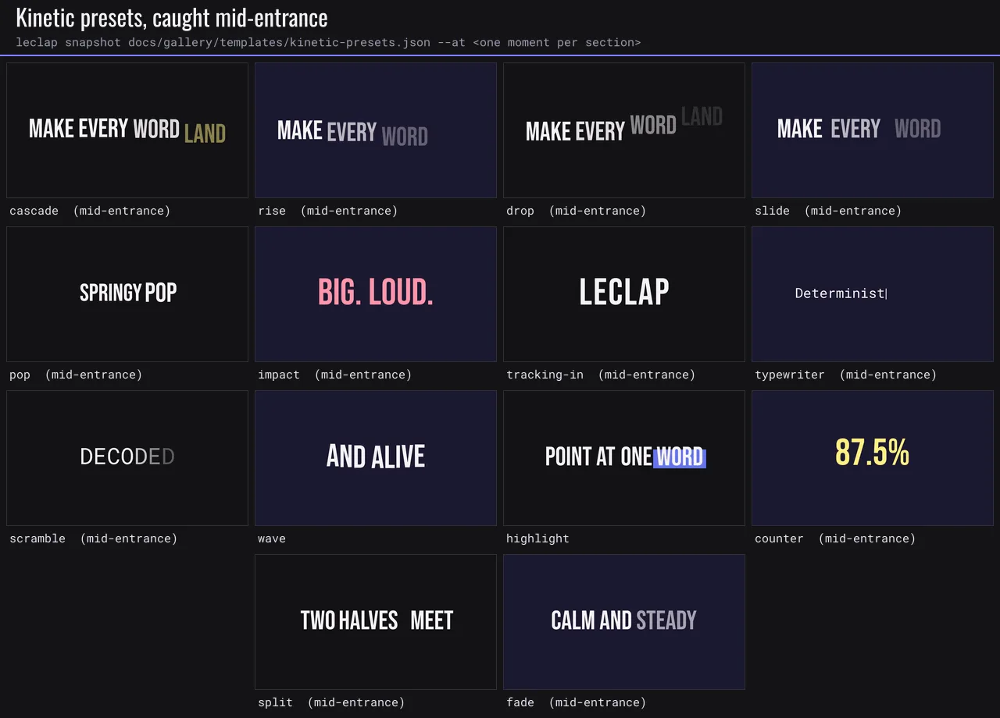

More in the [gallery](./gallery.md#kinetic-typography).

```jsonc
"kinetic": [
  { "text": { "en": "Make every word land." }, "preset": "cascade", "accent": { "words": "last" }, "exit": "cascade" },
  { "text": { "en": "Physics, not keyframes" }, "preset": "highlight", "font": "oswald", "size": 46, "y": "bottom", "delay": 0.7 }
]
```

| Preset          | Default unit | What it does                                                                      |
| --------------- | ------------ | --------------------------------------------------------------------------------- |
| `cascade`       | word         | Words rise into place one after another on a snappy spring.                       |
| `rise` / `drop` | word         | Travel up / fall down into place (drop lands on a bouncy spring).                 |
| `slide`         | word         | Slide in from `direction` (`left` = enters moving left).                          |
| `pop`           | word         | Each unit springs up from 30% size around its own centre.                         |
| `impact`        | word         | Each unit slams down from 180% size.                                              |
| `tracking-in`   | glyph        | Wide letter-spacing collapses to tight (keynote title).                           |
| `typewriter`    | glyph        | Glyphs appear one by one behind a blinking caret (`caret: false` to hide it).     |
| `scramble`      | glyph        | Glyphs decode from seeded random characters (`charset`).                          |
| `wave`          | glyph        | Glyphs rise in, then bob on a travelling sine (`amplitude`, `frequency`).         |
| `highlight`     | word         | Words cascade in, then a marker sweeps behind the accent words (`accent.marker`). |
| `counter`       | —            | A number rolls from `counter.from` to `counter.to` (see **Counter** below).       |
| `split`         | word         | Each line arrives as two halves from opposite sides.                              |
| `fade`          | word         | A plain staggered fade.                                                           |

| Field                                           | Default                                         | Notes                                                                                                                                                                           |
| ----------------------------------------------- | ----------------------------------------------- | ------------------------------------------------------------------------------------------------------------------------------------------------------------------------------- |
| `unit`                                          | per preset                                      | `line`, `word` or `glyph`. A block keeps at most 64 units; longer copy steps up to words, then lines.                                                                           |
| `order`                                         | `forward`                                       | `reverse`, `center`, `edges`, or `random` (seeded by `global.seed`).                                                                                                            |
| `delay` / `stagger` / `duration`                | 0.2 s / per preset / per preset                 | With a spring `ease` and no `duration`, the spring's settle time is used.                                                                                                       |
| `ease`                                          | per preset                                      | Any [easing](#easing) or `$token`.                                                                                                                                              |
| `distance`                                      | per preset × size                               | Travel in px, scaled by `global.motion.energy`.                                                                                                                                 |
| `font` / `size` / `color`                       | `bebas` / 11% of height / `#F5F3F7`             | Word/glyph units need a bundled font.                                                                                                                                           |
| `align` / `x` / `y` / `maxWidth` / `lineHeight` | `center` / centre / `center` / 84% width / 1.05 | `y` is px or `top`/`center`/`bottom` inside the title-safe area.                                                                                                                |
| `accent`                                        | —                                               | `{ words: [i…] \| "first" \| "last", color?, marker? }`.                                                                                                                        |
| `effect`                                        | —                                               | Shadow / outline, as for captions.                                                                                                                                              |
| `exit`                                          | `none`                                          | `fade`, `rise`, `drop`, `slide`, `shrink`, `cascade`, or `{ preset, at, duration, stagger, ease, distance }`.                                                                   |
| `wrap`                                          | `greedy`                                        | `balanced` keeps the line count but evens line widths and avoids ending a line on an article or preposition.                                                                    |
| `trail`                                         | —                                               | `{ echoes: 2..6, delta = 0.04 s, fade = 0.5 }`: fading echoes of each unit while it moves; they collapse into it when it rests. Not on `counter`; at most 192 echoes per block. |
| `fill`                                          | —                                               | Gradient, texture or shimmer inside the letters (see below).                                                                                                                    |
| `role`                                          | —                                               | A [motion role](#motion-roles).                                                                                                                                                 |

Moving boxes (the highlight marker, the typewriter caret) are emitted as one box per frame, each gated by an `enable` window, because FFmpeg evaluates `drawbox` geometry only once. They are frame-exact and deterministic. Validation codes: `kinetic_font_unmeasurable`, and `invalid_kinetic` (a counter without numbers). Agents get every preset, its defaults, art-direction rules and a starter from MCP `get_motion_catalog` (or `motionCatalog()` in the library). See [`examples/motion-design/kinetic-type.json`](../examples/motion-design/kinetic-type.json).

**Counter.** The `counter` preset rolls a number: `counter: { from, to?, decimals?, prefix?, suffix?, locale?, grouping?, tabular?, overshoot? }`. Digits are tabular by default (each sits in a fixed-width slot, so the number never jitters sideways), the value lands exactly on `to` when the roll ends and holds, and `decimals` round rather than truncate. `locale` sets the grouping separator and decimal mark (`en` 1,234.5, `fr` 1 234,5, `de` 1.234,5, `de-CH` 1’234.5; default: the template's active locale). `grouping` defaults to on from five integer digits, so years stay plain. `overshoot` (0–0.1, keep it at 0.02–0.04) runs past the value and settles back inside the duration; leave it at 0 for prices. Omit `to` to roll up to the first number in the block's `text` once form fields resolve: `"{{ form_price }}"` → `"EUR 24"` gives prefix `EUR ` and 24, and its separators set decimals, grouping and locale. Text without a number fades in as is. Without a `duration`, the roll lasts 0.6–1.6 s depending on the range; it keeps the block's `delay` and `ease` (a token, a bezier or a spring).

```jsonc
"kinetic": [{ "text": { "en": "{{ form_price }}" }, "preset": "counter", "counter": { "from": 0 }, "ease": "$expo", "delay": 0.4 }]
```

**Filled text.** `fill: { gradient?: { from, to, angle? } | { stops: [2–8 colours], angle? }, texture?: url, sweep?: { duration?, width?, color?, delay?, every? } }` turns the block's units into a mask over the fill, keeping each unit's timing; `sweep` moves a soft band across it (a shimmer). The mask needs `alphamerge`: where the build lacks it, the block is drawn in its `color` and the advisory `mask_unavailable` is reported when the target build is known. Agents find it in `motionCatalog().compositing.kineticFill`.

## Camera

A section takes a `camera`: a virtual camera that moves over the finished frame. By default it moves the text and graphics too; set `includeText: false` to keep overlays steady over a moving shot. It is rendered with sub-pixel precision on every output frame (the frame is resized per frame and cropped back by `zoompan`, with the sizes chosen so the zoom and position land within a few hundredths of a pixel), plus `rotate`, on the frame clock. Slow push-ins, drifts, Ken Burns, pulse, the resolve fx and the zoom-through transition move smoothly instead of in whole-pixel steps. Every frame of a move is drawn, including the slow first and last frames of an eased move: a moving zoom never rests at exactly 1 but at a 1.5-pixel over-scan (per edge, on the long side) that fades out by 1.05, because whole-pixel rasters cannot draw the tiniest steps away from zoom 1. Zooms of 1.05 and above land exactly as requested. The resolve fx and the zoom-through transition keep zoom 1 as the untouched picture, since they hand over to it. The frame is over-scanned just enough that pans, shake and roll never show an edge.

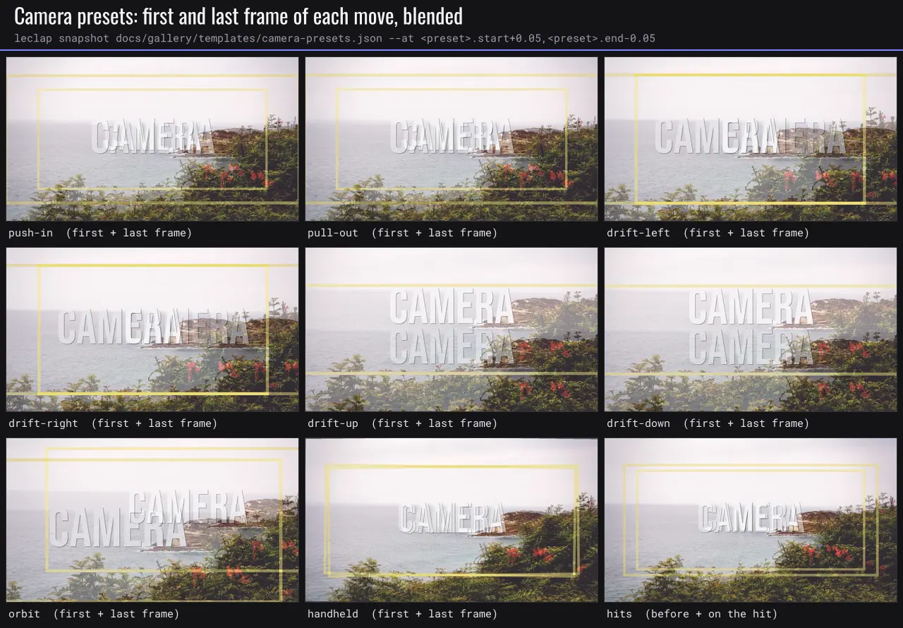

More in the [gallery](./gallery.md#camera).

```jsonc
"camera": { "preset": "push-in", "amount": 0.12, "hits": [0.6, { "at": 1.8, "strength": 0.06 }], "shake": { "amplitude": 4 } }
```

| Field                         | Default                                     | Notes                                                                                                                                                                                              |
| ----------------------------- | ------------------------------------------- | -------------------------------------------------------------------------------------------------------------------------------------------------------------------------------------------------- |
| `preset`                      | `none`                                      | `push-in`, `pull-out`, `drift-left`, `drift-right`, `drift-up`, `drift-down`, `orbit`, `handheld` (seeded shake only).                                                                             |
| `amount`                      | 0.12                                        | Zoom delta and drift range (0.01–0.6).                                                                                                                                                             |
| `delay` / `duration` / `ease` | 0 / to the section end / `ease-in-out-sine` | Timing of the preset move; any [easing](#easing) or token.                                                                                                                                         |
| `zoom` / `x` / `y` / `rotate` | —                                           | Keyframe tracks (as in `animate`) that override the preset per property. Zoom is a multiplier, x/y are output px, rotate is degrees.                                                               |
| `hits`                        | —                                           | Punch-ins: seconds, or `{ at, strength = 0.08, decay = 10 }`. Pair with `impact` type or a `flash`.                                                                                                |
| `shake`                       | —                                           | `{ amplitude = 6 px, frequency = 0.8 Hz, rotation = 0° }`: a seeded sum of sines (`global.seed` reshuffles it).                                                                                    |
| `includeText`                 | `true`                                      | `false` keeps text steady over a moving shot: the camera runs beneath the section's text and graphics, after any framing filters (scale / pad / perspective) authored ahead of its first drawtext. |

## Graphics

`graphics` (up to 24 per section) are editorial shapes and light hits that animate on a curve. FFmpeg evaluates `drawbox` geometry only once, so each animated frame is its own box behind an `enable` window: frame-exact, deterministic, and on every backend. Every type takes `at` (default 0), `duration`, `ease`, `until` (default: hold to the cut), `color`, `role` and `above` (see [Draw order](#draw-order-above)). Procedural light and texture primitives are `type: "fx"` graphics: see [Light and effects](#light-and-effects-graphicstype-fx).

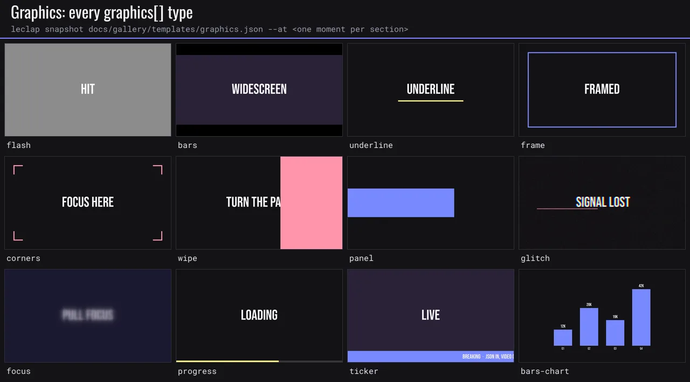

More in the [gallery](./gallery.md#graphics).

| Type         | Extra fields                                                                                                                                             | Effect                                                                                                                                |
| ------------ | -------------------------------------------------------------------------------------------------------------------------------------------------------- | ------------------------------------------------------------------------------------------------------------------------------------- |
| `flash`      | `intensity`                                                                                                                                              | A full-frame light hit that decays (white, 0.3 s).                                                                                    |
| `bars`       | `aspect` (2.39)                                                                                                                                          | Letterbox bars slide in from the top and bottom.                                                                                      |
| `underline`  | `x`, `y`, `width`, `thickness`, `origin`, `caps`, `settle`, `exit`, `exitDuration`                                                                       | A rule that draws itself across.                                                                                                      |
| `frame`      | `inset`, `thickness`, `target`, `clearance`, `radius`, `trace`, `contrast`, `exit`, `exitDuration`                                                       | A rectangle outline that traces itself clockwise.                                                                                     |
| `corners`    | `inset`, `length`, `thickness`, `target`, `clearance`, `spread`, `radius`, `trace`, `contrast`, `exit`, `exitDuration`                                   | Viewfinder brackets that extend from the corners.                                                                                     |
| `wipe`       | `direction`                                                                                                                                              | A colour panel sweeping across the frame: it covers, then uncovers.                                                                   |
| `panel`      | `x`, `y`, `width`, `height`, `from`                                                                                                                      | A block that grows from one edge (a backing plate for text).                                                                          |
| `glitch`     | `intensity` (0.6)                                                                                                                                        | Seeded RGB split, jitter, grain and colour slices (0.35 s); changes with `global.seed`.                                               |
| `focus`      | `direction` (`in` \| `out`), `amount` (24 px)                                                                                                            | Rack focus: `in` waits blurred until `at`, then sharpens; `out` blurs and holds until `until`. `above: false` keeps later text sharp. |
| `progress`   | `position`, `thickness` (8), `track`, `x`, `y`, `width`, `duration` (3 s, up to 600)                                                                     | A bar that fills (linear by default), then holds.                                                                                     |
| `ticker`     | `text`, `speed` (160 px/s), `position`, `height`, `font`, `size`, `textColor`                                                                            | A band grows in; the copy scrolls right to left and loops.                                                                            |
| `bars-chart` | `values`, `labels`, `max`, `x`, `y`, `width`, `height`, `stagger` (0.08), `gap` (0.3), `showValues`, `decimals`, `prefix`, `suffix`, `font`, `textColor` | Bars grow one after another (`duration` is per bar, 0.7 s) while their values count up.                                               |
| `fx`         | `effect`, `target`, `intensity`, `repeat`, `every`, `seed` and the primitive's own parameters                                                            | A procedural light or texture primitive clipped to its target: see [Light and effects](#light-and-effects-graphicstype-fx).           |

See [`examples/motion-design/fx-pack.json`](../examples/motion-design/fx-pack.json) for trails, whips, these graphics and the lower-third styles. A graphic's `duration` is at most 3 s, except `progress` (600 s) and `fx` (30 s).

### Strokes (`frame`, `corners`, `underline`)

`frame`, `corners` and `underline` draw even-pixel strokes, a trace that starts at the top-left with a short head fade, a visible exit before `until` (or the end of the section) and, for `frame` and `corners`, contrast-aware colour.

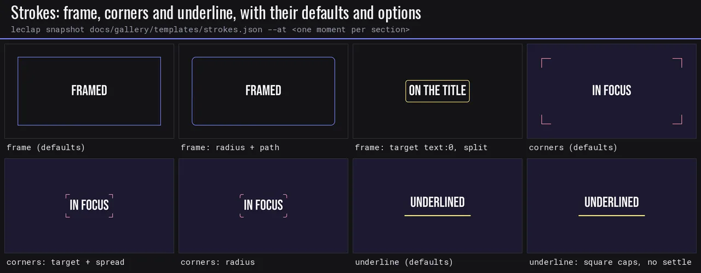

| Field          | Types              | Default                           | Notes                                                                                                                                                                                            |
| -------------- | ------------------ | --------------------------------- | ------------------------------------------------------------------------------------------------------------------------------------------------------------------------------------------------ |
| `target`       | `frame`, `corners` | —                                 | What the strokes frame instead of the whole frame: `"layer:<i>"`, `"pane:<i>"`, `"text:<i>"` or a `{ x, y, w, h }` rectangle (see [fx targets](#targets)). `inset` is then ignored.              |
| `clearance`    | `frame`, `corners` | 24                                | Px between the target edge and the strokes (−200–400; negative = inside it), clamped inside the frame.                                                                                           |
| `radius`       | `frame`, `corners` | 0                                 | Corner radius in px (0–400), raised to the thickness when smaller. Rounded corners are anti-aliased arcs generated at their exact size.                                                          |
| `trace`        | `frame`            | `path`                            | `path` (one head travels clockwise at constant speed), `split` (two heads leave the top-left and meet bottom-right), `sides` (each side in turn), `fade` (no draw-on).                           |
| `trace`        | `corners`          | `clockwise`                       | `clockwise` (the brackets start one after another from the top-left), `together`, `fade`.                                                                                                        |
| `spread`       | `corners`          | 1.06                              | Size the bracket rectangle starts at, relative to its rest size (1–1.3): the brackets close in on the subject on the entrance curve. 1 = no travel.                                              |
| `contrast`     | `frame`, `corners` | `auto`                            | `auto`: on a known solid background an unset colour becomes light or dark ink, and a low-contrast colour or footage gets a soft offset shadow. `shadow`: always the shadow. `none`: as authored. |
| `caps`         | `underline`        | `round`                           | `round` (anti-aliased half discs) or `square`.                                                                                                                                                   |
| `settle`       | `underline`        | 0.03                              | Overshoot of the draw-on as a fraction of the width (0–0.12): the line runs past its end, then settles back.                                                                                     |
| `exit`         | all three          | `fade` (`expand` for `corners`)   | How it leaves before `until`: `fade`, `retract` (undraws in its trace order), `expand` (grows about 4 % outward while fading; `frame` and `corners`), `none` (holds to the cut).                 |
| `exitDuration` | all three          | 60 % of the entrance, 0.15–0.35 s | Seconds the exit takes on `$smooth` (0.1–1.5).                                                                                                                                                   |

An `underline` is drawn above text by default, so a CTA card or a text plate never hides it. Strokes default to 4 px (6 px for `underline`), and with a `target`, `corners` their arms default to about 18 % of its short side (24–160 px).

```jsonc
"graphics": [
  { "type": "frame", "at": 0.2, "target": "layer:0", "clearance": 16, "radius": 24, "trace": "path", "exit": "fade", "color": "$color.fg" },
  { "type": "corners", "at": 0.2, "target": "text:0", "clearance": 32, "spread": 1.08, "exit": "expand", "color": "$color.accent" },
  { "type": "underline", "at": 0.6, "x": 440, "y": 520, "width": 400, "thickness": 8, "caps": "round", "settle": 0.03, "exit": "fade" }
]
```

### Draw order (`above`)

A graphic with `above: false` is drawn under the section's text: kinetic blocks, captions, title cards and lower thirds. With `above: true`, it is drawn over everything the section draws, including the section's own authored `filters` and masks, so an authored mask or a text plate never hides it. Defaults: `true` for `flash`, `wipe`, `glitch`, `focus` and `underline`; for an `fx`, `true` on a `text:<i>` target; `false` otherwise.

## Light and effects (`graphics[].type: "fx"`)

An `fx` graphic is a procedural light or texture primitive. It is rendered at output resolution, anchored to a `target`, and clipped to that target's shape, so one descriptor adapts to landscape, portrait and square. Each primitive is a set of open parameters, not a finished look: an omitted field gets a default derived from the target size, the theme accent, `global.motion.energy` and the seed, so two untuned placements never look alike. Same descriptor, same pixels.

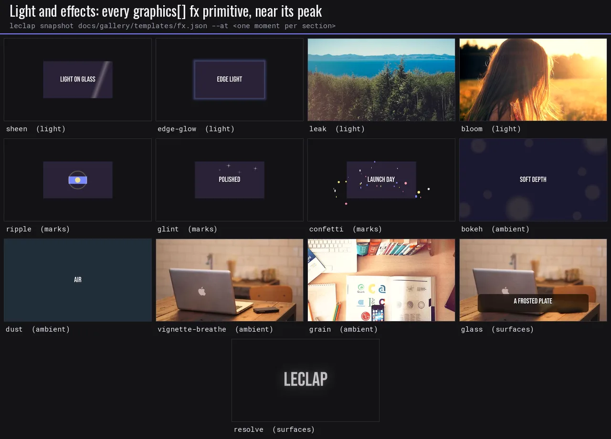

More in the [gallery](./gallery.md#light-and-effects).

```jsonc
"graphics": [
  { "type": "fx", "effect": "sheen", "target": "layer:0", "at": 0.6, "profile": "specular", "width": 0.12, "tilt": 20, "color": "$color.accent", "intensity": 0.8 },
  { "type": "fx", "effect": "leak", "edge": "top-right", "duration": 2.4, "drift": -0.08, "secondary": "$color.accent2" }
]
```

There are 13 primitives in four families:

| Family   | Primitives                                   | Character                                                                                                  |
| -------- | -------------------------------------------- | ---------------------------------------------------------------------------------------------------------- |
| Light    | `sheen`, `leak`, `edge-glow`, `bloom`        | Adds luminance and never greys: a highlight stays inside its target (an edge-glow blooms just outside it). |
| Marks    | `ripple`, `glint`, `confetti`                | Start from a point of the target and may leave it: a tap, a sparkle, a burst.                              |
| Ambient  | `bokeh`, `dust`, `vignette-breathe`, `grain` | Faint textures (≤ 0.12) that last the section. They are absent at `global.motion.energy: 0`.               |
| Surfaces | `glass`, `resolve`                           | Rework the pixels inside the target: a frosted plate under text, a title that lands in focus.              |

### Targets

`target` names what the effect lives on. It resolves at compile time to an even-pixel rectangle, snapped inward and clamped to the frame. An effect never draws outside it, except the marks and the edge-glow halo.

| `target`                  | What it is                                                                                                 |
| ------------------------- | ---------------------------------------------------------------------------------------------------------- |
| `"frame"` (default)       | The whole frame.                                                                                           |
| `"pane:<i>"`              | Pane `i` of the section's [layout](#layouts) (split screen).                                               |
| `"layer:<i>"`             | `options.layers[i]` of a `color_background`.                                                               |
| `"text:<i>"`              | Kinetic block `i`, clipped to its letters.                                                                 |
| `{ x, y, w, h, radius? }` | A rectangle in px or frame fractions (`"iw*0.5"`, `"ih*0.25"`), with rounded corners when `radius` is set. |

A shaped target (`text:<i>`, or a rectangle with a `radius`) needs `alphamerge`. Where the build lacks it, the effect is skipped with the `mask_unavailable` warning.

### Shared fields

Every primitive takes these fields, on top of its own parameters:

| Field        | Default                                     | Notes                                                                                                                                                                                     |
| ------------ | ------------------------------------------- | ----------------------------------------------------------------------------------------------------------------------------------------------------------------------------------------- |
| `effect`     | (required)                                  | The primitive's name.                                                                                                                                                                     |
| `target`     | `"frame"`                                   | See [Targets](#targets).                                                                                                                                                                  |
| `at`         | 0                                           | Seconds from the section start, or a [time reference](#time-references) (`"card.end"`).                                                                                                   |
| `duration`   | per primitive                               | Seconds one pass takes (up to 30). Defaults are given at energy 1 and scale by 1/√energy (energy clamped to 0.5–2). Set a surface or an ambient texture to the section length to hold it. |
| `ease`       | per primitive                               | Any [easing](#easing) or `$token`.                                                                                                                                                        |
| `until`      | —                                           | Hard stop: nothing of the effect draws after it.                                                                                                                                          |
| `repeat`     | 1                                           | Passes (1–8).                                                                                                                                                                             |
| `every`      | `duration` + 1.2                            | Seconds from one pass start to the next when `repeat` > 1.                                                                                                                                |
| `color`      | warm white tinted by the theme accent       | `#rrggbb`, a colour name or a theme token (`"$color.accent"`). Its `@alpha` is ignored: use `intensity`.                                                                                  |
| `intensity`  | per primitive                               | 0–1 of the primitive's ceiling (below). Keep it ≤ 0.6 over skin.                                                                                                                          |
| `seed`       | —                                           | Mixed with `global.seed` and the graphic's path: re-rolls the context defaults and the dither.                                                                                            |
| `above`      | `true` on a `text:<i>` target, else `false` | See [Draw order](#draw-order-above).                                                                                                                                                      |
| `role`, `id` | —                                           | A [motion role](#motion-roles), and an id for time references.                                                                                                                            |

### Ceilings and restraint

`intensity` 1 maps to the primitive's ceiling, the highest peak alpha it may reach:

| Ceiling  | Primitives                                                                           |
| -------- | ------------------------------------------------------------------------------------ |
| 0.12     | `bloom`, `bokeh`, `dust`, `vignette-breathe`, `grain` (`grain` is noise strength 12) |
| 0.25     | `leak`                                                                               |
| 0.3–0.35 | `sheen`, `edge-glow`, `resolve` (0.35), `glass` (0.3)                                |
| 0.85–1   | `ripple` (0.85), `glint` (0.9), `confetti` (1): small marks that must read           |

Keep one hero effect per beat and at most two layered (ambient textures count). Land it on the beat its target resolves. Effects never cover text you need read or faces. Tie colour to the palette (`$color.accent`, `$color.fg`) and timing to the motion tokens. The [sameness lint](#compose-motion-dont-pick-stock-animations) flags an untuned fx (`fx_untuned`), a repeated effect, an off-theme colour and more than two decorative effects in one section.

### Reduced motion, devices and warnings

At `global.motion.energy: 0`, every primitive switches to its reduced form (each table below names it): light holds still or becomes a faint static highlight, marks rest in place and fade in and out, and the ambient textures and `bloom` are dropped. Every primitive lowers to filters on the [on-device allowlist](./on-device-compilation.md). Where a build lacks an optional filter, it falls back: `sheen` and `leak` use compile-time sprites without `gradients`, `vignette-breathe` uses a gradient mask without `vignette`, and `confetti` and `glint` drop their spin without `rotate`. When an fx cannot render, it is skipped with a warning: `fx_target` (the target names nothing in the section), `mask_unavailable` (a shaped target without `alphamerge`) or `fx_skipped` (a missing filter or input). Effects are drawn in "Preview render" in the builder, not on its editing canvas.

Wide, soft lights (`leak`, `bloom`, `vignette-breathe`) carry a fine static grain, about ±1 code value and seeded like every fx, so their slow falloff still reads as a gradient after H.264 encoding instead of flat contour bands. The grain covers only the light itself; the picture outside it is untouched.

Agents get every primitive, its parameters, defaults and design intent from MCP `get_motion_catalog` (`motionCatalog().fx` in the library). The prose comes from `FX_DOCS` ([`fx-docs.ts`](../packages/ffmpeg-video-composer/src/schemas/fx-docs.ts)), the tables below included.

### Primitives

Every parameter is optional. Sizes in px are given at 1080p and scale with the frame.

#### `sheen` (light)

A specular light band that crosses its target once (or `repeat` times), clipped to the target shape: light on the glass of a card, a screen, a product shot or the letters of a title. Defaults: 0.75 s on `cubic-bezier(0.45, 0, 0.2, 1)`, ceiling 0.35, intensity 0.91. Reduced motion: a static 8% highlight that fades in and out on the target.

| Field       | Range                               | What it does                                                                                                                                                                                                                                 |
| ----------- | ----------------------------------- | -------------------------------------------------------------------------------------------------------------------------------------------------------------------------------------------------------------------------------------------- |
| `profile`   | `specular` \| `soft` \| `twin`      | Light profile across the band: specular (tight gaussian core + a bloom twice as wide, default: glass, metal, screens), soft (one wide gaussian wash: paper, fabric, matte cards), twin (two thin parallel glints: chrome, lenses, techy UI). |
| `width`     | 0.02–0.6                            | Band width as a fraction of the target's short side (default ~0.15, varied by target shape and seed). 0.05–0.1 = a crisp glint, 0.2–0.4 = a broad wash.                                                                                      |
| `tilt`      | -60–60                              | Band angle in degrees off the perpendicular of its travel (default 14–26, from the seed). 0 = square to the path; negative leans the other way.                                                                                              |
| `direction` | `right` \| `left` \| `down` \| `up` | Travel path across the target (default: right on wide targets, down on tall ones). Match the scene's motion or reading direction.                                                                                                            |
| `bloom`     | 0–0.6                               | Share of the peak carried by the soft bloom around a specular core (default 0.25; 0 = bare core).                                                                                                                                            |

Use when: a hero object lands or resolves; a CTA card or price settles; a title locks up. Avoid: over faces or footage with skin (keep intensity ≤ 0.6 there); more than one sheen per beat.

#### `leak` (light)

A warm light leak: two soft radial lobes from an off-frame source at one edge, drifting slowly along it, rising and fading like film exposure. It lifts the mid-tones, never the blacks, never greys a bright surface, and has no edge anywhere. Defaults: 2.6 s on `cubic-bezier(0.4, 0, 0.2, 1)`, ceiling 0.25, intensity 0.88. Reduced motion: a still, dimmer leak that fades in and out without drifting.

| Field       | Range                                                                                                  | What it does                                                                                                                                                                                         |
| ----------- | ------------------------------------------------------------------------------------------------------ | ---------------------------------------------------------------------------------------------------------------------------------------------------------------------------------------------------- |
| `edge`      | `left` \| `right` \| `top` \| `bottom` \| `top-left` \| `top-right` \| `bottom-left` \| `bottom-right` | Where the off-frame source sits (default from the seed: a side or a top corner, top corners on tall targets). The light pours in from there and never reaches the far side.                          |
| `size`      | 0.2–1.5                                                                                                | Lobe radius as a fraction of the target's long side (default 0.3–0.42 from the seed). 0.25 = a tight flare at the edge, 1+ = a wash over half the frame.                                             |
| `stretch`   | 0.5–3                                                                                                  | Lobe elongation along its edge (default 1–1.3): 1 = round, 2+ = a long streak hugging the edge.                                                                                                      |
| `drift`     | -0.3–0.3                                                                                               | Travel along the edge over one pass, as a fraction of the edge's length; the sign sets the direction (default ±0.06–0.10 from the seed). 0 = a still leak.                                           |
| `secondary` | colour                                                                                                 | Colour of the second lobe: "#rrggbb" or a theme token (default rose #FF7A88; the first lobe is `color`, default amber #FFB36B, both nudged toward the theme accent).                                 |
| `balance`   | 0–1                                                                                                    | Strength of the second lobe relative to the first (default 0.55–0.8). 0 = a single lobe.                                                                                                             |
| `spread`    | 0–1.5                                                                                                  | Offset of the second lobe along the edge, in lobe radii (default 0.5–0.9).                                                                                                                           |
| `shadows`   | 0–1                                                                                                    | How much the shadows are kept clean (default 1: the light lifts the mid-tones and never the blacks; 0 = a wash into the shadows too). Surfaces brighter than the light itself are always left alone. |
| `rise`      | 0.05–0.6                                                                                               | Share of the life spent fading in (default 0.3); ease-in, so it blooms rather than switches on.                                                                                                      |
| `fall`      | 0.1–0.8                                                                                                | Share of the life spent fading out (default 0.5): a leak leaves more slowly than it arrives.                                                                                                         |

Use when: a beat change or an entrance on footage or photos; a warm, analogue transition accent. Avoid: over text-heavy cards or UI screenshots; several leaks in a row (one per scene change at most).

#### `edge-glow` (light)

A glow around a card or video rect: a crisp inner hairline plus a soft bloom outside the target's (rounded) shape only, breathing gently. Defaults: 4 s on `cubic-bezier(0.4, 0, 0.2, 1)`, ceiling 0.35, intensity 0.51. Reduced motion: the same glow, still (no breathing).

| Field       | Range  | What it does                                                                                                                        |
| ----------- | ------ | ----------------------------------------------------------------------------------------------------------------------------------- |
| `line`      | 0–1    | Opacity of the inner hairline (default 0.55; 0 = glow only).                                                                        |
| `lineWidth` | 0.5–8  | Hairline width in px at 1080p, scaled with the frame (default 1.5).                                                                 |
| `spread`    | 2–48   | Bloom radius (gaussian σ) in px at 1080p, scaled with the frame (default 8–12 from the seed).                                       |
| `glow`      | colour | Bloom colour: "#rrggbb" or a theme token (default: the light colour pushed toward the theme accent). The hairline stays near-white. |
| `breathe`   | 0–0.25 | Opacity swing of the bloom, ± share (default 0.06; 0 = steady).                                                                     |
| `period`    | 1.5–12 | Seconds per breath (default 3.6–4.8 from the seed).                                                                                 |

Use when: a name card, a CTA or a product card that should read as lit or active; a focused pane. Avoid: on the full frame (use leak or bloom); on more than one card at once.

#### `bloom` (light)

Highlight halation: the brightest parts of the picture bleed a soft, warm glow into their surroundings, as film does. Built from the frame itself, so it follows the footage. Defaults: 6 s on `cubic-bezier(0.4, 0, 0.2, 1)`, ceiling 0.12, intensity 0.85. Reduced motion: absent.

| Field       | Range      | What it does                                                                                                                                                       |
| ----------- | ---------- | ------------------------------------------------------------------------------------------------------------------------------------------------------------------ |
| `threshold` | 0.3–0.98   | Luma (0..1 of the video range) above which highlights halate (default 0.68–0.78 from the seed). Lower = more of the picture glows; 0.9 = only speculars and skies. |
| `knee`      | 0.02–0.4   | Softness of the threshold, in luma (default 0.12): small = only clipped highlights, large = gradual.                                                               |
| `radius`    | 0.002–0.06 | Halation spread (gaussian σ) as a fraction of the target's short side (default ~0.011, i.e. 12 px at 1080p, from the seed). 0.03+ = a dreamy haze.                 |
| `ramp`      | 0.13–2     | Seconds of fade-in and fade-out at both ends of the life (default 0.5).                                                                                            |

Use when: bright skies, windows, product speculars; a filmic, warm finish on photos or footage. Avoid: on flat UI cards or text-only sections (nothing to bloom); stacked with leak and vignette at once.

#### `ripple` (marks)

Expanding anti-aliased rings (or a pressed dot plus a ring) from a point of the target: a tap, a pulse, a "look here". Defaults: 0.88 s on `cubic-bezier(0.16, 1, 0.3, 1)`, ceiling 0.85, intensity 1. Reduced motion: one still ring at its middle size that fades in and out (an opacity pulse, no growth).

| Field     | Range               | What it does                                                                                                                                                                                    |
| --------- | ------------------- | ----------------------------------------------------------------------------------------------------------------------------------------------------------------------------------------------- |
| `variant` | `ring` \| `tap`     | ring (default): anti-aliased rings expanding from the origin and fading out (a pulse, a radar, a "look here"). tap: a filled dot pressed in and released, then one ring (a UI tap on a button). |
| `origin`  | `{x, y}` (−0.5–1.5) | Ring centre, as fractions of the target ({x, y}; default the target centre).                                                                                                                    |
| `radius`  | 0.1–3               | The rings' final radius as a share of the target's short side (default 0.9–1.2 from the seed, so the ring clears its target; a tap on a small button: 0.9–1.4 so the ring clears it).           |
| `rings`   | int 1–3             | Rings per pass (default 2 for ring, 1 for tap).                                                                                                                                                 |
| `stagger` | 0–0.6               | Seconds between ring starts (default 0.18). The pass duration covers every ring.                                                                                                                |
| `start`   | 0.1–0.9             | Ring size when it appears, as a share of its final size (default 0.375: 0.6 → 1.6).                                                                                                             |
| `stroke`  | 1–16                | Ring stroke in px at 1080p, at full size (default 5; scaled to the output frame).                                                                                                               |
| `halo`    | 0–24                | Gaussian halo around the stroke, σ in px at 1080p (default 6; 0 = a bare line).                                                                                                                 |
| `dot`     | 0.05–0.8            | tap: the pressed dot's radius as a share of the final ring radius (default 0.28).                                                                                                               |
| `press`   | 0–0.3               | tap: how far the dot sinks on press, as a share of its size (default 0.09: 0.9 → 0.82 → 1).                                                                                                     |

Use when: a UI tap in a product demo; a call to action or a hotspot that needs one beat of attention. Avoid: on every element of a section; over faces; more than two passes in a row (it reads as an alarm).

#### `glint` (marks)

Four-point star glints that twinkle once on a target (scale up, turn, vanish), or small lights orbiting it: the sparkle of something new or polished. Defaults: 0.9 s on `cubic-bezier(0.34, 1.56, 0.64, 1)`, ceiling 0.9, intensity 0.85. Reduced motion: the stars appear at rest at half size and fade in and out (no scale, turn or travel).

| Field     | Range                             | What it does                                                                                                                                                                                                                                                                    |
| --------- | --------------------------------- | ------------------------------------------------------------------------------------------------------------------------------------------------------------------------------------------------------------------------------------------------------------------------------- |
| `path`    | `scatter` \| `corners` \| `orbit` | Where the light sits: scatter (default: seeded points on the target, biased to its upper half and corners, like specular highlights), corners (just inside its corners), orbit (lights travelling around the target's edge with a short trail: a spec orbit for product shots). |
| `points`  | 1–6 points `{x, y}` (−0.5–1.5)    | Exact star positions as target fractions; overrides path and count (scatter/corners only).                                                                                                                                                                                      |
| `count`   | int 1–6                           | Stars (default 3–5 from the seed, fewer on small targets) or orbiting lights (default 2).                                                                                                                                                                                       |
| `size`    | 8–96                              | Star span in px at 1080p (default 36–52 per star from the seed, 34 for orbit lights; scaled to the output frame).                                                                                                                                                               |
| `stagger` | 0–0.4                             | Seconds between star twinkles (default 0.12). The pass duration covers every star.                                                                                                                                                                                              |
| `spin`    | -90–90                            | Degrees each star turns while it twinkles (default 15; 0 = no turn).                                                                                                                                                                                                            |
| `trail`   | 0–1                               | orbit: strength of the trail behind each light (default 0.4; 0 = none).                                                                                                                                                                                                         |
| `speed`   | 0.2–3                             | orbit: revolutions per second (default 0.9).                                                                                                                                                                                                                                    |

Use when: a product, a logo or a price lands; a "new" badge; jewellery, glass, chrome. Avoid: over text you need read; on footage with busy highlights; together with confetti in one beat.

#### `confetti` (marks)

A ballistic burst of tumbling paper pieces in the theme colours: launched from a point, slowed by drag, pulled down by gravity, swaying as they fall. Defaults: 2.2 s on `linear`, ceiling 1, intensity 1. Reduced motion: a few pieces appear at rest around the origin and fade in and out (no flight, no tumble).

| Field     | Range               | What it does                                                                                                                |
| --------- | ------------------- | --------------------------------------------------------------------------------------------------------------------------- |
| `count`   | int 4–36            | Pieces in the burst (default 28–36, from the seed). Repeated passes share 36.                                               |
| `origin`  | `{x, y}` (−0.5–1.5) | Where the burst starts, as fractions of the target ({x, y}; default the target centre, {x: 0.5, y: 0.5}).                   |
| `angle`   | -180–180            | Burst direction in degrees: -90 = up (default), 0 = right, 90 = down, ±180 = left.                                          |
| `spread`  | 0–360               | Cone the pieces leave in, degrees around angle (default 90–130 from the seed; 360 = all around).                            |
| `speed`   | 0.2–4               | Launch speed in frame heights per second (default 1.5; each piece varies ±25 %).                                            |
| `gravity` | 0–8                 | Downward pull in frame heights per s² (default 1.6; 0 = floating).                                                          |
| `drag`    | 0.1–8               | Air drag per second (default 3.2): higher = pieces stall and drift down slowly, like paper.                                 |
| `sway`    | 0–0.1               | Side-to-side flutter while falling, in frame widths (default 0.012).                                                        |
| `spin`    | 0–4                 | Maximum tumble in turns per second (default 1.4; each piece gets its own rate and sense).                                   |
| `size`    | 4–64                | A piece's long side in px at 1080p (default 28; scaled to the output frame).                                                |
| `discs`   | 0–1                 | Share of round pieces; the rest are 2:1 strips (default 0.2).                                                               |
| `colors`  | 1–5 colours         | Palette, 1–5 colours ("#rrggbb", names or "$color.*" tokens). Default: the theme accent, accent2, brand and a neutral (fg). |
| `depth`   | 0–1                 | Depth tiers: 1 (default) gives pieces at 0.6 / 0.8 / 1.0 size with slight alpha; 0 = all equal.                             |
| `fade`    | 0.1–2               | Seconds faded out at the end of the burst (default 0.5).                                                                    |

Use when: a real celebration: a launch, a milestone, a win, a sign-up count; once per video. Avoid: serious, corporate or editorial tones; behind text that must be read; more than one burst per video.

#### `bokeh` (ambient)

Out-of-focus light discs drifting slowly in three depth tiers (near discs larger, brighter and faster), clipped to the target: depth and warmth behind a title card or an intro. Defaults: 6 s on `linear`, ceiling 0.12, intensity 0.75. Reduced motion: absent (ambient motion is dropped).

| Field      | Range    | What it does                                                                                                                                                                                     |
| ---------- | -------- | ------------------------------------------------------------------------------------------------------------------------------------------------------------------------------------------------ |
| `count`    | int 2–16 | Number of out-of-focus discs (default 6–10 from the seed). Fewer, larger discs read calmer.                                                                                                      |
| `size`     | 0.02–0.3 | Radius of the nearest discs as a share of the target's short side (default ~0.1–0.15). The middle and far depth tiers are 0.6× and 0.35× that.                                                   |
| `softness` | 0–1      | Edge roll-off as a share of the radius (default 0.25–0.45): 0 = crisp lens discs, 1 = soft glowing blobs.                                                                                        |
| `drift`    | -180–360 | Drift heading in degrees, screen convention: 0 = right, 90 = down, -90 (or 270) = up. Default from the seed (bokeh: rising within ±70° of up; dust: settling or rising within ±35° of vertical). |
| `speed`    | 0–0.2    | Drift of the nearest tier in target short sides per second (default 0.035, scaled by motion energy); far tiers move slower (parallax).                                                           |
| `depth`    | 0–1      | Parallax spread between depth tiers (default 0.5): 0 = all tiers drift together, 1 = far tiers almost still.                                                                                     |
| `clear`    | 0–0.8    | Half-size of the empty zone kept at the target's centre, as a share of the target (default 0.3 for bokeh, 0.2 for dust): where titles sit. 0 = particles anywhere.                               |

Use when: a calm title or name card needs depth; an intro or outro card over a flat or dark background. Avoid: busy footage, product shots, data or UI screens; more than one ambient texture per section.

#### `dust` (ambient)

Fine motes of dust drifting and catching the light (1–2 px, seeded positions and lives), clipped to the target: air in a still photo or a quiet interview intro. Defaults: 6 s on `linear`, ceiling 0.12, intensity 1. Reduced motion: absent (ambient motion is dropped).

| Field     | Range    | What it does                                                                                                                                                                                     |
| --------- | -------- | ------------------------------------------------------------------------------------------------------------------------------------------------------------------------------------------------ |
| `count`   | int 4–40 | Motes visible at once on average (default 16–24 from the seed).                                                                                                                                  |
| `size`    | 0.5–4    | Mote diameter in px at 720p, scaled to the frame (default 2.5: about 2 and 3 px motes; smaller ones vanish under video compression at the 0.12 ceiling).                                         |
| `drift`   | -180–360 | Drift heading in degrees, screen convention: 0 = right, 90 = down, -90 (or 270) = up. Default from the seed (bokeh: rising within ±70° of up; dust: settling or rising within ±35° of vertical). |
| `speed`   | 0–0.1    | Drift in target short sides per second (default 0.012, scaled by motion energy, ±50% per mote).                                                                                                  |
| `flicker` | 0–1      | How often motes catch and lose the light (default 0.5): 0 = every mote stays for the whole effect, 1 = short lives (about a third of the effect) fading in and out.                              |
| `clear`   | 0–0.8    | Half-size of the empty zone kept at the target's centre, as a share of the target (default 0.3 for bokeh, 0.2 for dust): where titles sit. 0 = particles anywhere.                               |

Use when: a still photo, a backdrop or a slow interview intro needs air and texture. Avoid: fast cuts, bright flat UI screens; together with bokeh or grain in the same section.

#### `vignette-breathe` (ambient)

A slow, barely-there vignette that breathes: the edges of the target darken a little and the falloff drifts in and out, steering the eye to a focus point. Defaults: 6 s on `cubic-bezier(0.4, 0, 0.2, 1)`, ceiling 0.12, intensity 1. Reduced motion: absent.

| Field    | Range          | What it does                                                                                         |
| -------- | -------------- | ---------------------------------------------------------------------------------------------------- |
| `angle`  | 0.15–1.2       | Lens angle in radians: how far in the falloff reaches (default 0.55–0.7 from the seed; PI/5 ≈ 0.63). |
| `swing`  | 0–0.15         | Breathing amplitude of the angle in radians (default 0.04; 0 = a still vignette).                    |
| `period` | 2–16           | Seconds per breath (default 5.4–6.6 from the seed). Keep ≥ 4 s: it should never be noticed.          |
| `focus`  | `{x, y}` (0–1) | Centre of attention as fractions of the target (e.g. the speaker's face); the falloff rings it.      |

Use when: interviews, portraits, photo backdrops: a quiet focus on the subject. Avoid: bright, graphic cards where dark corners read as dirt; together with another darkening grade.

#### `grain` (ambient)

Fine, seeded, luma-only film grain under a low ceiling (noise strength 12 at intensity 1): binds mixed footage and flat cards into one texture. Defaults: 6 s on `cubic-bezier(0.4, 0, 0.2, 1)`, ceiling 0.12, intensity 0.85. Reduced motion: absent.

| Field      | Range   | What it does                                                                          |
| ---------- | ------- | ------------------------------------------------------------------------------------- |
| `size`     | 1–4     | Grain size in px at 1080p, scaled with the frame (default 1: fine; 2–3 = 16 mm-like). |
| `animated` | boolean | A new grain pattern every frame, like film (default true); false = a still texture.   |
| `ramp`     | 0.13–2  | Seconds of fade-in and fade-out at both ends of the life (default 0.3).               |

Use when: mixed sources (phone footage, screenshots, renders) cut together; a filmic finish. Avoid: crisp UI demos and text-heavy cards; on top of grade.grain.

#### `glass` (surfaces)

A frosted glass panel on the target rectangle (blurred, toned and desaturated footage behind it, a top-lit edge, rounded corners from the target radius) that keeps the text on it legible: a lower third, a name card or a caption plate. Defaults: 4 s on `linear`, ceiling 0.3, intensity 0.5. Reduced motion: unchanged (it does not move; it still frosts in and out over its ramp).

| Field        | Range             | What it does                                                                                                                                                                                                           |
| ------------ | ----------------- | ---------------------------------------------------------------------------------------------------------------------------------------------------------------------------------------------------------------------- |
| `tone`       | `dark` \| `light` | dark: smoked glass for light text (its brightest point stays dark enough for white text at ≥ 4.5:1); light: milk glass for dark text (its darkest point stays light enough for #1A1A1A text at ≥ 4.5:1). Default dark. |
| `frost`      | 0–0.3             | Frost blur σ as a share of the card's short side (default ~0.08–0.12, at most 40 px): 0.03 = clear glass, 0.2 = heavy frost where nothing behind is legible.                                                           |
| `saturation` | 0–1               | Colour kept from what is behind the glass (default ~0.45–0.65): 0 = neutral grey glass.                                                                                                                                |
| `highlight`  | 0–1               | Strength of the top-lit edge highlight (a 1 px rim, 2 px from a 1080 px short side; default ~0.6–0.85, peaking at 0.35 alpha at 1). 0 = no rim.                                                                        |
| `ramp`       | 0.1–1.5           | Seconds the card takes to frost in and to clear out (default 0.3, at least 4 frames).                                                                                                                                  |

Use when: text sits over footage or a busy photo and needs a plate that still shows the scene. Avoid: flat colour backgrounds (a plain card is cleaner); more than one glass panel per beat.

#### `resolve` (surfaces)

A logo or title resolves into place: the target region starts defocused, slightly enlarged and dissolved into a soft glow of itself, then sharpens (per-frame blur steps, no visible step), settles to scale 1 and becomes opaque. Before `at` the target shows that glow. Defaults: 0.7 s on `cubic-bezier(0.16, 1, 0.3, 1)`, ceiling 0.35, intensity 1. Reduced motion: a plain cross-fade from the glow into the sharp element (no defocus steps, no scale).

| Field   | Range | What it does                                                                                                                                |
| ------- | ----- | ------------------------------------------------------------------------------------------------------------------------------------------- |
| `blur`  | 0–0.2 | Starting defocus σ as a share of the target's short side (default ~0.035–0.055, e.g. 8 px on a 180 px logo box), eased to 0 frame by frame. |
| `scale` | 1–1.2 | Starting scale, settling to 1 (default 1.03–1.05). 1 = no scale.                                                                            |
| `fade`  | 0.1–1 | Share of the duration the element takes to become opaque (default 0.55).                                                                    |

Use when: an intro logo, a brand lock-up or a one-word title lands on a calm card. Avoid: text that already has a kinetic entrance (pick one); over moving footage (the region is processed as a rectangle with a feathered edge).

### Examples

A product card that lands, catches the light and holds (one hero, one supporting mark):

```jsonc
"graphics": [
  { "type": "fx", "effect": "sheen", "target": { "x": "iw*0.25", "y": "ih*0.2", "w": "iw*0.5", "h": "ih*0.6", "radius": 24 }, "at": 0.5, "profile": "specular", "width": 0.1, "direction": "right", "duration": 0.8, "ease": "$smooth" },
  { "type": "fx", "effect": "glint", "target": { "x": "iw*0.25", "y": "ih*0.2", "w": "iw*0.5", "h": "ih*0.6", "radius": 24 }, "at": 1.1, "path": "corners", "count": 3, "size": 40, "color": "$color.accent" }
]
```

An interview: smoked glass under the lower third and a quiet vignette on the speaker:

```jsonc
"graphics": [
  { "type": "fx", "effect": "glass", "target": { "x": 64, "y": 520, "w": 720, "h": 140, "radius": 20 }, "duration": 6, "tone": "dark", "frost": 0.1 },
  { "type": "fx", "effect": "vignette-breathe", "duration": 6, "focus": { "x": 0.45, "y": 0.4 }, "swing": 0.04, "period": 6 }
]
```

A UI demo tap on the exact control, and a payoff burst once per video:

```jsonc
{ "type": "fx", "effect": "ripple", "variant": "tap", "target": { "x": 900, "y": 560, "w": 220, "h": 64, "radius": 32 }, "at": 1.4, "color": "$color.accent" }
{ "type": "fx", "effect": "confetti", "at": "cta.end", "origin": { "x": 0.5, "y": 1 }, "angle": -90, "spread": 100, "colors": ["$color.accent", "$color.accent2", "$color.fg"] }
```

See [`examples/motion-design/effects-tour/05-compositing.json`](../examples/motion-design/effects-tour/05-compositing.json) (one section per primitive) and the six two-part recipes in [`examples/overlay-effects/preview-template.json`](../examples/overlay-effects/preview-template.json).

## Time references

Every "when" field inside a section accepts seconds **or** a reference that names the moment. The compiler resolves it to seconds before rendering, so nothing is computed by hand and the output is identical to the equivalent numbers.

| Reference              | Meaning                                                                                                                                                                                                                              |
| ---------------------- | ------------------------------------------------------------------------------------------------------------------------------------------------------------------------------------------------------------------------------------ |
| `"<id>.start"`         | When the element with that `id` in this section starts (a kinetic block's `delay`, a graphic's `at`, a drawtext's reveal delay).                                                                                                     |
| `"<id>.end"`           | When its entrance has landed. Kinetic block: its last unit has arrived (stagger and spring settle times included, laid out with the real font metrics and text). Graphic: `at + duration`. Drawtext: reveal delay + reveal duration. |
| `"50%"`                | A fraction of the section duration.                                                                                                                                                                                                  |
| `"end"`                | The section end.                                                                                                                                                                                                                     |
| `"beat:12"`, `"bar:3"` | The 12th beat, or the downbeat of bar 3, of `global.beats`, counted from 1 on the whole video and converted to section time.                                                                                                         |
| `"cue:drop"`           | A named moment from the section's `cues`.                                                                                                                                                                                            |

Each form takes an offset, with or without spaces: `"title.end + 0.2"`, `"title.start-0.1"`, `"end - 0.5"`, `"beat:8 - 0.1"`, `"cue:drop - 0.1"`.

Fields: kinetic `delay` and `exit.at`; graphics `at` and `until`; camera `delay`, `hits[]` (a reference or `{ at }`) and keyframe `t`; drawtext filter `reveal.delay`, `exit.after` and `animate` keyframe `t`; `subtitles.cues[].at` / `end`; `sfx[].at` and `options.audioAutomation[].at`; footage `options.speedRamp[].at`, `options.freeze[].at`, `options.focus[].t` and `cutaways[].at`. `global.sfx[].at` and `global.audio.automation[].at` take whole-video references (see [Audio](#audio)). Relative keyframe times (`"+0.3"`, `"+$short"`) keep working. Kinetic blocks, graphics and drawtext filters take an optional `id`, unique within the section. Names use letters, digits, `_` and `-`, and a `-` must be followed by a letter.

```jsonc
"global": { "beats": { "bpm": 120, "offset": 0.1 } },   // or { "times": [0.48, 0.97, 1.51] } from an analysis
"sections": [{
  "name": "hook", "type": "color_background", "options": { "duration": 4 },
  "cues": { "drop": 2.2 },
  "kinetic": [
    { "id": "title", "text": { "en": "Name the moment" }, "preset": "cascade", "delay": "beat:2 - 0.1" },
    { "text": { "en": "not the math" }, "preset": "fade", "y": "bottom", "delay": "title.end + 0.15" }
  ],
  "graphics": [{ "type": "flash", "at": "cue:drop", "duration": 0.2 }],
  "camera": { "preset": "push-in", "hits": ["cue:drop"] }
}]
```

- **Beats.** `global.beats` is a tempo grid `{ bpm, offset = 0, beatsPerBar = 4 }` or explicit `{ times, beatsPerBar }`, in seconds of the whole video. A section's start is the sum of the earlier section durations minus each transition overlap, so beat references need every earlier section to declare `options.duration` (a recorded `project_video` is only measured at render time).
- **Measured grid.** `global.beats: { "analyze": "music", "beatsPerBar"?: 4 }` measures the template's music track during the Node compile, before references resolve. The browser and on-device engines reject it with `beats_analysis_unavailable`: precompute the grid with `leclap beats <audio> --json` or the MCP `analyze_music` tool and paste `{ bpm, offset, beatsPerBar }` (optionally with `confidence` and `usable`). An analysis also reports `times`, `confidence` (z-score of the tempo peak; 3 or more is a clear pulse) and `cues { build?, drop?, end }`; put the drop in the `cues` of the section playing at that moment. `offset` is the first downbeat, so `bar:n` aligns. When `usable` is false (calm or ambient music), the advisory `beat_grid_low_confidence` says to pace by phrases: section lengths in seconds, entrances timed to the words. In the web builder, library tracks and uploads fill `global.beats` and the drop cue automatically.
- **Lengths on the grid.** `options.duration: { "beats": 8 }` or `{ "bars": 2 }` needs a grid with a `bpm` (`beat_duration_needs_bpm`).
- **Lead.** Hard hits (camera hits, flash graphics) land exactly on the beat: `"beat:12"`. Entrances read as on the beat when they lead it by 0.04–0.19 s, so write the lead explicitly: `"beat:12 - 0.1"`.

Validation codes: `unknown_time_ref` (no such id or cue, with the nearest one as a hint), `circular_time_ref` (the chain is shown, e.g. `a → b → a`), `unresolvable_time_ref` (no `global.beats`, a beat past the end of `times`, or a section length or start that depends on a probed clip), `negative_time` (the reference lands before the section starts) and `duplicate_time_id`. Agents get the grammar, fields, examples and rules from `motionCatalog().timing` (MCP `get_motion_catalog`).

Inspection tools read the same grammar on the whole video: `leclap snapshot --at intro.end` and MCP `render_frames { "at": ["beat:8", "50%"] }` resolve `<section>.start|end` or an element id across sections, `N%` and `end` of the whole video, and `beat` / `bar` / `cue` on absolute seconds. `leclap timeline` (MCP `get_timeline`) shows where everything sits without rendering; see [snapshots and timeline](./engine-configuration.md#snapshots-timeline-and-catalog-search).

## Themes

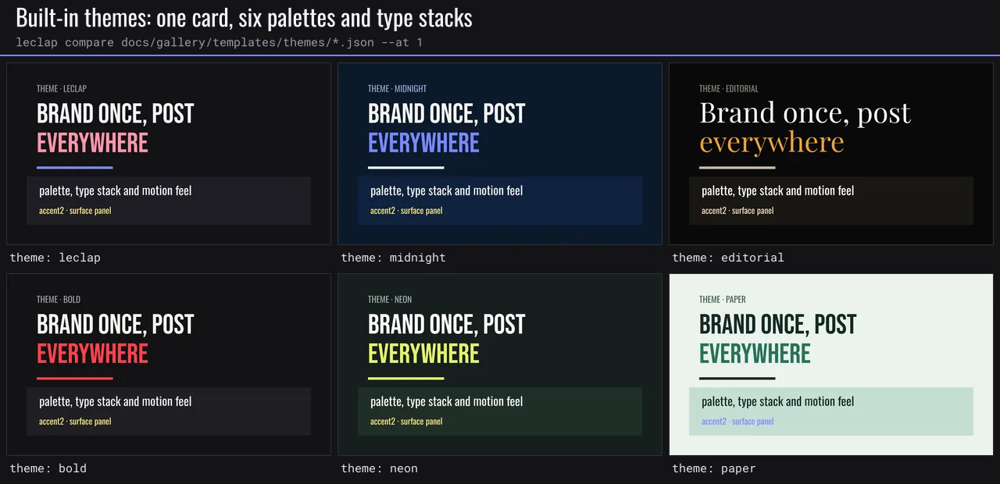

More in the [gallery](./gallery.md#themes).

`global.theme` names a template's look once: a palette, a type stack and a motion feel. Use a built-in name, or an object that overrides single tokens of one:

| Theme              | Look                                                                                                                      |
| ------------------ | ------------------------------------------------------------------------------------------------------------------------- |
| `leclap` (default) | Brand lavender `#7C83FD` and pink `#FF8AAE` on ink `#141416`; Bebas Neue / Oswald; juicy springs.                         |
| `midnight`         | Calm navy for interviews: lavender accent, slow and controlled (energy 0.8, `$smooth`).                                   |
| `editorial`        | Warm black and sand with Playfair Display: launches, quotes (energy 0.7, `$expo`).                                        |
| `bold`             | Ink and signal red: hooks, challenges (energy 1.3, `$snappy`).                                                            |
| `neon`             | Deep green and electric lime: promos, reels (energy 1.2, `$bouncy`).                                                      |
| `paper`            | Light sage canvas, deep green ink: tutorials (energy 0.9, `$gentle`).                                                     |
| `sunset`           | Dusk plum with coral and amber, Pacifico / Rubik: travel, lifestyle (energy 1, `$juicy`).                                 |
| `ocean`            | Deep teal with a sand-yellow accent, Rubik body: wellness, nature, calm tech (energy 0.85, `$smooth`).                    |
| `mono`             | Black on white, one electric-blue accent, Archivo Black / Roboto Mono: minimal, data (energy 0.8, `$expo`).               |
| `candy`            | Pale pink, plum ink, violet / pink / mint, Righteous / Rubik: kids, food, beauty (energy 1.2, `$wobbly`).                 |
| `retro`            | Seventies cream, brown, burnt orange, teal and mustard, Lobster / Oswald: vintage, food, music (energy 1, `$anticipate`). |
| `corporate`        | Light grey-blue, navy ink, blue accent, green for good news, Oswald / Rubik: pitches, reports (energy 0.75, `$smooth`).   |

```json
"global": { "theme": { "extends": "midnight", "colors": { "accent": "#FF8AAE" }, "fonts": { "display": "anton" } } }
```

Tokens: colors `bg`, `fg`, `muted`, `surface`, `brand`, `accent`, `accent2` (`#RRGGBB`); fonts `display`, `body`, `mono` (bundled font id or `.ttf` file name); `radius` (px, for builders); `motion.energy`, `motion.ease`, `motion.beat`.

Reference them as the **whole value** of any string field in `global` or `sections`:

- `"$color.accent"`, `"$color.bg@0.55"` (alpha 0..1, written out as FFmpeg's `#hex@alpha`);
- `"$font.display"`: the `.ttf` file in a `fontfile` field, the bundled id in a `font` field.

Tokens inside larger strings (`"x+$color.bg"`) are not resolved and fail validation. Without `global.theme`, tokens resolve against `leclap`.

`theme.motion` fills `global.motion` where the template leaves it unset: `energy`, the `$theme` easing token (from `ease`, e.g. `"$snappy"`) and the `$beat` duration token. Explicit `global.motion` values always win.

Validation: `unknown_theme` and `unknown_theme_token` name the nearest match. `TemplateValidator.getThemeWarnings()` returns the advisory `accent_overuse` when one section uses the accent on more than 2 elements: one accent per idea; use `$color.fg`, `$color.muted` or `$color.brand` for the rest. Built-in themes and the grammar are listed in `motionCatalog().themes` (MCP `get_motion_catalog`) and in `themeCatalog()`.

**Palette drift (advisory).** With `global.theme` set, `getMotionWarnings` / `getThemeWarnings` report `palette_drift` when a section or `global` uses literal hex colours outside the theme palette (alpha is ignored; within 8 per RGB channel of a palette colour counts as on-palette), or when the template uses more than 2 distinct font families (registry ids, `.ttf` files and `$font.*` tokens collapse to one). Fix with `$color.*` / `$font.*` tokens.

### Create your own theme

A theme object layers over a built-in (`extends`, default `leclap`): state only the tokens that differ, or all of them to own the look. A complete one:

```json
"global": {
  "theme": {
    "extends": "leclap",
    "colors": {
      "bg": "#10202b",
      "fg": "#f4f1ea",
      "muted": "#9fb0bd",
      "surface": "#1b3140",
      "brand": "#f4f1ea",
      "accent": "#ff8a5b",
      "accent2": "#ffd166"
    },
    "fonts": { "display": "anton", "body": "rubik", "mono": "mono" },
    "radius": 10,
    "motion": { "energy": 1.1, "ease": "$snappy", "beat": 0.5 }
  }
}
```

A theme restyles only what reads it. Most elements read it because you write tokens into them (`"backgroundColor": "$color.bg"`, `"color": "$color.fg"`, `"font": "$font.display"`); title cards, lower thirds and kinetic text keep their literal defaults until you do. A few engine defaults read the theme on their own:

| Token     | Use it for                                                            | Read by default                                                                                                                         |
| --------- | --------------------------------------------------------------------- | --------------------------------------------------------------------------------------------------------------------------------------- |
| `bg`      | The canvas: `color_background` `backgroundColor`, plates behind text. | The `boxed` caption box (`$color.bg@0.82`).                                                                                             |
| `fg`      | Headlines and body copy.                                              | `confetti` colours.                                                                                                                     |
| `muted`   | Kickers, labels, secondary lines.                                     | Nothing.                                                                                                                                |
| `surface` | Panels, bands and plates over `bg`.                                   | Nothing.                                                                                                                                |
| `brand`   | Rules, underlines, logo-adjacent details.                             | The `keynote` caption crown; the `neon` caption outline and glow; `confetti`.                                                           |
| `accent`  | The one highlight per idea: a word, a bar, a call to action.          | The active word of `loud` and `neon` captions; `ripple`; the default light of `fx` effects (a warm white tinted toward it); `confetti`. |
| `accent2` | A rare second highlight.                                              | The active word of `clean` and `boxed` captions; the crowned line of `clean`, `loud`, `boxed` and `neon`; `confetti`.                   |

Fonts take a bundled id (`bebas`, `oswald`, `anton`, `archivo-black`, `bungee`, `righteous`, `abril-fatface`, `playfair`, `lobster`, `pacifico`, `rubik`, `mono`) or a `.ttf` file name. `radius` is read by builders that draw plates; the engine itself does not apply it.

**Contrast.** Keep `fg` and `muted` at WCAG AA, 4.5:1 against `bg`, and `brand`, `accent` and `accent2` at 3:1 at least: every built-in does. Every caption DNA draws near-white words, so on a light theme (`paper`, `mono`, `candy`, `retro`, `corporate`) set the subtitles' `color` and `activeColor` to tokens such as `"$color.fg"` and `"$color.accent"`.

**Alpha.** Any colour token takes `@alpha` (0..1): `"$color.bg@0.55"` for a scrim, `"$color.brand@0.3"` for a soft rule. The theme colours themselves are opaque `#RRGGBB`.

**From a reference.** To start from a picture or a clip instead of a blank, run `leclap style ref.jpg` (or MCP `extract_style`, or **Match a reference** in the builder): it prints a theme object (all seven colours with contrast already fixed, plus `motion` for a clip) to paste as `global.theme`, then add your `fonts` (see below).

### Match a reference

Derive a `global.theme` object from a reference image or clip: `leclap style ref.mp4 --out style-guide.md`, the MCP `extract_style` tool, or **Match a reference** in the web builder's Advanced panel and in Generate with AI. The palette is clustered in OKLab and assigned to `bg`, `fg`, `muted`, `surface`, `brand`, `accent` and `accent2`; `fg` and `muted` are moved to WCAG AA (4.5:1) on `bg`, and accents to 3:1, when they fall short. Grain suggests a `global.grade.grain`. Clips also give the average shot length, cuts per minute and motion energy (→ `theme.motion`) and a suggested genre. Only the palette, texture and pacing carry over: the reference's subjects, logos and text are never copied. The same reference and seed always give the same theme. The library API is described in [engine configuration](./engine-configuration.md#reference-style-and-music-analysis).

## Delivery platforms

Set `global.platform` when a video has a destination. It tunes the defaults and the validation for that app; the rendered frames stay the engine's own presets.

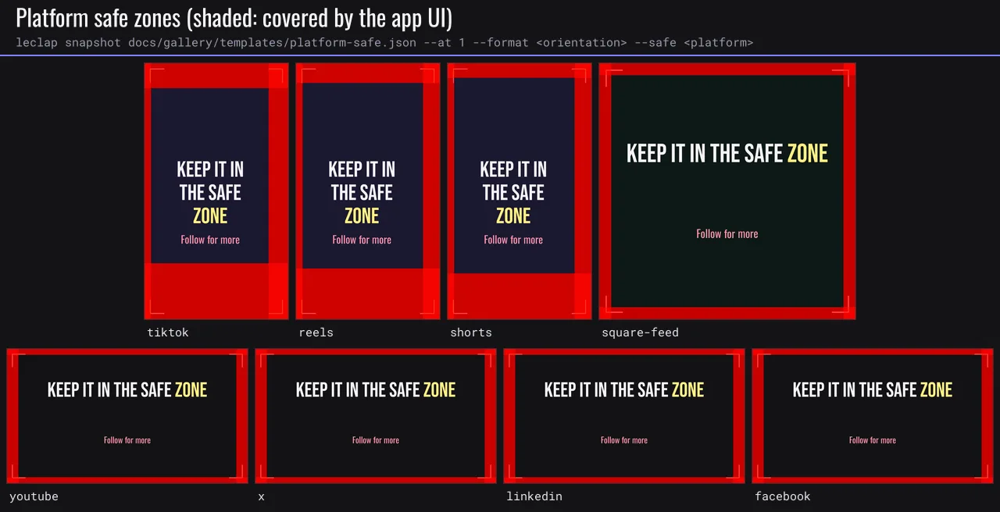

More in the [gallery](./gallery.md#delivery-platforms).

| `platform`                               | Orientation | Max duration | Safe zone (top / bottom / left / right) | What covers the frame                             |
| ---------------------------------------- | ----------- | ------------ | --------------------------------------- | ------------------------------------------------- |
| `tiktok`                                 | portrait    | 600 s        | 10% / 22% / 5% / 14%                    | tab bar, caption block, action buttons            |
| `reels` (`ig`, `instagram`)              | portrait    | 90 s         | 8% / 20% / 5% / 12%                     | header, caption and audio row, action buttons     |
| `shorts` (`yt-shorts`, `youtube-shorts`) | portrait    | 180 s        | 6% / 18% / 5% / 12%                     | search bar, title and channel row, action buttons |
| `youtube`                                | landscape   | 12 h         | 5% each edge                            | title-safe margin, player controls                |
| `x` (`twitter`)                          | landscape   | 140 s        | 5% each edge                            | title-safe margin, player controls                |
| `linkedin`                               | landscape   | 600 s        | 5% each edge                            | title-safe margin, player controls                |
| `facebook`                               | landscape   | 240 s        | 5% each edge                            | title-safe margin, player controls                |
| `square-feed`                            | square      | 240 s        | 5% each edge                            | title-safe margin, player controls                |

Every platform targets -14 LUFS integrated loudness with a -1 dBTP true-peak ceiling, at 30 fps.

What `global.platform` changes:

- **Orientation**: when `global.orientation` is omitted, the platform's orientation is used (portrait for TikTok, Reels and Shorts). An explicit `orientation` always wins; validation flags it with `platform_orientation_mismatch` when it contradicts the platform.
- **Captions**: a `caption` without an explicit `position` is lifted above the platform's bottom UI (on TikTok portrait, 306 px from the bottom instead of 110 px). A caption with an authored `position` stays where it is.
- **Loudness**: `global.audio.normalize: "loudnorm"` targets the platform loudness (`I=-14:TP=-1`) instead of the default `I=-16:TP=-1.5`.
- **Validation** (advisory warnings, never errors):
  - `platform_ui_overlap`: text reaches into an edge the app's UI covers, e.g. "the bottom 22% is covered by TikTok's caption block". It replaces the 5% title-safe `text_overflow` check and judges every edge, including preset-pinned lower thirds.
  - `platform_duration_exceeded`: the timeline is longer than the platform accepts; the message gives the excess.
  - `platform_fps_mismatch`: `global.fps` is outside 24..60.

`platformCatalog()` (exported from the package, and `platforms[]` in `get_motion_catalog`) lists every platform with its aliases, safe zones, maximum duration and loudness target.

```json
{
  "global": { "platform": "tiktok", "audio": { "normalize": "loudnorm" } },
  "sections": [
    {
      "name": "hook",
      "type": "color_background",
      "options": { "duration": 3 },
      "caption": { "text": { "en": "Wait for it" } }
    }
  ]
}
```

## Formats (one story, several compositions)

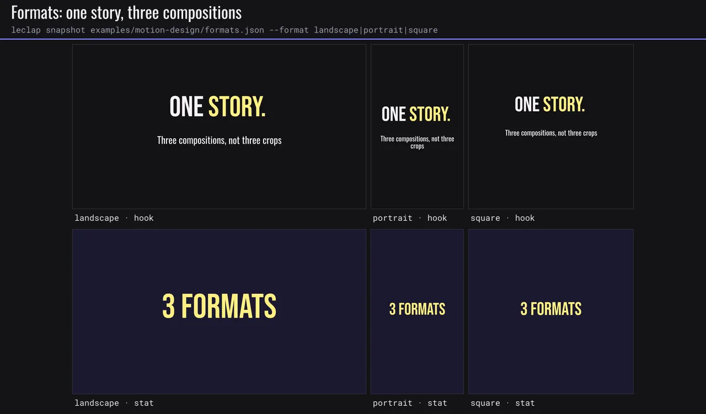

More in the [gallery](./gallery.md#formats).

A 9:16 cut of a 16:9 film is a different composition, not a crop. Declare `formats` at the descriptor top level; each entry patches the descriptor when that orientation renders:

```jsonc
"formats": {
  "portrait": {
    "global": { "platform": "shorts" },
    "sections": {
      "hook": { "camera": { "preset": "drift-up" }, "kinetic": { "byId": { "support": { "size": 52 } } } },
      "proof": { "kinetic": { "byId": { "aside": { "remove": true } } } }
    }
  },
  "square": { "global": { "platform": "square-feed" }, "sections": { "proof": { "remove": true } } }
}
```

Merge rules: objects merge key by key; arrays and scalars replace; `null` deletes a key; `sections.<name>: { "remove": true }` drops a section; `{ "byId": { "<id>": patch } }` patches `kinetic`, `graphics` or `filters` elements by `id` (`{ "remove": true }` drops one). Unknown sections, ids and formats are reported with a suggestion.

**Responsive values.** Any value may be `{ "$format": { "landscape": 120, "portrait": 150, "square": 130, "default": 120 } }`, as the only key of its object. It resolves to the rendering format, else `default` (`format_value_missing`, `format_marker_invalid`, `format_marker_mixed` otherwise).

**Order.** Markers resolve, then the format patch applies, then markers inside the patch resolve, and `global.orientation` becomes the format. This runs right after partial expansion, before theme tokens, motion tokens and time references. The format is `ProjectConfig.format`, `leclap render --format` or `compose_video { format }`, else `global.orientation` (or the `global.platform` default). A template without `formats` or markers renders unchanged.

**Validation** checks every declared format: the base one, each `formats` key and each format a marker names. A finding that only some formats raise is prefixed with them (`[portrait] …`). Advisories: `format_crop_only` (a declared format with no overrides) and `format_story_diverges` (section names or order differ from the base other than by removals).

Art direction: vertical means fewer simultaneous elements, larger type, a stronger top-to-bottom hierarchy and its own camera path; square means tighter typography and shorter holds. Set `global.platform` per format for its safe zones. The catalog guide is `motionCatalog().formats`; the example is [`examples/motion-design/formats.json`](../examples/motion-design/formats.json).

## Determinism

The same template, assets, seed and platform profile always render the same bytes:

- **`global.seed`** (uint32, default 0) is the root of every procedural effect. Each element derives `hash(seed, element path)`; every `noise` filter (grain, glitch) gets its own `all_seed`. Change the seed to reshuffle grain without touching anything else.
- **Frame grid**: each section chain starts with a CFR `fps` conform, so `t` in every animated expression is an exact frame time.
- **Raw-filter hygiene**: `%{localtime}`, `%{gmtime}`, `time(…)` and `random(…)` in raw filters raise the advisory `nondeterministic_expression`: the template still renders, but two renders of it differ, so the preview may not match the export and the section cache and `leclap verify` cannot vouch for it. Use `global.seed`-driven effects when the render must be reproducible.
- **Deterministic encoder profile**: bit-exact muxing, no inherited metadata and pinned libx264 threads. It is on by default, in the CLI and in MCP renders; `ProjectConfig.deterministic: false` turns it off (see [engine configuration](./engine-configuration.md#deterministic)).
- **Render manifest**: `compile(config, template, { onManifest })` (or `leclap render --manifest`) records the template, asset, normalized-filtergraph and output digests. `leclap verify <video>.manifest.json [--rerender]` checks a video against it.

Encoders differ per platform (x264, OpenH264, VideoToolbox), so bytes match **per platform profile**. The normalized filtergraph is the invariant across platforms. It is snapshotted for every kit template in `packages/ffmpeg-video-composer/tests/__goldens__`.

## Migrating older templates

| Old field                                       | Replacement                                                                          |
| ----------------------------------------------- | ------------------------------------------------------------------------------------ |
| `global.audioVolumeLevel`                       | `global.audio.sourceVolume`                                                          |
| `global.transitionDuration`                     | `global.transition.duration` (with `transition.type`)                                |
| `options.musicVolumeLevel`                      | `options.musicVolume`                                                                |
| `inputs[].frames` / `frequency` / `overlay`     | removed — use a single `animation` input (`.apng`/`.webp`/`.gif`/`.webm`)            |
| `inputs[].type: "frame"`                        | removed — use `type: "animation"`                                                    |
| ZIP frame-sequence animation (`url: "…/x.zip"`) | removed — convert to a single-file animation (`.apng` recommended); see MIGRATION.md |

Other breaking changes:

- **Durations are now seconds everywhere.** Previously, `project_video` `options.duration` was in **milliseconds**; now it is **seconds** (e.g. `30000` → `30`). All other durations were already seconds.
- Transitions are now structured: a bare `transitionDuration` becomes a `transition` object (`{ type, duration }`) on `global` and/or per section. A template that relied on an implicit cross-fade should set `global.transition` explicitly, or `{ "type": "cut" }` for hard cuts.
- The structured-sugar layer (`look`, `grade`, `motion`, `audio`, `layers`, `framingGuide`) is new — older templates remain valid without it.

## Registered JSON effects (desktop authoring)

See the [complete effect configuration reference](./effects-configuration.md) for every built-in/example prop, default, bound, asset slot, timing rule and registration workflow.

An `effect` section references a versioned, registered graphics implementation while its editable controls remain ordinary JSON. The execution caller resolves effects into `project_video` clips before invoking the existing FFmpeg engine. The core exports `resolveTemplateEffects(template, renderer, { preflight })` for library consumers; it does not import Remotion or launch Chromium.

```json
{
  "name": "intro",
  "type": "effect",
  "effect": {
    "id": "leclap.title-reveal",
    "version": "1.0.0",
    "props": {
      "headline": "LECLAP",
      "headlineY": 320,
      "logoDelayFrames": 15,
      "entranceDurationFrames": 24,
      "springDamping": 18
    },
    "assets": {
      "background": "/absolute/path/to/media/background.mp4",
      "logo": "/absolute/path/to/media/logo.png",
      "font": "/absolute/path/to/media/font.ttf"
    }
  },
  "options": { "duration": 10 }
}
```

Effect IDs and exact semantic versions are required; props contain JSON values only. The core validates the reference contract, while the registered backend validates its specific props, asset slots and runtime support. Every effect is preflighted before effect rendering begins. Resolution preserves section filters, transitions and compositing options.

The Node MCP backend includes `leclap.title-reveal@1.0.0` (`LeclapTitle`) and `leclap.web-app-promo@1.0.0` (`LeclapWebAppPromo`), plus operator-registered effects from a configured catalog. Discover the available effects with `get_effect_schema` and `{ "list": true }`, then request an exact id/version to inspect prop defaults/bounds, asset slots and runtime requirements. The current output contract is 1280×720, 30 fps, 300 frames (10 seconds). Enable the Remotion opt-in and configure a trusted entry; see [the runnable example](../examples/llm-remotion-title). The example paths above are placeholders: replace them with absolute regular local files contained under the configured media directory, including a background video at least 10 seconds long for the title effect. Inspect selected frames or a short range with `render_preview` before `compose_video`. This is desktop rendering; native/browser callers may consume the resulting compatible clip but do not execute React code locally.

Calling the core compile API with an unresolved effect reports `effect_backend_unavailable` before platform initialization. Ordinary templates are unchanged. Library consumers can provide another trusted renderer/preflight callback to the generic resolution API; MCP operators can register bounded JSON prop and asset contracts in their configured catalog.

Configure the MCP entry, browser, catalog, media root, timeout and cache through its startup flags,
not effect props or `ProjectConfig`. See [registered-effect configuration](./engine-configuration.md#registered-effects-and-mcp-runtime).
Use expanded effect section names, including partial prefixes, for preview and patch requests.
`patch_template` preserves inline partial authoring and materializes only a selected registry instance;
other references and the shared definition remain unchanged. JSON revisions guard edits, while
render provenance records observed inputs; neither guarantees identical bytes across hosts.

For reproducibility, retain the JSON, exact implementation/dependencies, resolved assets/fonts and render settings. JSON syntax alone does not guarantee identical pixels across rendering backends or identical encoded bytes.
